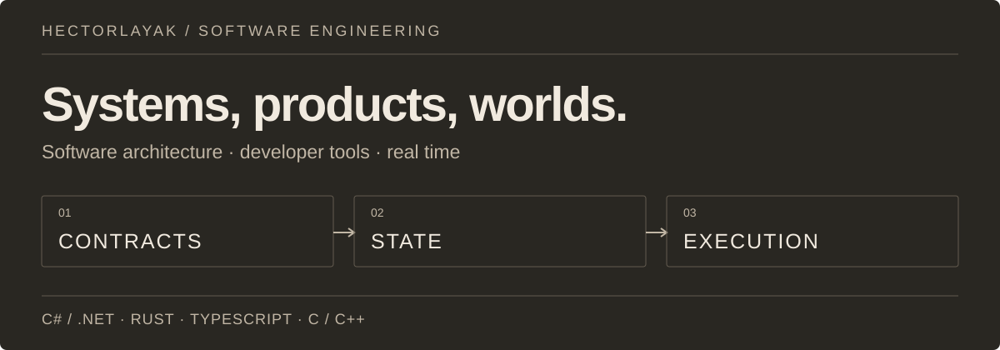
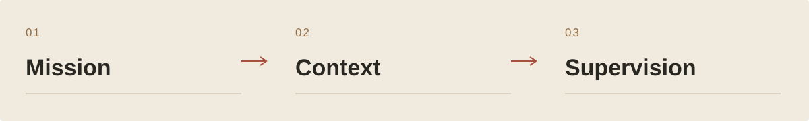
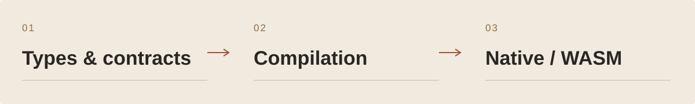
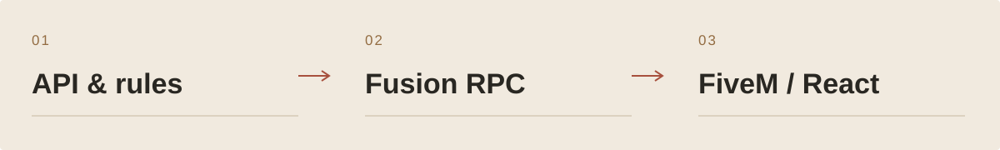
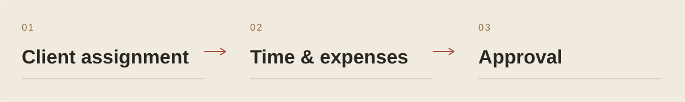
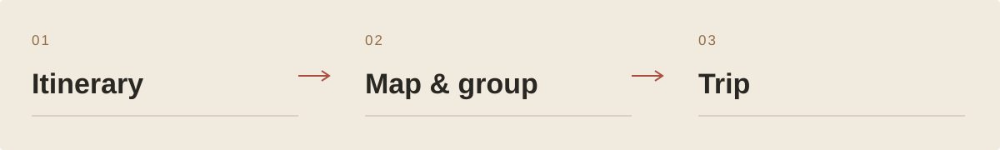
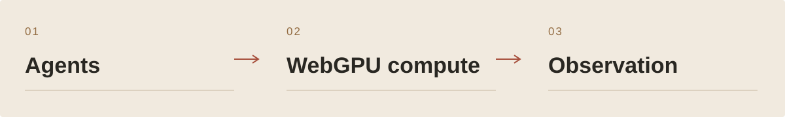

<picture>
  <source media="(prefers-color-scheme: light)" srcset="assets/editorial/identity-en-light.svg">
  
</picture>

<strong>Software architecture · developer tools · real-time systems</strong>

<a href="#six-projects-to-enter-the-workshop">Selected projects</a> · <a href="#workshop-inventory">Complete inventory</a> · <a href="https://floriansola.fr/en">Personal website ↗</a> · <a href="README.md">Français</a>

I build software where **the model, the rules and the experience need to work together**: business platforms, code understanding tools, languages, networked games and simulations. My work spans low-level execution through to the interface, with contracts and state consistency as the common thread.

**C# / .NET · Rust · TypeScript · C / C++** 
Fusion RPC, React, Vue, Unity, Unreal, WebGPU, LLVM / WebAssembly, Linux and self-hosted infrastructure.

## Six projects to enter the workshop

### 01 / AINDEX

AINDEX organizes agent work around the project: missions, repository context, changes and verification. A Rust engine owns the project authority; Studio gives humans a shared view for supervision and decisions.

**One project authority.** The Rust engine owns tasks, reservations, validation and provenance. Studio, the extension and the gateway present these contracts, keeping every interface aligned with the same authority.

Product journey

1. Connect an objective to a mission, its scope and the repository’s rules.
2. Give the agent useful context when work happens: contracts, dependencies, references and observed state.
3. Follow changes and agent activity through the supervision components shared by Studio and its viewers.
4. Inspect verification results, resolve contradictions and make the integration decision.

[Architecture and project ↗](https://floriansola.fr/en/projects/aindex)

### 02 / HECTOR

HECTOR is a language and native compiler for human authors and agents. Types, effects and contracts accompany business kernels targeting native execution and WebAssembly.

**The compiler owns semantics.** The json, syntax, foundation, core and driver units are written in Hector. Bootstrap rebuilds the chain from its seeds; LLVM handles native emission. Launchers direct work to the same authority.

Product journey

1. Express behavior in Hector with its types, effects and contract clauses.
2. Analyze sources with the native compiler and inspect facts produced by the checker.
3. Build a native or WebAssembly library for an external consumer.
4. Compare interfaces and publication properties, then qualify the workflow on its target host.

[Architecture and project ↗](https://floriansola.fr/en/projects/hector)

### 03 / OneRP

OneRP brings a SaaS backend, administration and FiveM modules together. Characters, economy, inventory, vehicles, housing and activities share reactive business services and in-game React interfaces.

**Reactive business state.** Fusion tracks read dependencies. Mutations invalidate the relevant data, while player-scoped sentinels keep recomputation focused on the useful scope.

Product journey

1. Create and configure a server instance in the administration panel.
2. Welcome players, select a character and guide their arrival.
3. Interact with jobs, inventory, banking, vehicles and housing.
4. Validate actions through server business services.

[Architecture and project ↗](https://floriansola.fr/en/projects/onerp-framework)

### 04 / StaffingOS

StaffingOS connects client assignments, time, expenses and absences to approvals and financial preparation. Worker and management workspaces share records and access rules.

**Shared records, distinct responsibilities.** Workers, managers, HR and accounting act on shared records with explicit permissions and scopes. Assignment, time and absence rules are shared across interfaces.

Product journey

1. Record the client, site, requirement and assigned person.
2. Create the assignment with dates and versioned rates.
3. Submit time, expenses and absence requests through authorised workspaces.
4. Review requests and exceptions through approval workflows.

[Architecture and project ↗](https://floriansola.fr/en/projects/staffingos)

### 05 / RoadTripper

A shared travel notebook for planning each day, exploring places on a map, organising the group and tracking expenses. The copilot proposes changes for travellers to review before adopting them.

**Keep the day as the anchor.** The overview, itinerary and map share the selected day and stop identifiers. On mobile, the next action comes before secondary tools, and a stop opens for reading before editing.

Product journey

1. Build the trip
2. Move between itinerary and map
3. Prepare together
4. Adapt the itinerary

[Architecture and project ↗](https://floriansola.fr/en/projects/roadtripper)

### 06 / Poisson Engine

Poisson simulates schooling, predation, metabolism and mutations in the browser. The engine separates WebGPU/CPU compute from WebGL/Canvas2D rendering and supports observation, sandbox and gameplay modes.

**Compute and rendering adapt independently.** WebGPU accelerates simulation compute, with a CPU path when unavailable. Rendering chooses WebGL or Canvas2D. This separation adapts both workload and presentation to browser capabilities.

Product journey

1. Choose a mode and observe schools, predators and ecosystem resources.
2. Adjust parameters and follow their effects on movement, energy and reproduction.
3. Explore genetics, mutations and relationships between species.
4. Play with progression, abilities, missions and the economy, or inspect the simulation.

[Architecture and project ↗](https://floriansola.fr/en/projects/poisson-engine)

## Engineering questions

| Area | What I work on |
| :--- | :--- |
| **Contracts & domain** | Business invariants, transactions, tenant boundaries and data shapes. |
| **AI & tools** | Context retrieval, evaluation and control over agent execution. |
| **Real time & worlds** | Server authority, persistence, synchronization and collective behavior. |
| **Interfaces & operations** | User journeys, observability, delivery and recovery. |

## Workshop inventory

**33 projects**, spanning business products, engines, research, collaborations and tools. Each link leads to its project presentation.

<strong>Languages, AI & agents</strong> · 9 projects

| Project | Domain |
| :--- | :--- |
| [AINDEX](https://floriansola.fr/en/projects/aindex) | Agents do the work. Humans oversee the project. |
| [HECTOR](https://floriansola.fr/en/projects/hector) | A language for expressing behavior, compiling it and inspecting contracts. |
| [Continuum](https://floriansola.fr/en/projects/continuum) | Learn to navigate, then measure decisions in a reproducible laboratory. |
| [PromptVault](https://floriansola.fr/en/projects/promptvault) | Turn a team’s prompts into reusable tools |
| [Matchr](https://floriansola.fr/en/projects/matchr) | One offer, a targeted CV and a tracked application dossier. |
| [GeopolAI / ModelRisk](https://floriansola.fr/en/projects/geopolai) | Model decision comparison and bias observation. |
| [AISelector](https://floriansola.fr/en/projects/ai-selector) | One contract for multiple AI providers |
| [Vouch](https://floriansola.fr/en/projects/vouch) | Prepare security answers from traceable sources |
| [Vision Security Lab](https://floriansola.fr/en/projects/vision-security-lab) | Observe automated behaviour from visual input. |

<strong>Business products & collaboration</strong> · 6 projects

| Project | Domain |
| :--- | :--- |
| [OneRP](https://floriansola.fr/en/projects/onerp-framework) | A SaaS foundation for operating FiveM roleplay worlds. |
| [SaleCast](https://floriansola.fr/en/projects/salecast) | Connect sales channels and plan the next replenishment. |
| [StaffingOS](https://floriansola.fr/en/projects/staffingos) | Connect assignments, time, expenses and financial preparation. |
| [RoadTripper](https://floriansola.fr/en/projects/roadtripper) | A shared itinerary, a map and a copilot for travelling together. |
| [PartyFlow](https://floriansola.fr/en/projects/partyflow) | Create a room, gather players and move through timed challenges |
| [Racine](https://floriansola.fr/en/projects/racine) | A family space for connections and shared memories |

<strong>Worlds, games & simulation</strong> · 13 projects

| Project | Domain |
| :--- | :--- |
| [FantasyOnline](https://floriansola.fr/en/projects/fantasy-online) | A persistent fantasy world, from generated terrain to server rules. |
| [FantasyOnline.Shared](https://floriansola.fr/en/projects/fantasy-online-shared) | Share contracts and rules through explicit adoption by each game. |
| [Nexus / Reclaim City](https://floriansola.fr/en/projects/nexus) | Reclaim City: recovery, a private district and a shared Roblox city. |
| [SurvivalKingdom](https://floriansola.fr/en/projects/survival-kingdom) | Connect survival, a multiplayer world and the services that sustain it. |
| [Survival Unreal](https://floriansola.fr/en/projects/survival-acfu) | Unreal systems: zone server, HUD and progression. |
| [REWORLD](https://floriansola.fr/en/projects/reworld) | Build an atlas, connect its territories and write their story. |
| [MANDATE EARTH](https://floriansola.fr/en/projects/mandate-earth) | Prepare a plan, commit resources and track the consequences. |
| [Symbiont](https://floriansola.fr/en/projects/symbiont) | Grow a colony without exhausting the world that feeds it. |
| [Poisson Engine](https://floriansola.fr/en/projects/poisson-engine) | A living ecosystem simulated in the browser. |
| [Ultra RP](https://floriansola.fr/en/projects/ultra-rp-sbox) | A s&box roleplay world, from player jobs to operations tooling |
| [Development Tycoon](https://floriansola.fr/en/projects/development-tycoon) | Design the growth of a software studio as a management game. |
| [Red Dead Roleplay](https://floriansola.fr/en/projects/red-dead-roleplay) | Compose a roleplay world around characters and interactions. |
| [V-Multi / SARP](https://floriansola.fr/en/projects/gaming-platform) | A formative journey through multiplayer and community worlds. |

<strong>Infrastructure, tools & background</strong> · 5 projects

| Project | Domain |
| :--- | :--- |
| [VPS Command Center](https://floriansola.fr/en/projects/vps-command-center) | Connect service health to operational decisions. |
| [Self-hosted Infrastructure](https://floriansola.fr/en/projects/self-hosted-infrastructure) | Organise product hosting, delivery and recovery. |
| [Portfolio Engineering](https://floriansola.fr/en/projects/portfolio-engineering) | Turn recurring problems into reusable components. |
| [Gecko IoT](https://floriansola.fr/en/projects/gecko-iot) | Professional experience close to embedded software. |
| [Integrations & Archives](https://floriansola.fr/en/projects/integrations-archives) | Preserve adapters, experiments and early versions. |

---

[Personal website](https://floriansola.fr/en) · [Notes and articles](https://floriansola.fr/en/blog) · [Français](README.md)
