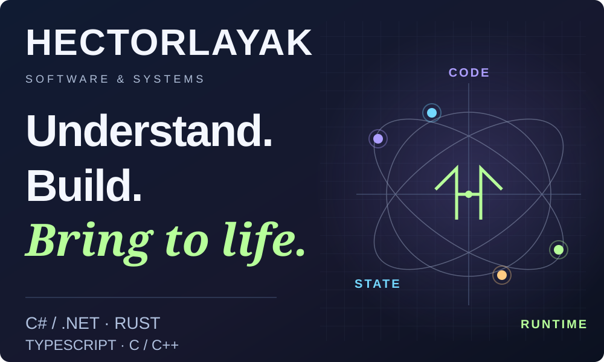
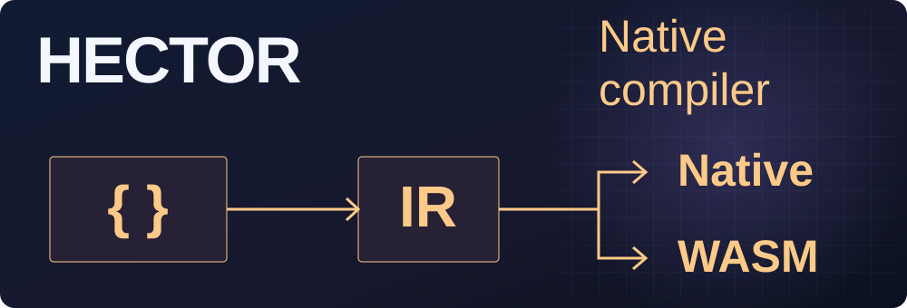
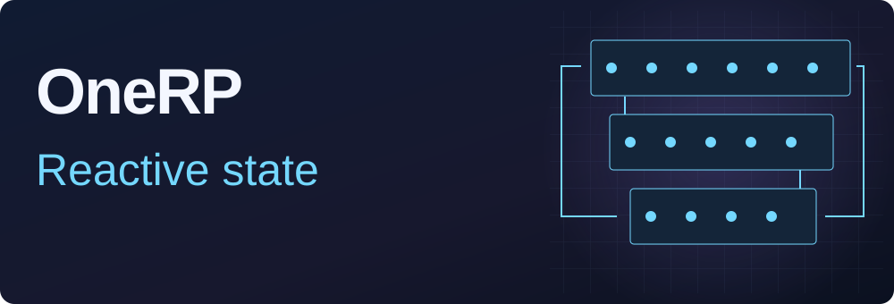
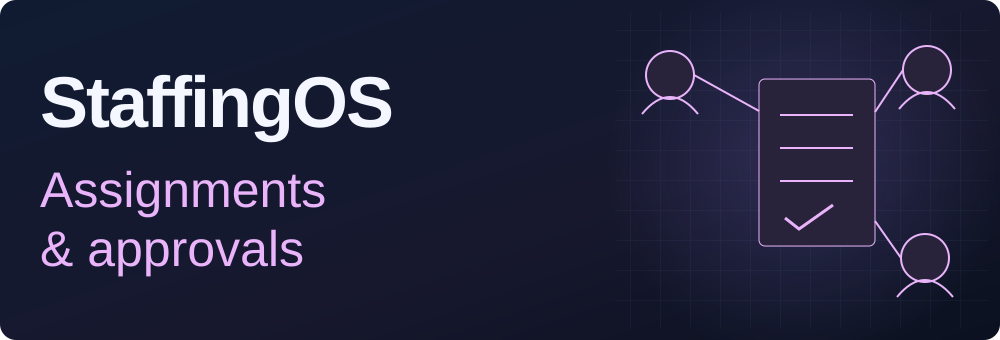
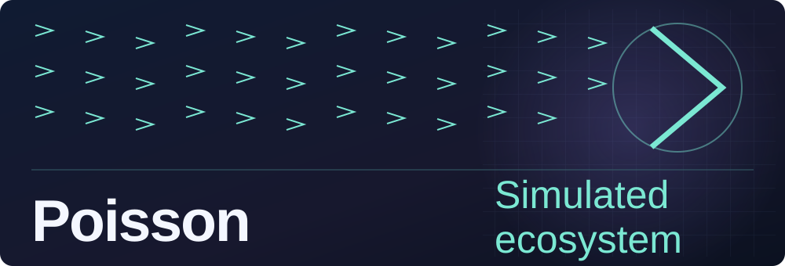
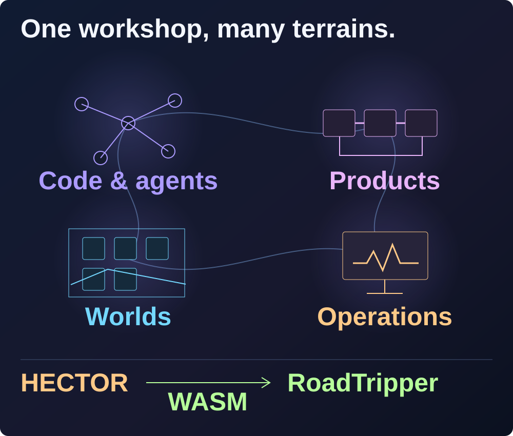

<a href="#selected-projects">Six projects</a> · <a href="#the-workshop-map">The map</a> · <a href="#the-whole-workshop">33 projects</a> · <a href="https://floriansola.fr/en">Studio &amp; services ↗</a> · <a href="README.md">Français</a>

I build applied AI tools, .NET platforms and real-time systems. My projects explore agent orchestration, executable contracts, networking engines and simulation, with one recurring concern: keeping state, performance and component boundaries explicit.

**C# / .NET · Rust · Python · TypeScript · C / C++**

## Selected projects

**Let agents do the work. Keep control of the project.**

AINDEX organises agent-assisted development around one project. An objective becomes missions linked to scope, code dependencies and decisions. Teams follow the work, inspect changes and intervene where their judgment matters.

*Real supervision interface · fictional demonstration project.*

Architecture and ideas

**A mission connected to code.** Objectives, scope and dependencies share one context. The index connects symbols, calls and references to the requested work.

**Useful context at the right time.** A capsule combines obligations and relevant sources. Provenance and freshness remain inspectable throughout the mission.

**Supervision supports decisions.** Studio shows progress, changes and items needing attention. Questions, results and review material belong to the same workflow.

[Explore the project ↗](projects/aindex.en.md)

**Describe the need. Build the mechanics.**

HECTOR starts with an idea: authors should express expected behavior, constraints and permitted transformations. Types, units, effects and contracts make that intent explicit. The language also targets agents, whose proposals become inspectable by the compiler.

Architecture and ideas

**Behavior before mechanics.** Declare values, results and obligations, along with permitted changes to representation, fusion or independent ordering.

**For humans and agents.** Types, effects and contracts make proposals inspectable. An agent proposes a change; the compiler reports the contradictions it can detect.

**Reusable kernels.** The same sources produce native and WebAssembly libraries. Interfaces and compiler identities accompany their integration into applications.

[Explore the project ↗](projects/hector.en.md)

OneRP brings a SaaS backend, administration and FiveM modules together. Characters, economy, inventory, vehicles, housing and activities share reactive business services and in-game React interfaces.

Architecture and journey

**Reactive business state.** Fusion tracks read dependencies. Mutations invalidate the relevant data, while player-scoped sentinels keep recomputation focused on the useful scope.

**Transactional economic operations.** Mutation templates open operation contexts and provide serializable isolation for concurrent writes. Instance filters and read guards support business services.

1. Create and configure a server instance in the administration panel.
2. Welcome players, select a character and guide their arrival.
3. Interact with jobs, inventory, banking, vehicles and housing.
4. Validate actions through server business services.
5. Follow state changes and manage instances through connected interfaces.

[Explore the project ↗](projects/onerp-framework.en.md)

StaffingOS connects client assignments, time, expenses and absences to approvals and financial preparation. Worker and management workspaces share records and access rules.

Architecture and journey

**Shared records, distinct responsibilities.** Workers, managers, HR and accounting act on shared records with explicit permissions and scopes. Assignment, time and absence rules are shared across interfaces.

**Traceable operations.** Assignment creation records a command fingerprint, versions, audit and durable events in one transaction. Recovery distinguishes new work from replay of an existing operation.

1. Record the client, site, requirement and assigned person.
2. Create the assignment with dates and versioned rates.
3. Submit time, expenses and absence requests through authorised workspaces.
4. Review requests and exceptions through approval workflows.
5. Prepare payroll and preinvoice batches, then record payment evidence.

[Explore the project ↗](projects/staffingos.en.md)

A shared travel notebook for planning each day, exploring places on a map, organising the group and tracking expenses. The copilot proposes changes for travellers to review before adopting them.

Architecture and journey

**Keep the day as the anchor.** The overview, itinerary and map share the selected day and stop identifiers. On mobile, the next action comes before secondary tools, and a stop opens for reading before editing.

**Share calculations across client and server.** The notebook domain is independent of the interface. Hector, compiled to WebAssembly, provides deterministic planning, budget and progress calculations; the gateway validates incoming data again.

1. Build the trip — Create a notebook with dates and preferences, organise stops by day, and add places, breaks and overnight stays.
2. Move between itinerary and map — Select a day, inspect a stop and find it on the map without losing the selection. Calculate or refresh a route when a provider is configured.
3. Prepare together — Invite members with a role, assign travellers to cars, review departure preparation and collect reservations, documents and the budget.
4. Adapt the itinerary — Suggest a place to the group or ask the copilot for a detour. Review changes against the current notebook before adopting them, and share location only with consent.
5. Keep expenses clear — Record expenses, their shares and declared reimbursements, while keeping committed, estimated and recorded amounts distinct.

[Explore the project ↗](projects/roadtripper.en.md)

Poisson simulates schooling, predation, metabolism and mutations in the browser. The engine separates WebGPU/CPU compute from WebGL/Canvas2D rendering and supports observation, sandbox and gameplay modes.

Architecture and journey

**Compute and rendering adapt independently.** WebGPU accelerates simulation compute, with a CPU path when unavailable. Rendering chooses WebGL or Canvas2D. This separation adapts both workload and presentation to browser capabilities.

**Organize data for parallel execution.** Typed arrays, SoA data, spatial grids, prefix sums and reordering bring neighboring agents closer in memory. The GPU pipeline handles schooling and hunting forces before physics integration.

1. Choose a mode and observe schools, predators and ecosystem resources.
2. Adjust parameters and follow their effects on movement, energy and reproduction.
3. Explore genetics, mutations and relationships between species.
4. Play with progression, abilities, missions and the economy, or inspect the simulation.

[Explore the project ↗](projects/poisson-engine.en.md)

## The workshop map

**A concrete connection between areas:** RoadTripper uses Hector through WebAssembly for planning, budget and progress calculations.

## The whole workshop

**33 projects**, organized into four areas. Products, research, tools and collaborations.

<strong>Languages, AI & agents</strong> · 9 projects

| Project | Domain |
| :--- | :--- |
| [AINDEX](projects/aindex.en.md) | Agents do the work. Humans oversee the project. |
| [HECTOR](projects/hector.en.md) | A language for expressing behavior, compiling it and inspecting contracts. |
| [Continuum](projects/continuum.en.md) | Learn to navigate, then measure decisions in a reproducible laboratory. |
| [PromptVault](projects/promptvault.en.md) | Turn a team’s prompts into reusable tools |
| [Matchr](projects/matchr.en.md) | One offer, a targeted CV and a tracked application dossier. |
| [ModelRisk Observatory · GeopolAI](projects/geopolai.en.md) | Compare AI-model responses under controlled scenarios |
| [AISelector](projects/ai-selector.en.md) | One contract for multiple AI providers |
| [Vouch](projects/vouch.en.md) | Prepare security answers from traceable sources |
| [Vision Security Lab](projects/vision-security-lab.en.md) | Observe automated behaviour from visual input. |

<strong>Business products & collaboration</strong> · 6 projects

| Project | Domain |
| :--- | :--- |
| [OneRP](projects/onerp-framework.en.md) | A SaaS foundation for operating FiveM roleplay worlds. |
| [SaleCast](projects/salecast.en.md) | Connect sales channels and plan the next replenishment. |
| [StaffingOS](projects/staffingos.en.md) | Connect assignments, time, expenses and financial preparation. |
| [RoadTripper](projects/roadtripper.en.md) | A shared itinerary, a map and a copilot for travelling together. |
| [PartyFlow](projects/partyflow.en.md) | Create a room, gather players and move through timed challenges |
| [Racine](projects/racine.en.md) | A family space for connections and shared memories |

<strong>Worlds, games & simulation</strong> · 13 projects

| Project | Domain |
| :--- | :--- |
| [FantasyOnline](projects/fantasy-online.en.md) | A persistent fantasy world, from generated terrain to server rules. |
| [FantasyOnline.Shared](projects/fantasy-online-shared.en.md) | Share contracts and rules through explicit adoption by each game. |
| [Nexus / Reclaim City](projects/nexus.en.md) | Recover wrecks and rebuild a district of your own. |
| [SurvivalKingdom](projects/survival-kingdom.en.md) | Connect survival, a multiplayer world and the services that sustain it. |
| [SurvivalUnreal](projects/survival-unreal.en.md) | A survival world connected to its own game services. |
| [REWORLD](projects/reworld.en.md) | Build an atlas, connect its territories and write their story. |
| [MANDATE EARTH](projects/mandate-earth.en.md) | Prepare a plan, commit resources and track the consequences. |
| [Symbiont](projects/symbiont.en.md) | Grow a colony without exhausting the world that feeds it. |
| [Poisson Engine](projects/poisson-engine.en.md) | A living ecosystem simulated in the browser. |
| [Ultra RP](projects/ultra-rp-sbox.en.md) | A s&box roleplay world, from player jobs to operations tooling |
| [Development Tycoon](projects/development-tycoon.en.md) | Design the growth of a software studio as a management game. |
| [Red Dead Roleplay](projects/red-dead-roleplay.en.md) | Compose a roleplay world around characters and interactions. |
| [V-Multi / SARP](projects/gaming-platform.en.md) | A formative journey through multiplayer and community worlds. |

<strong>Infrastructure, tools & background</strong> · 5 projects

| Project | Domain |
| :--- | :--- |
| [VPS Command Center](projects/vps-command-center.en.md) | Connect service health to operational decisions. |
| [Self-hosted Infrastructure](projects/self-hosted-infrastructure.en.md) | Organise product hosting, delivery and recovery. |
| [Portfolio Engineering](projects/portfolio-engineering.en.md) | Turn recurring problems into reusable components. |
| [Gecko IoT](projects/gecko-iot.en.md) | Professional experience close to embedded software. |
| [Integrations & Archives](projects/integrations-archives.en.md) | Preserve adapters, experiments and early versions. |

---

[Studio & services](https://floriansola.fr/en) · [Notes and articles](https://floriansola.fr/en/blog) · [Français](README.md)
