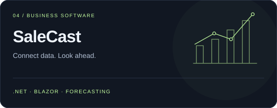

<picture>
  <source media="(prefers-color-scheme: light)" srcset="assets/cover-light-en.svg">
  
</picture>

  <strong>Senior C#/.NET Developer · Software Architect · Product Builder</strong> 
  Based in France · Business software, real-time systems, AI and simulated worlds.

  <a href="https://floriansola.fr/en"><strong>Portfolio</strong></a> &nbsp;·&nbsp;
  <a href="https://floriansola.fr/en/cv">Background & CV</a> &nbsp;·&nbsp;
  <a href="README.md">Version française ↗</a>

---

### Building the connections that make a product work.

The most interesting products bring several hard problems together: data that must stay consistent, people working collaboratively, AI that needs the right context, or a world that persists after its players leave.

That is where I like to work. **I connect systems engineering with product clarity**: designing the engine, understanding business rules, shaping the interface and preparing operations. My work spans **C#/.NET and real-time architecture**, **Rust, tools for AI agents and simulation**.

Since my first multiplayer projects in 2016, I have worked across business software, configurators, telecom mobile apps and IoT firmware. Today I build SaaS products, developer tools and research projects, with close attention to both architecture and the user experience. [My background →](https://floriansola.fr/en/cv)

### Selected work

<table>
  <tr>
    <td width="50%" valign="top">
      
      
Persistent code understanding for agents: dependency graphs, relevant context and relationships between changes, tasks and evidence. A focus on <strong>what an agent needs to know before acting</strong>.

      <a href="https://aindex.floriansola.fr">Discover AINDEX ↗</a>
    </td>
    <td width="50%" valign="top">
      
      
A language and compiler research project for humans and agents, producing native and WebAssembly kernels. <strong>Continuum</strong> extends the exploration into learning and navigation.

      Research in progress · HECTOR & Continuum
    </td>
  </tr>
  <tr>
    <td width="50%" valign="top">
      
      
Roleplay as a platform: a .NET backend, <strong>Fusion RPC</strong>, tenant isolation, FiveM modules and React interfaces. Business rules, server authority and real-time state in one architecture.

      <a href="https://floriansola.fr/projects/onerp-framework">Project overview ↗</a>
    </td>
    <td width="50%" valign="top">
      
      
Connecting multi-channel commerce, synchronization and forecasting in a .NET/Blazor SaaS. Another business domain: <strong>StaffingOS</strong>, for HR operations, approvals and accounting workflows.

      <a href="https://floriansola.fr/projects/salecast">Project overview ↗</a>
    </td>
  </tr>
  <tr>
    <td width="50%" valign="top">
      
      
Turning a group trip into a shared plan: stops, maps, collaboration and mobile UX. From the first <strong>MyRoadTrip</strong> to newer RoadTripper iterations, geography meets product design.

      <a href="https://floriansola.fr/projects/myroadtrip">Project overview ↗</a>
    </td>
    <td width="50%" valign="top">
      
      
An ecosystem emerging from agents and rules: simulation, spatial indexing and <strong>WebGPU</strong> compute. Performance, collective behavior and browser rendering meet in one engine.

      <a href="https://poisson.floriansola.fr/demo/">Explore the demo ↗</a> · <a href="https://floriansola.fr/projects/poisson-engine">Architecture ↗</a>
    </td>
  </tr>
</table>

This selection includes products, client work and R&D at different stages. Much of the code is private; links lead to public presentations or available demos.

### More of the workshop

**AI in the product** — [PromptVault](https://floriansola.fr/projects/promptvault) turns prompts into team tools; [Matchr](https://floriansola.fr/projects/matchr) explores applications and ATS analysis; [GeopolAI / ModelRisk](https://floriansola.fr/projects/geopolai) explores and compares model decisions.

**Games and persistent worlds** — FantasyOnline and its shared Unity/Roblox foundation, SurvivalKingdom in Unreal, REWORLD's maps, MANDATE EARTH's strategy, Symbiont's ecology and s&box roleplay systems. Projects in development where I explore rules, persistent state and interaction.

**The infrastructure underneath** — Linux, Docker, Caddy, PostgreSQL, Forgejo and GitHub Actions on a VPS. I also care about what keeps software running after the commit: reproducible deployments, observability, backups and recovery procedures.

### What I bring to a project

| Area | How I approach it |
| :--- | :--- |
| **Architecture & domain** | Define responsibilities, contracts and the rules that must stay true. |
| **Real-time & data** | Work on server authority, invalidation, synchronization and transactions. |
| **AI & tools** | Connect context, behavior, evaluation and human supervision. |
| **Product & delivery** | Connect the interface to the domain, then tests and deployment to expected behavior. |

  <code>C# / .NET</code> <code>Rust</code> <code>TypeScript</code> <code>C / C++</code> 
  <code>ActualLab Fusion</code> <code>Blazor</code> <code>React</code> <code>Vue</code> <code>PostgreSQL</code> 
  <code>Unity</code> <code>Unreal Engine</code> <code>WebGPU</code> <code>LLVM / WASM</code> <code>Linux / Docker</code>

---

  <strong>A product to build, a system to rethink, a difficult idea to make real?</strong> 
  Let's talk architecture, constraints and next steps.  
  <a href="https://floriansola.fr/en#contact">Get in touch</a>

Understand deeply. Build with intent.

