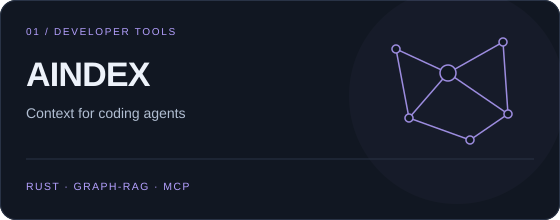
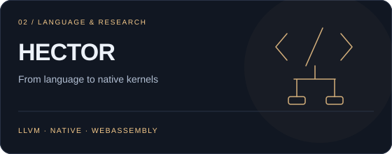
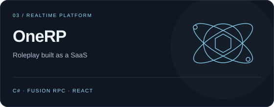
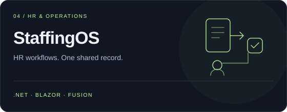
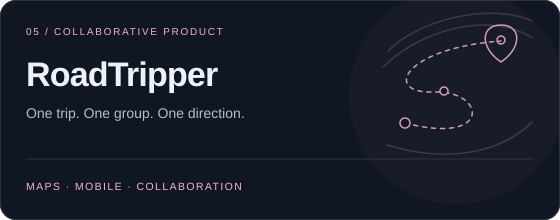
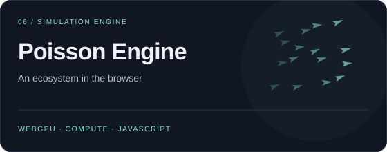
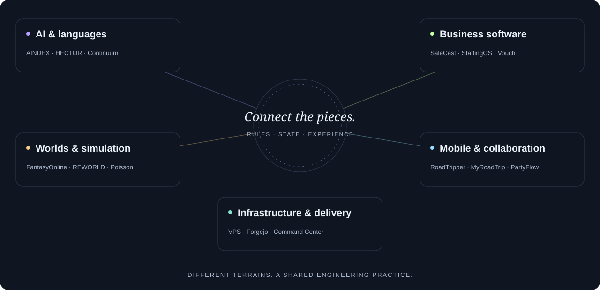

<picture>
  <source media="(prefers-color-scheme: light)" srcset="assets/cover-en-light.svg">
  
</picture>

<strong>Software architect · Product builder · Persistent-world enthusiast</strong> Code that understands. Systems that connect. Worlds that evolve.

<a href="#the-workshop">Workshop</a> &nbsp;·&nbsp; <a href="#the-projects">All projects</a> &nbsp;·&nbsp; <a href="https://floriansola.fr/en/projects">Explore the portfolio ↗</a> &nbsp;·&nbsp; <a href="README.md">Français</a>

---

I like the point where **systems engineering meets the user experience**. A multi-tenant SaaS, an AI agent that needs context, a compiler, a living world or a shared journey all raise the same questions: who owns the rules, how does state stay coherent, and how does the system become understandable?

My workshop connects **C#/.NET, Rust, TypeScript and C/C++** with business software, real-time architecture, AI, game engines and self-hosted infrastructure. I work from the engine to the interface, then through tests, delivery and operations.

### The workshop

<table>
  <tr>
    <td width="50%" valign="top">
      
      
Code understanding, task context and agent supervision.

      <a href="https://floriansola.fr/en/projects/aindex">Explore the project ↗</a>
    </td>
    <td width="50%" valign="top">
      
      
Language, native compiler and WebAssembly kernels.

      <a href="https://floriansola.fr/en/projects/hector">Explore the project ↗</a>
    </td>
  </tr>
  <tr>
    <td width="50%" valign="top">
      
      
A roleplay SaaS platform: Fusion RPC, multi-tenancy, FiveM and React.

      <a href="https://floriansola.fr/en/projects/onerp-framework">Explore the project ↗</a>
    </td>
    <td width="50%" valign="top">
      
      
HR operations, timesheets, expenses, leave and accounting.

      <a href="https://floriansola.fr/en/projects/staffingos">Explore the project ↗</a>
    </td>
  </tr>
  <tr>
    <td width="50%" valign="top">
      
      
Next generation: a shared plan, map and mobile journey.

      <a href="https://floriansola.fr/en/projects/roadtripper-v2">Explore the project ↗</a>
    </td>
    <td width="50%" valign="top">
      
      
Agent ecosystems, simulation and WebGPU compute.

      <a href="https://floriansola.fr/en/projects/poisson-engine">Explore the project ↗</a>
    </td>
  </tr>
</table>

### The workshop map

<picture>
  <source media="(prefers-color-scheme: light)" srcset="assets/atlas-en-light.svg">
  
</picture>

### The projects

**34 project pages**, organized by terrain. Open a group to explore the work, then follow a case for its architecture and current scope.

<strong>Languages, AI & agents</strong> · 9 projects

| Project | The terrain | Stage |
| :--- | :--- | :--- |
| [AINDEX](https://floriansola.fr/en/projects/aindex) | Code understanding, task context and agent supervision. | Development |
| [HECTOR](https://floriansola.fr/en/projects/hector) | Language, native compiler and WebAssembly kernels. | Research |
| [Continuum](https://floriansola.fr/en/projects/continuum) | Learning, navigation and corrective collection in a lab. | Research |
| [PromptVault](https://floriansola.fr/en/projects/promptvault) | Reusable prompts, team tools and AI governance. | Background & work |
| [Matchr](https://floriansola.fr/en/projects/matchr) | Application dossiers, ATS analysis and AI assistance. | Background & work |
| [GeopolAI / ModelRisk](https://floriansola.fr/en/projects/geopolai) | Model decision comparison and bias observation. | Background & work |
| [AISelector](https://floriansola.fr/en/projects/ai-selector) | C# contracts and adapters for AI providers. | Prototype |
| [Vouch](https://floriansola.fr/en/projects/vouch) | Security questionnaires and source-grounded RAG answers. | Background & work |
| [Vision Security Lab](https://floriansola.fr/en/projects/vision-security-lab) | Vision, agent behavior and controlled evaluation. | Research |

<strong>Business products & collaboration</strong> · 7 projects

| Project | The terrain | Stage |
| :--- | :--- | :--- |
| [OneRP](https://floriansola.fr/en/projects/onerp-framework) | Roleplay SaaS platform, Fusion RPC and multi-tenant architecture. | Background & work |
| [SaleCast](https://floriansola.fr/en/projects/salecast) | Multi-channel commerce, synchronization and forecasting. | Background & work |
| [StaffingOS](https://floriansola.fr/en/projects/staffingos) | HR operations, timesheets, expenses, leave and accounting. | Development |
| [MyRoadTrip](https://floriansola.fr/en/projects/myroadtrip) | First generation: collaborative trips and offline use. | Background & work |
| [RoadTripper V2](https://floriansola.fr/en/projects/roadtripper-v2) | Next generation: a shared plan, map and mobile journey. | Development |
| [PartyFlow](https://floriansola.fr/en/projects/partyflow) | Mobile exploration with Vue, Ionic and Capacitor. | Prototype |
| [Racine](https://floriansola.fr/en/projects/racine) | Memories, family connections and a private shared space. | Background & work |

<strong>Worlds, games & simulation</strong> · 13 projects

| Project | The terrain | Stage |
| :--- | :--- | :--- |
| [FantasyOnline](https://floriansola.fr/en/projects/fantasy-online) | Unity fantasy MMORPG and authoritative .NET services. | Development |
| [FantasyOnline.Shared](https://floriansola.fr/en/projects/fantasy-online-shared) | A reusable foundation of contracts, services and adapters. | Development |
| [Nexus / Reclaim City](https://floriansola.fr/en/projects/nexus) | Reclaim City: recovery, a private district and a shared Roblox city. | Development |
| [SurvivalKingdom](https://floriansola.fr/en/projects/survival-kingdom) | Unreal survival RPG, zone server and .NET backend. | Development |
| [SURVIVALACFU](https://floriansola.fr/en/projects/survival-acfu) | Unreal prototype: ACF Ultimate integration and SurvivalKingdom systems. | Prototype |
| [REWORLD](https://floriansola.fr/en/projects/reworld) | Geography, placement, federations and a browser atlas. | Development |
| [MANDATE EARTH](https://floriansola.fr/en/projects/mandate-earth) | Agentic plans, resources, logistics and cooperation. | Development |
| [Symbiont](https://floriansola.fr/en/projects/symbiont) | Colony, resources and the ecology of a living world. | Prototype |
| [Poisson](https://floriansola.fr/en/projects/poisson-engine) | Agent ecosystems, simulation and WebGPU compute. | Background & work |
| [Ultra RP · s&box](https://floriansola.fr/en/projects/ultra-rp-sbox) | Roleplay systems, interfaces and a backend for s&box. | Background & work |
| [Development Tycoon](https://floriansola.fr/en/projects/development-tycoon) | Contribution to a Unity management-game project. | Collaboration |
| [Red Dead Roleplay](https://floriansola.fr/en/projects/red-dead-roleplay) | Contribution to a C# client/server roleplay project. | Collaboration |
| [V-Multi / SARP](https://floriansola.fr/en/projects/gaming-platform) | V-Multi / SARP: network foundations and multiplayer operations. | Background & work |

<strong>Infrastructure, tools & background</strong> · 5 projects

| Project | The terrain | Stage |
| :--- | :--- | :--- |
| [VPS Command Center](https://floriansola.fr/en/projects/vps-command-center) | Cockpit, telemetry, logs and service delivery. | Operations |
| [Infrastructure auto-hébergée](https://floriansola.fr/en/projects/self-hosted-infrastructure) | Linux, Forgejo, VPS CI, deployment and recovery. | Operations |
| [Portfolio Engineering](https://floriansola.fr/en/projects/portfolio-engineering) | Reusable patterns and components extracted from products. | Background & work |
| [Gecko / IoT](https://floriansola.fr/en/projects/gecko-iot) | Professional background: C/FreeRTOS firmware and IoT. | Background & work |
| [Intégrations & archives](https://floriansola.fr/en/projects/integrations-archives) | Printer, PrestaShop, MobileGame, UnrealCSharp, expense integrations and CV websites. | Archives & integrations |

The portfolio includes products, professional work, collaboration, research, prototypes and archives. Code is often private; links open public project presentations. Research and development labels describe scope rather than release readiness.

### The craft

| What I build | What I pay attention to |
| :--- | :--- |
| **Systems & business software** | Domain rules, contracts, transactions and tenant boundaries. |
| **AI & developer tools** | Context, evaluation, task evidence and human supervision. |
| **Games & simulation** | Authority, persistence, collective behavior and performance. |
| **Interfaces & operations** | Readable journeys, observability, delivery and recovery. |

<code>C# / .NET</code> <code>Rust</code> <code>TypeScript</code> <code>C / C++</code> <code>Fusion</code> <code>Blazor</code> <code>React</code> <code>Vue</code> <code>PostgreSQL</code> <code>Unity</code> <code>Unreal</code> <code>Roblox / Luau</code> <code>WebGPU</code> <code>LLVM / WASM</code> <code>Linux</code> <code>Docker</code> <code>Forgejo</code> <code>GitHub Actions</code>

---

<strong>A difficult idea to make real?</strong> Let's talk about the system, its constraints and the next useful step.  <a href="https://floriansola.fr/en#contact"><strong>Start a conversation ↗</strong></a> &nbsp;·&nbsp; <a href="https://floriansola.fr/en/projects">Explore the whole workshop</a>

Understand deeply. Connect the pieces. Build with intent.

