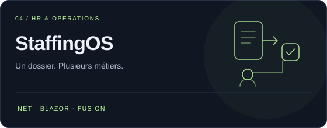
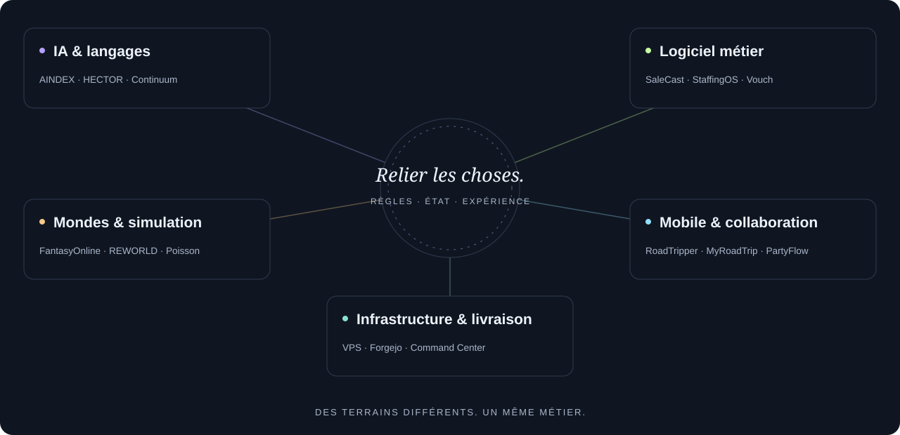

<picture>
  <source media="(prefers-color-scheme: light)" srcset="assets/cover-light.svg">
  
</picture>

<strong>Architecte logiciel · Créateur de produits · Bâtisseur de mondes persistants</strong> Du code qui comprend. Des systèmes qui se relient. Des mondes qui évoluent.

<a href="#atelier">Atelier</a> &nbsp;·&nbsp; <a href="#les-projets">Tous les projets</a> &nbsp;·&nbsp; <a href="https://floriansola.fr/projects">Explorer le portfolio ↗</a> &nbsp;·&nbsp; <a href="README.en.md">English</a>

---

J’aime le point de rencontre entre **la profondeur des systèmes et l’expérience de ceux qui les utilisent**. Un SaaS multi-tenant, un agent IA qui cherche son contexte, un compilateur, un monde vivant ou un voyage partagé posent les mêmes questions : qui porte les règles, comment l’état reste cohérent, et comment rendre le système compréhensible ?

Mon atelier relie **C#/.NET, Rust, TypeScript et C/C++** au logiciel métier, au temps réel, à l’IA, aux moteurs de jeu et à l’infrastructure auto-hébergée. Je travaille du moteur à l’interface, puis des tests à la livraison et à l’exploitation.

### Atelier

<table>
  <tr>
    <td width="50%" valign="top">
      
      
Compréhension du code, contexte de tâche et supervision des agents.

      <a href="https://floriansola.fr/projects/aindex">Explorer le projet ↗</a>
    </td>
    <td width="50%" valign="top">
      
      
Langage, compilateur natif et noyaux WebAssembly.

      <a href="https://floriansola.fr/projects/hector">Explorer le projet ↗</a>
    </td>
  </tr>
  <tr>
    <td width="50%" valign="top">
      
      
Une plateforme SaaS roleplay : Fusion RPC, multi-tenant, serveur FiveM et React.

      <a href="https://floriansola.fr/projects/onerp-framework">Explorer le projet ↗</a>
    </td>
    <td width="50%" valign="top">
      
      
Opérations RH, temps, frais, absences et parcours comptables.

      <a href="https://floriansola.fr/projects/staffingos">Explorer le projet ↗</a>
    </td>
  </tr>
  <tr>
    <td width="50%" valign="top">
      
      
Nouvelle génération : programme commun, carte et parcours mobile.

      <a href="https://floriansola.fr/projects/roadtripper-v2">Explorer le projet ↗</a>
    </td>
    <td width="50%" valign="top">
      
      
Écosystème d’agents, simulation et calcul WebGPU.

      <a href="https://floriansola.fr/projects/poisson-engine">Explorer le projet ↗</a>
    </td>
  </tr>
</table>

### La carte de l’atelier

<picture>
  <source media="(prefers-color-scheme: light)" srcset="assets/atlas-light.svg">
  
</picture>

### Les projets

**34 fiches projets**, organisées par terrain. Ouvre un groupe pour parcourir l’atelier, puis une fiche pour son architecture et son périmètre actuel.

<strong>Moteurs, IA & agents</strong> · 9 projets

| Projet | Le terrain | Repère |
| :--- | :--- | :--- |
| [AINDEX](https://floriansola.fr/projects/aindex) | Compréhension du code, contexte de tâche et supervision des agents. | Développement |
| [HECTOR](https://floriansola.fr/projects/hector) | Langage, compilateur natif et noyaux WebAssembly. | Recherche |
| [Continuum](https://floriansola.fr/projects/continuum) | Apprentissage, navigation et collecte corrective en laboratoire. | Recherche |
| [PromptVault](https://floriansola.fr/projects/promptvault) | Prompts réutilisables, outils d’équipe et gouvernance IA. | Parcours & réalisation |
| [Matchr](https://floriansola.fr/projects/matchr) | Dossiers de candidature, analyse ATS et assistance IA. | Parcours & réalisation |
| [GeopolAI / ModelRisk](https://floriansola.fr/projects/geopolai) | Comparaison de décisions et observation des biais de modèles. | Parcours & réalisation |
| [AISelector](https://floriansola.fr/projects/ai-selector) | Contrats et adaptateurs de fournisseurs IA en C#. | Prototype |
| [Vouch](https://floriansola.fr/projects/vouch) | Questionnaires sécurité et réponses RAG reliées à leurs sources. | Parcours & réalisation |
| [Vision Security Lab](https://floriansola.fr/projects/vision-security-lab) | Vision, comportements d’agents et évaluation contrôlée. | Recherche |

<strong>Produits métier & collaboration</strong> · 7 projets

| Projet | Le terrain | Repère |
| :--- | :--- | :--- |
| [OneRP](https://floriansola.fr/projects/onerp-framework) | Plateforme SaaS roleplay, Fusion RPC et architecture multi-tenant. | Parcours & réalisation |
| [SaleCast](https://floriansola.fr/projects/salecast) | Commerce multicanal, synchronisation et prévisions métier. | Parcours & réalisation |
| [StaffingOS](https://floriansola.fr/projects/staffingos) | Opérations RH, temps, frais, absences et parcours comptables. | Développement |
| [MyRoadTrip](https://floriansola.fr/projects/myroadtrip) | Première génération : voyages collaboratifs et usages hors-ligne. | Parcours & réalisation |
| [RoadTripper V2](https://floriansola.fr/projects/roadtripper-v2) | Nouvelle génération : programme commun, carte et parcours mobile. | Développement |
| [PartyFlow](https://floriansola.fr/projects/partyflow) | Exploration mobile avec Vue, Ionic et Capacitor. | Prototype |
| [Racine](https://floriansola.fr/projects/racine) | Souvenirs, liens familiaux et espace partagé privé. | Parcours & réalisation |

<strong>Mondes, jeux & simulation</strong> · 13 projets

| Projet | Le terrain | Repère |
| :--- | :--- | :--- |
| [FantasyOnline](https://floriansola.fr/projects/fantasy-online) | MMORPG fantasy Unity et services .NET autoritaires. | Développement |
| [FantasyOnline.Shared](https://floriansola.fr/projects/fantasy-online-shared) | Socle de contrats, services et adaptateurs réutilisables. | Développement |
| [Nexus / Reclaim City](https://floriansola.fr/projects/nexus) | Reclaim City : récupération, district privé et ville partagée sur Roblox. | Développement |
| [SurvivalKingdom](https://floriansola.fr/projects/survival-kingdom) | RPG de survie Unreal, serveur de zone et backend .NET. | Développement |
| [SURVIVALACFU](https://floriansola.fr/projects/survival-acfu) | Prototype Unreal : intégration ACF Ultimate et systèmes SurvivalKingdom. | Prototype |
| [REWORLD](https://floriansola.fr/projects/reworld) | Géographie, placement, fédérations et atlas navigateur. | Développement |
| [MANDATE EARTH](https://floriansola.fr/projects/mandate-earth) | Plans agentiques, ressources, logistique et coopération. | Développement |
| [Symbiont](https://floriansola.fr/projects/symbiont) | Colonie, ressources et écologie d’un monde vivant. | Prototype |
| [Poisson](https://floriansola.fr/projects/poisson-engine) | Écosystème d’agents, simulation et calcul WebGPU. | Parcours & réalisation |
| [Ultra RP · s&box](https://floriansola.fr/projects/ultra-rp-sbox) | Systèmes roleplay, interfaces et backend pour s&box. | Parcours & réalisation |
| [Development Tycoon](https://floriansola.fr/projects/development-tycoon) | Contribution à un jeu de gestion Unity. | Collaboration |
| [Red Dead Roleplay](https://floriansola.fr/projects/red-dead-roleplay) | Contribution à un projet roleplay C# client/serveur. | Collaboration |
| [V-Multi / SARP](https://floriansola.fr/projects/gaming-platform) | V-Multi / SARP : fondations réseau et exploitation multijoueur. | Parcours & réalisation |

<strong>Infrastructure, outils & parcours</strong> · 5 projets

| Projet | Le terrain | Repère |
| :--- | :--- | :--- |
| [VPS Command Center](https://floriansola.fr/projects/vps-command-center) | Cockpit, télémétrie, journaux et livraison des services. | Exploitation |
| [Infrastructure auto-hébergée](https://floriansola.fr/projects/self-hosted-infrastructure) | Linux, Forgejo, CI sur VPS, déploiement et reprise. | Exploitation |
| [Portfolio Engineering](https://floriansola.fr/projects/portfolio-engineering) | Patterns et composants réutilisables issus des produits. | Parcours & réalisation |
| [Gecko / IoT](https://floriansola.fr/projects/gecko-iot) | Parcours professionnel : firmware C/FreeRTOS et IoT. | Parcours & réalisation |
| [Intégrations & archives](https://floriansola.fr/projects/integrations-archives) | Printer, PrestaShop, MobileGame, UnrealCSharp, intégrations de dépenses et CV web. | Archives & intégrations |

Le portfolio rassemble produits, parcours professionnel, collaborations, recherche, prototypes et archives. Le code est souvent privé ; les liens ouvrent les présentations publiques. Les repères de recherche et de développement décrivent le périmètre du travail.

### Le métier derrière les projets

| Ce que je construis | Ce à quoi je fais attention |
| :--- | :--- |
| **Systèmes & logiciel métier** | Règles de domaine, contrats, transactions et frontières entre tenants. |
| **IA & outils de développement** | Contexte, évaluation, preuves de travail et supervision humaine. |
| **Jeux & simulation** | Autorité, persistance, comportements collectifs et performance. |
| **Interfaces & exploitation** | Parcours lisibles, observabilité, livraison et reprise. |

<code>C# / .NET</code> <code>Rust</code> <code>TypeScript</code> <code>C / C++</code> <code>Fusion</code> <code>Blazor</code> <code>React</code> <code>Vue</code> <code>PostgreSQL</code> <code>Unity</code> <code>Unreal</code> <code>Roblox / Luau</code> <code>WebGPU</code> <code>LLVM / WASM</code> <code>Linux</code> <code>Docker</code> <code>Forgejo</code> <code>GitHub Actions</code>

---

<strong>Une idée difficile à concrétiser ?</strong> Parlons du système, de ses contraintes et de la prochaine étape utile.  <a href="https://floriansola.fr/#contact"><strong>Ouvrir la discussion ↗</strong></a> &nbsp;·&nbsp; <a href="https://floriansola.fr/projects">Parcourir tout l’atelier</a>

Comprendre en profondeur. Relier les choses. Construire avec intention.

