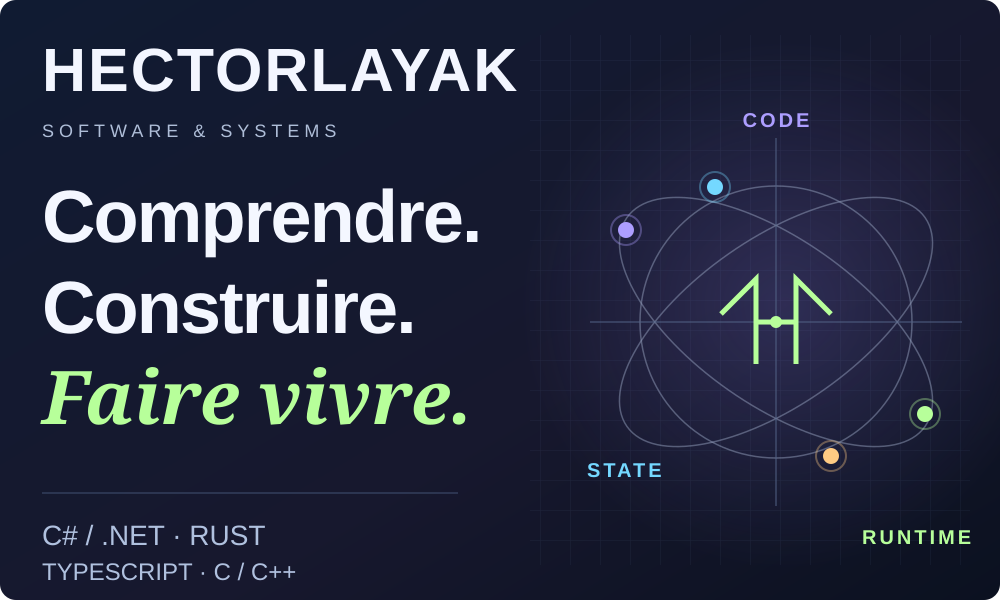
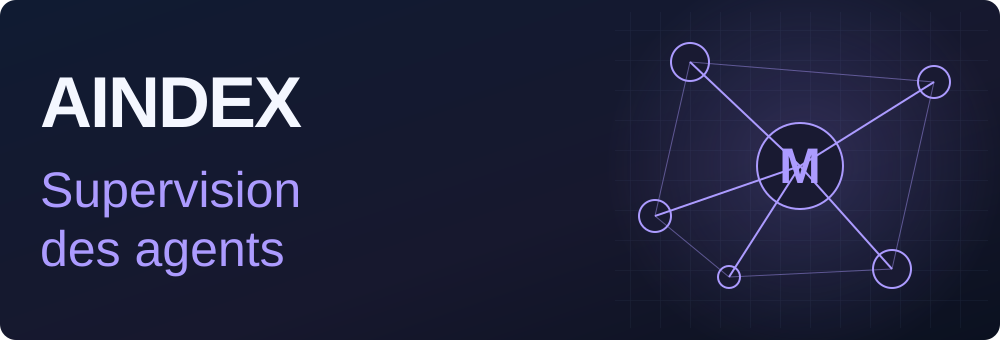
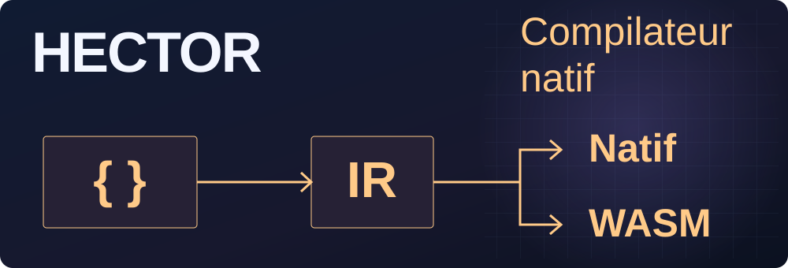
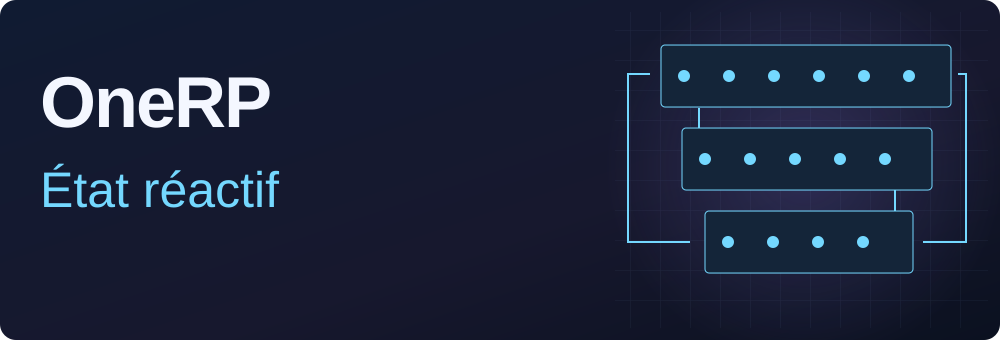
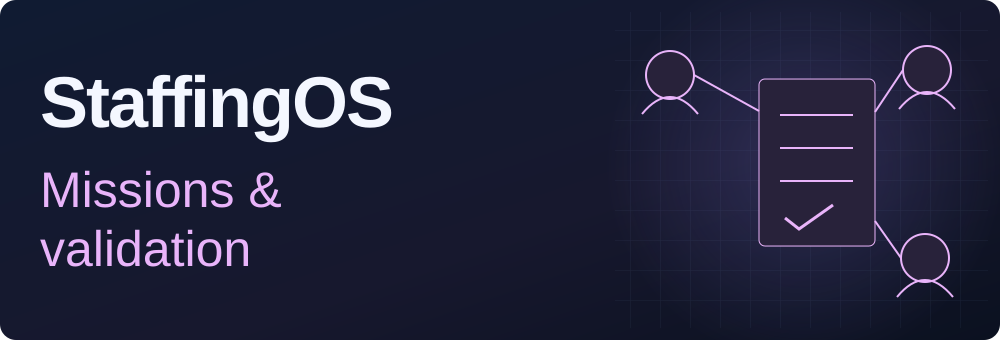
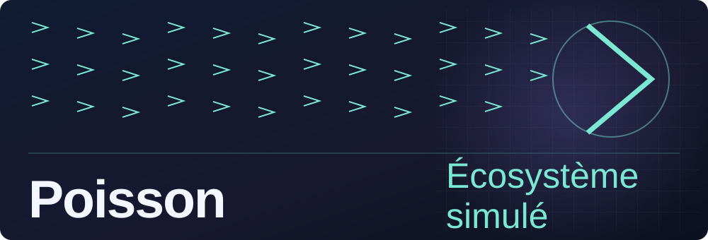
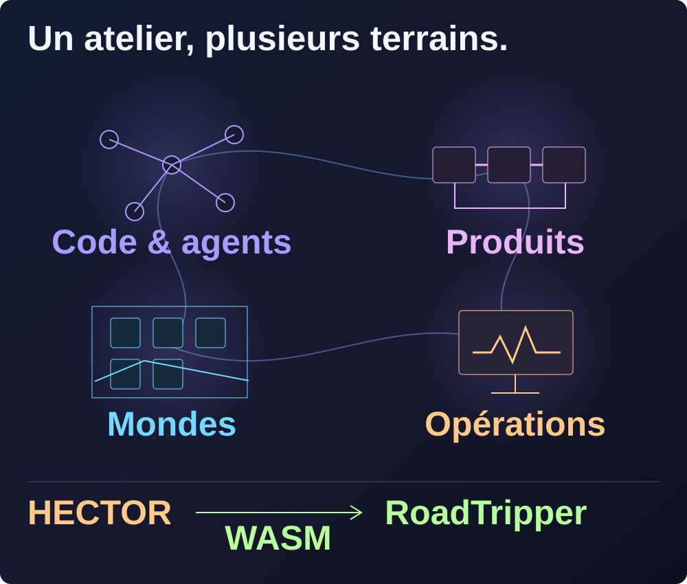

<a href="#projets-choisis">Six projets</a> · <a href="#la-carte-de-latelier">La carte</a> · <a href="#tout-latelier">33 projets</a> · <a href="https://floriansola.fr">Studio &amp; services ↗</a> · <a href="README.en.md">English</a>

Je construis des outils d’IA appliquée, des plateformes .NET et des systèmes temps réel. Mes projets explorent l’orchestration d’agents, les contrats exécutables, les moteurs réseau et la simulation, avec un fil rouge : maîtriser l’état, les performances et les frontières entre composants.

**C# / .NET · Rust · Python · TypeScript · C / C++**

## Projets choisis

AINDEX organise le travail des agents autour du projet : missions, contexte du dépôt, changements et vérifications. Le moteur Rust porte l’autorité ; le Studio donne aux humains une vue commune pour superviser et décider.

Architecture et parcours

**Une autorité de projet.** Le moteur Rust possède les tâches, les réservations, les validations et leur provenance. Le Studio, l’extension et la passerelle présentent ces contrats ; les interfaces restent alignées sur la même autorité.

**Le contexte arrive au moment utile.** Une capsule rassemble le contrat complet de la mission et une sélection de références courantes. Un adaptateur d’hôte peut la fournir lors des événements de travail ; la lecture aindex_context sert de point d’accès quand un rafraîchissement est nécessaire.

1. Relier un objectif à une mission, à son périmètre et aux règles du dépôt.
2. Fournir à l’agent le contexte utile au moment du travail : contrats, dépendances, références et état observé.
3. Suivre les changements et l’activité dans une supervision humaine commune au Studio et à ses lecteurs.
4. Examiner les vérifications, résoudre les contradictions et prendre la décision d’intégration.

[Explorer le projet ↗](projects/aindex.md)

HECTOR est un langage et un compilateur natif pour auteurs humains et agents. Types, effets et contrats accompagnent des noyaux métier exécutables en natif et WebAssembly.

Architecture et parcours

**Le compilateur porte la sémantique.** Les unités json, syntax, foundation, core et driver sont écrites en Hector. Le bootstrap reconstruit la chaîne depuis ses seeds ; LLVM assure l’émission native. Les lanceurs dirigent vers cette même autorité.

**Des contrats observables.** Préconditions, postconditions, effets et identités de source accompagnent l’analyse et l’exécution. Les faits du checker alimentent les contrôles de sélection et de compatibilité avec une référence.

1. Écrire un comportement en Hector avec ses types, effets et clauses de contrat.
2. Analyser les sources avec le compilateur natif et examiner les faits produits par le checker.
3. Construire une bibliothèque native ou WebAssembly pour un consommateur externe.
4. Comparer les interfaces et les propriétés de publication, puis qualifier le parcours sur son hôte cible.

[Explorer le projet ↗](projects/hector.md)

OneRP associe un backend SaaS, une administration et des modules FiveM. Personnages, économie, inventaires, véhicules, logements et activités partagent des services métier réactifs et des interfaces React en jeu.

Architecture et parcours

**Un état métier réactif.** Fusion relie les lectures à leurs dépendances. Les mutations invalident les données concernées ; les sentinelles propres au joueur limitent les recalculs au périmètre utile.

**Des opérations économiques transactionnelles.** Les modèles de mutation ouvrent des contextes d'opération et prévoient une isolation sérialisable pour les écritures concurrentes. Les filtres d'instance et contrôles de lecture accompagnent les services métier.

1. Créer et configurer une instance de serveur depuis l'administration.
2. Accueillir le joueur, choisir son personnage et suivre son arrivée dans le monde.
3. Interagir avec les métiers, inventaires, banques, véhicules et logements.
4. Faire valider les actions par les services métier du serveur.
5. Suivre les états et administrer les instances depuis les interfaces connectées.

[Explorer le projet ↗](projects/onerp-framework.md)

StaffingOS relie les missions chez les clients, les temps, les frais et les absences aux étapes de validation et de préparation financière. Les espaces salarié et gestionnaire partagent les dossiers et leurs règles d'accès.

Architecture et parcours

**Un dossier, plusieurs responsabilités.** Le salarié, le responsable, les RH et la comptabilité interviennent sur les mêmes dossiers avec des droits et des périmètres explicites. Les règles de mission, de temps et d'absence sont partagées entre interfaces.

**Des écritures traçables.** La création d'une mission associe empreinte de commande, versions, audit et événements durables dans une transaction. Les reprises distinguent une nouvelle action du rejeu d'une action déjà enregistrée.

1. Enregistrer le client, son site, le besoin et la personne affectée.
2. Créer la mission avec ses dates et ses versions tarifaires.
3. Saisir les temps, frais et demandes d'absence depuis les espaces autorisés.
4. Examiner les demandes et exceptions dans les circuits de validation.
5. Préparer les lots de prépaie et préfacturation, puis enregistrer les preuves de règlement.

[Explorer le projet ↗](projects/staffingos.md)

Un carnet de voyage partagé pour construire ses journées, explorer les lieux sur une carte, organiser le groupe et suivre ses dépenses. Le copilote propose des changements que les voyageurs peuvent relire avant de les adopter.

Architecture et parcours

**Le jour reste le point d'ancrage.** L'accueil, le programme et la carte partagent la journée et les identifiants d'étapes. Sur mobile, la prochaine action précède les outils secondaires ; une fiche se consulte avant d'être modifiée.

**Un calcul commun au client et au serveur.** Le domaine du carnet reste indépendant de l'interface. Hector, compilé en WebAssembly, porte les calculs déterministes de planning, budget et progression ; la passerelle valide à nouveau les données reçues.

1. Composer le voyage — Créer un carnet avec les dates et les préférences, répartir les étapes par journée, puis ajouter les lieux, pauses et nuitées.
2. Passer du programme à la carte — Choisir une journée, ouvrir une étape en lecture et la retrouver sur la carte sans perdre sa sélection. Calculer ou actualiser le trajet quand un fournisseur est configuré.
3. Préparer le départ ensemble — Inviter les membres avec un rôle, affecter les voyageurs aux voitures, vérifier la préparation et rassembler réservations, documents et budget.
4. Faire évoluer le parcours — Proposer un lieu au groupe ou demander au copilote un détour. Relire les changements sur le carnet courant avant leur adoption ; partager sa position seulement après accord.
5. Garder les comptes lisibles — Enregistrer les dépenses, leurs parts et les remboursements déclarés ; distinguer les montants engagés, estimés et réellement saisis.

[Explorer le projet ↗](projects/roadtripper.md)

Poisson simule bancs, prédation, métabolisme et mutations dans le navigateur. Le moteur sépare le calcul WebGPU/CPU du rendu WebGL/Canvas2D et sert des modes d’observation, de sandbox et de jeu.

Architecture et parcours

**Calcul et rendu évoluent séparément.** WebGPU accélère le calcul de simulation, avec un chemin CPU quand il est indisponible. Le rendu choisit WebGL ou Canvas2D. Cette séparation permet d’adapter le travail et la présentation aux capacités du navigateur.

**Organiser les données pour le parallélisme.** Tableaux typés, structures SoA, grille spatiale, prefix-sum et réordonnancement rapprochent les agents voisins en mémoire. Le pipeline GPU traite les forces de banc et de chasse avant l’intégration physique.

1. Choisir un mode et observer les bancs, prédateurs et ressources de l’écosystème.
2. Modifier les paramètres et suivre les effets sur les déplacements, l’énergie et la reproduction.
3. Explorer génétique, mutations et rapports entre espèces.
4. Jouer avec progression, capacités, missions et économie, ou inspecter la simulation.

[Explorer le projet ↗](projects/poisson-engine.md)

## La carte de l’atelier

**Un lien concret entre les terrains :** RoadTripper utilise Hector en WebAssembly pour ses calculs de planning, de budget et de progression.

## Tout l’atelier

**33 projets**, organisés en quatre terrains. Produits, recherche, outils et collaborations.

<strong>Moteurs, IA & agents</strong> · 9 projets

| Projet | Domaine |
| :--- | :--- |
| [AINDEX](projects/aindex.md) | Les agents opèrent. Les humains supervisent le projet. |
| [HECTOR](projects/hector.md) | Un langage pour exprimer les comportements, compiler et examiner les contrats. |
| [Continuum](projects/continuum.md) | Apprendre à naviguer, puis mesurer les décisions dans un laboratoire reproductible. |
| [PromptVault](projects/promptvault.md) | Transformer les prompts d’une équipe en outils réutilisables |
| [Matchr](projects/matchr.md) | Une offre, un CV ciblé, un dossier de candidature suivi. |
| [ModelRisk Observatory · GeopolAI](projects/geopolai.md) | Comparer les réponses de modèles IA sur des scénarios contrôlés |
| [AISelector](projects/ai-selector.md) | Un contrat commun pour appeler plusieurs fournisseurs IA |
| [Vouch](projects/vouch.md) | Préparer des réponses de sécurité à partir de sources traçables |
| [Vision Security Lab](projects/vision-security-lab.md) | Observer des comportements automatisés à partir de l’image. |

<strong>Produits métier & collaboration</strong> · 6 projets

| Projet | Domaine |
| :--- | :--- |
| [OneRP](projects/onerp-framework.md) | Un socle SaaS pour exploiter des mondes roleplay FiveM. |
| [SaleCast](projects/salecast.md) | Relier les canaux de vente et préparer le prochain réapprovisionnement. |
| [StaffingOS](projects/staffingos.md) | Relier missions, temps, frais et préparation des sorties financières. |
| [RoadTripper](projects/roadtripper.md) | Un programme commun, une carte et un copilote pour voyager à plusieurs. |
| [PartyFlow](projects/partyflow.md) | Créer un salon, réunir les joueurs et enchaîner les défis |
| [Racine](projects/racine.md) | Un espace familial pour garder les liens et les souvenirs |

<strong>Mondes, jeux & simulation</strong> · 13 projets

| Projet | Domaine |
| :--- | :--- |
| [FantasyOnline](projects/fantasy-online.md) | Un monde fantasy persistant, du terrain généré aux règles serveur. |
| [FantasyOnline.Shared](projects/fantasy-online-shared.md) | Partager les contrats et les règles, avec une adoption explicite par jeu. |
| [Nexus / Reclaim City](projects/nexus.md) | Récupérer des épaves et reconstruire un district à son image. |
| [SurvivalKingdom](projects/survival-kingdom.md) | Relier la survie, un monde multijoueur et les services qui le font durer. |
| [SurvivalUnreal](projects/survival-unreal.md) | Un monde de survie relié à ses propres services de jeu. |
| [REWORLD](projects/reworld.md) | Composer un atlas, relier ses territoires et écrire leur histoire. |
| [MANDATE EARTH](projects/mandate-earth.md) | Préparer un plan, engager des ressources et en suivre les conséquences. |
| [Symbiont](projects/symbiont.md) | Faire grandir une colonie sans épuiser le monde qui la nourrit. |
| [Poisson Engine](projects/poisson-engine.md) | Un écosystème vivant simulé dans le navigateur. |
| [Ultra RP](projects/ultra-rp-sbox.md) | Un monde roleplay s&box, du métier du joueur aux outils d’exploitation |
| [Development Tycoon](projects/development-tycoon.md) | Concevoir la croissance d’un studio logiciel comme un jeu de gestion. |
| [Red Dead Roleplay](projects/red-dead-roleplay.md) | Composer un monde roleplay autour des personnages et des interactions. |
| [V-Multi / SARP](projects/gaming-platform.md) | Un parcours fondateur dans le multijoueur et les mondes communautaires. |

<strong>Infrastructure, outils & parcours</strong> · 5 projets

| Projet | Domaine |
| :--- | :--- |
| [VPS Command Center](projects/vps-command-center.md) | Relier la santé des services aux décisions d’exploitation. |
| [Infrastructure auto-hébergée](projects/self-hosted-infrastructure.md) | Organiser l’hébergement, la livraison et la reprise des produits. |
| [Portfolio Engineering](projects/portfolio-engineering.md) | Transformer les problèmes récurrents en composants réutilisables. |
| [Gecko IoT](projects/gecko-iot.md) | Une expérience professionnelle au contact du logiciel embarqué. |
| [Intégrations & archives](projects/integrations-archives.md) | Conserver les adaptateurs, les essais et les premières versions. |

---

[Studio & services](https://floriansola.fr) · [Notes et articles](https://floriansola.fr/blog) · [English](README.en.md)
