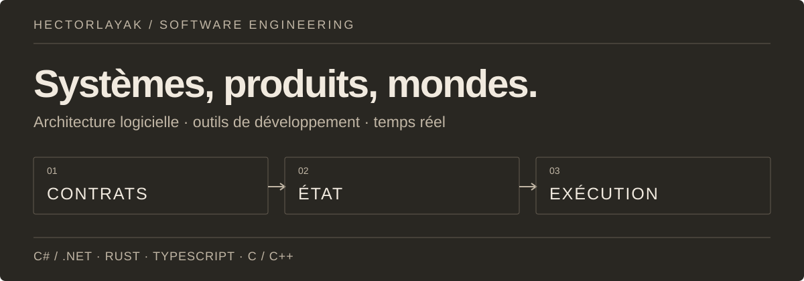
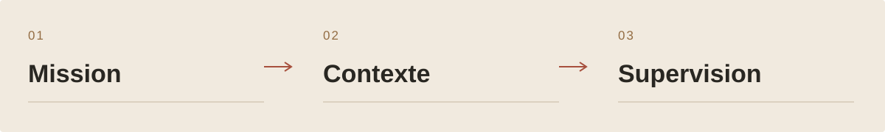
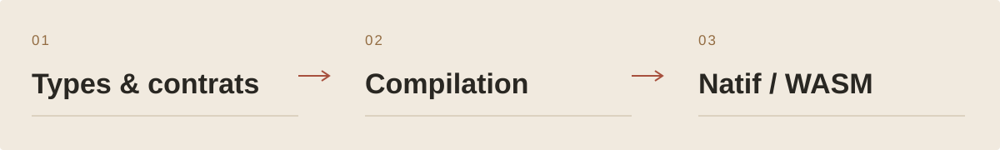
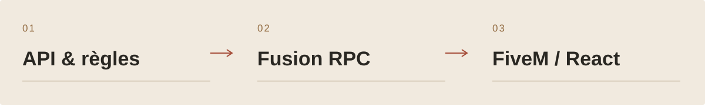
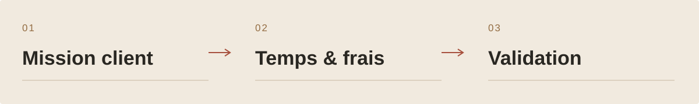
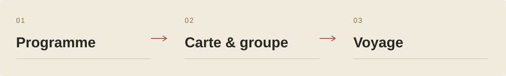
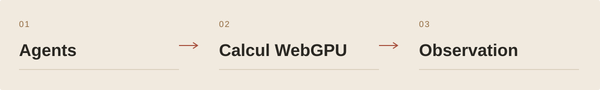

<picture>
  <source media="(prefers-color-scheme: light)" srcset="assets/editorial/identity-fr-light.svg">
  
</picture>

<strong>Architecture logicielle · outils de développement · systèmes temps réel</strong>

<a href="#six-projets-pour-entrer-dans-latelier">Projets choisis</a> · <a href="#inventaire-de-latelier">Inventaire complet</a> · <a href="https://floriansola.fr">Site personnel ↗</a> · <a href="README.en.md">English</a>

Je construis des logiciels où **le modèle, les règles et l'expérience doivent tenir ensemble** : plateformes métier, outils pour comprendre le code, langages, jeux en réseau et simulations. Mon terrain va de l'exécution bas niveau à l'interface, avec les contrats et la cohérence de l'état comme fil conducteur.

**C# / .NET · Rust · TypeScript · C / C++**  
Fusion RPC, React, Vue, Unity, Unreal, WebGPU, LLVM / WebAssembly, Linux et infrastructure auto-hébergée.

## Six projets pour entrer dans l'atelier

### 01 / AINDEX

AINDEX organise le travail des agents autour du projet : missions, contexte du dépôt, changements et vérifications. Le moteur Rust porte l’autorité ; le Studio donne aux humains une vue commune pour superviser et décider.

**Une autorité de projet.** Le moteur Rust possède les tâches, les réservations, les validations et leur provenance. Le Studio, l’extension et la passerelle présentent ces contrats ; les interfaces restent alignées sur la même autorité.

Parcours du produit

1. Relier un objectif à une mission, à son périmètre et aux règles du dépôt.
2. Fournir à l’agent le contexte utile au moment du travail : contrats, dépendances, références et état observé.
3. Suivre les changements et l’activité dans une supervision humaine commune au Studio et à ses lecteurs.
4. Examiner les vérifications, résoudre les contradictions et prendre la décision d’intégration.

[Architecture et projet ↗](https://floriansola.fr/projects/aindex)

### 02 / HECTOR

HECTOR est un langage et un compilateur natif pour auteurs humains et agents. Types, effets et contrats accompagnent des noyaux métier exécutables en natif et WebAssembly.

**Le compilateur porte la sémantique.** Les unités json, syntax, foundation, core et driver sont écrites en Hector. Le bootstrap reconstruit la chaîne depuis ses seeds ; LLVM assure l’émission native. Les lanceurs dirigent vers cette même autorité.

Parcours du produit

1. Écrire un comportement en Hector avec ses types, effets et clauses de contrat.
2. Analyser les sources avec le compilateur natif et examiner les faits produits par le checker.
3. Construire une bibliothèque native ou WebAssembly pour un consommateur externe.
4. Comparer les interfaces et les propriétés de publication, puis qualifier le parcours sur son hôte cible.

[Architecture et projet ↗](https://floriansola.fr/projects/hector)

### 03 / OneRP

OneRP associe un backend SaaS, une administration et des modules FiveM. Personnages, économie, inventaires, véhicules, logements et activités partagent des services métier réactifs et des interfaces React en jeu.

**Un état métier réactif.** Fusion relie les lectures à leurs dépendances. Les mutations invalident les données concernées ; les sentinelles propres au joueur limitent les recalculs au périmètre utile.

Parcours du produit

1. Créer et configurer une instance de serveur depuis l'administration.
2. Accueillir le joueur, choisir son personnage et suivre son arrivée dans le monde.
3. Interagir avec les métiers, inventaires, banques, véhicules et logements.
4. Faire valider les actions par les services métier du serveur.

[Architecture et projet ↗](https://floriansola.fr/projects/onerp-framework)

### 04 / StaffingOS

StaffingOS relie les missions chez les clients, les temps, les frais et les absences aux étapes de validation et de préparation financière. Les espaces salarié et gestionnaire partagent les dossiers et leurs règles d'accès.

**Un dossier, plusieurs responsabilités.** Le salarié, le responsable, les RH et la comptabilité interviennent sur les mêmes dossiers avec des droits et des périmètres explicites. Les règles de mission, de temps et d'absence sont partagées entre interfaces.

Parcours du produit

1. Enregistrer le client, son site, le besoin et la personne affectée.
2. Créer la mission avec ses dates et ses versions tarifaires.
3. Saisir les temps, frais et demandes d'absence depuis les espaces autorisés.
4. Examiner les demandes et exceptions dans les circuits de validation.

[Architecture et projet ↗](https://floriansola.fr/projects/staffingos)

### 05 / RoadTripper

Un carnet de voyage partagé pour construire ses journées, explorer les lieux sur une carte, organiser le groupe et suivre ses dépenses. Le copilote propose des changements que les voyageurs peuvent relire avant de les adopter.

**Le jour reste le point d'ancrage.** L'accueil, le programme et la carte partagent la journée et les identifiants d'étapes. Sur mobile, la prochaine action précède les outils secondaires ; une fiche se consulte avant d'être modifiée.

Parcours du produit

1. Composer le voyage
2. Passer du programme à la carte
3. Préparer le départ ensemble
4. Faire évoluer le parcours

[Architecture et projet ↗](https://floriansola.fr/projects/roadtripper)

### 06 / Poisson Engine

Poisson simule bancs, prédation, métabolisme et mutations dans le navigateur. Le moteur sépare le calcul WebGPU/CPU du rendu WebGL/Canvas2D et sert des modes d’observation, de sandbox et de jeu.

**Calcul et rendu évoluent séparément.** WebGPU accélère le calcul de simulation, avec un chemin CPU quand il est indisponible. Le rendu choisit WebGL ou Canvas2D. Cette séparation permet d’adapter le travail et la présentation aux capacités du navigateur.

Parcours du produit

1. Choisir un mode et observer les bancs, prédateurs et ressources de l’écosystème.
2. Modifier les paramètres et suivre les effets sur les déplacements, l’énergie et la reproduction.
3. Explorer génétique, mutations et rapports entre espèces.
4. Jouer avec progression, capacités, missions et économie, ou inspecter la simulation.

[Architecture et projet ↗](https://floriansola.fr/projects/poisson-engine)

## Questions d'ingénierie

| Terrain | Ce que je travaille |
| :--- | :--- |
| **Contrats & domaine** | Invariants métier, transactions, frontières de tenants et formes des données. |
| **IA & outils** | Recherche de contexte, évaluation et contrôle de l'exécution des agents. |
| **Temps réel & mondes** | Autorité serveur, persistance, synchronisation et comportements collectifs. |
| **Interfaces & exploitation** | Parcours utilisateur, observabilité, livraison et reprise. |

## Inventaire de l'atelier

**33 projets**, des produits métier aux moteurs, en passant par la recherche, les collaborations et les outils. Chaque lien mène à la présentation du projet.

<strong>Moteurs, IA & agents</strong> · 9 projets

| Projet | Domaine |
| :--- | :--- |
| [AINDEX](https://floriansola.fr/projects/aindex) | Les agents opèrent. Les humains supervisent le projet. |
| [HECTOR](https://floriansola.fr/projects/hector) | Un langage pour exprimer les comportements, compiler et examiner les contrats. |
| [Continuum](https://floriansola.fr/projects/continuum) | Apprendre à naviguer, puis mesurer les décisions dans un laboratoire reproductible. |
| [PromptVault](https://floriansola.fr/projects/promptvault) | Transformer les prompts d’une équipe en outils réutilisables |
| [Matchr](https://floriansola.fr/projects/matchr) | Une offre, un CV ciblé, un dossier de candidature suivi. |
| [GeopolAI / ModelRisk](https://floriansola.fr/projects/geopolai) | Comparaison de décisions et observation des biais de modèles. |
| [AISelector](https://floriansola.fr/projects/ai-selector) | Un contrat commun pour appeler plusieurs fournisseurs IA |
| [Vouch](https://floriansola.fr/projects/vouch) | Préparer des réponses de sécurité à partir de sources traçables |
| [Vision Security Lab](https://floriansola.fr/projects/vision-security-lab) | Observer des comportements automatisés à partir de l’image. |

<strong>Produits métier & collaboration</strong> · 6 projets

| Projet | Domaine |
| :--- | :--- |
| [OneRP](https://floriansola.fr/projects/onerp-framework) | Un socle SaaS pour exploiter des mondes roleplay FiveM. |
| [SaleCast](https://floriansola.fr/projects/salecast) | Relier les canaux de vente et préparer le prochain réapprovisionnement. |
| [StaffingOS](https://floriansola.fr/projects/staffingos) | Relier missions, temps, frais et préparation des sorties financières. |
| [RoadTripper](https://floriansola.fr/projects/roadtripper) | Un programme commun, une carte et un copilote pour voyager à plusieurs. |
| [PartyFlow](https://floriansola.fr/projects/partyflow) | Créer un salon, réunir les joueurs et enchaîner les défis |
| [Racine](https://floriansola.fr/projects/racine) | Un espace familial pour garder les liens et les souvenirs |

<strong>Mondes, jeux & simulation</strong> · 13 projets

| Projet | Domaine |
| :--- | :--- |
| [FantasyOnline](https://floriansola.fr/projects/fantasy-online) | Un monde fantasy persistant, du terrain généré aux règles serveur. |
| [FantasyOnline.Shared](https://floriansola.fr/projects/fantasy-online-shared) | Partager les contrats et les règles, avec une adoption explicite par jeu. |
| [Nexus / Reclaim City](https://floriansola.fr/projects/nexus) | Reclaim City : récupération, district privé et ville partagée sur Roblox. |
| [SurvivalKingdom](https://floriansola.fr/projects/survival-kingdom) | Relier la survie, un monde multijoueur et les services qui le font durer. |
| [Survival Unreal](https://floriansola.fr/projects/survival-acfu) | Systèmes Unreal : serveur de zone, HUD et progression. |
| [REWORLD](https://floriansola.fr/projects/reworld) | Composer un atlas, relier ses territoires et écrire leur histoire. |
| [MANDATE EARTH](https://floriansola.fr/projects/mandate-earth) | Préparer un plan, engager des ressources et en suivre les conséquences. |
| [Symbiont](https://floriansola.fr/projects/symbiont) | Faire grandir une colonie sans épuiser le monde qui la nourrit. |
| [Poisson Engine](https://floriansola.fr/projects/poisson-engine) | Un écosystème vivant simulé dans le navigateur. |
| [Ultra RP](https://floriansola.fr/projects/ultra-rp-sbox) | Un monde roleplay s&box, du métier du joueur aux outils d’exploitation |
| [Development Tycoon](https://floriansola.fr/projects/development-tycoon) | Concevoir la croissance d’un studio logiciel comme un jeu de gestion. |
| [Red Dead Roleplay](https://floriansola.fr/projects/red-dead-roleplay) | Composer un monde roleplay autour des personnages et des interactions. |
| [V-Multi / SARP](https://floriansola.fr/projects/gaming-platform) | Un parcours fondateur dans le multijoueur et les mondes communautaires. |

<strong>Infrastructure, outils & parcours</strong> · 5 projets

| Projet | Domaine |
| :--- | :--- |
| [VPS Command Center](https://floriansola.fr/projects/vps-command-center) | Relier la santé des services aux décisions d’exploitation. |
| [Infrastructure auto-hébergée](https://floriansola.fr/projects/self-hosted-infrastructure) | Organiser l’hébergement, la livraison et la reprise des produits. |
| [Portfolio Engineering](https://floriansola.fr/projects/portfolio-engineering) | Transformer les problèmes récurrents en composants réutilisables. |
| [Gecko IoT](https://floriansola.fr/projects/gecko-iot) | Une expérience professionnelle au contact du logiciel embarqué. |
| [Intégrations & archives](https://floriansola.fr/projects/integrations-archives) | Conserver les adaptateurs, les essais et les premières versions. |

---

[Site personnel](https://floriansola.fr) · [Notes et articles](https://floriansola.fr/blog) · [English](README.en.md)
