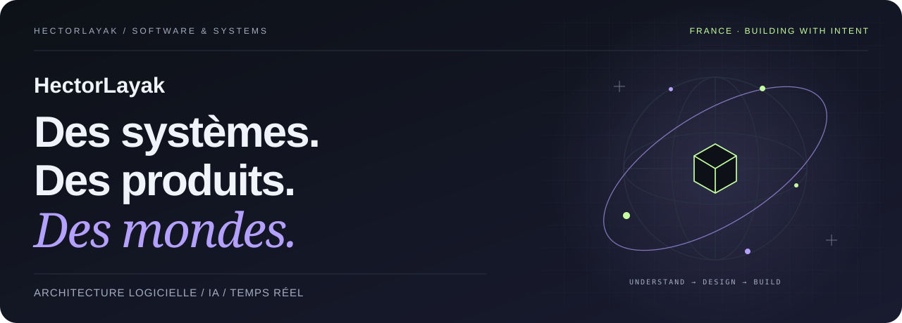
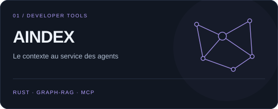
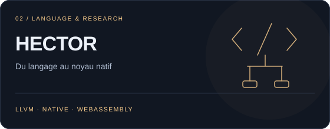
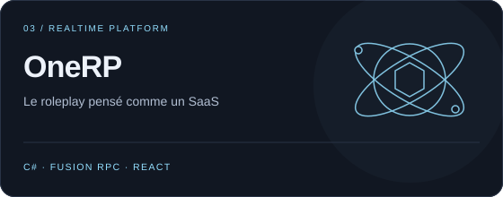
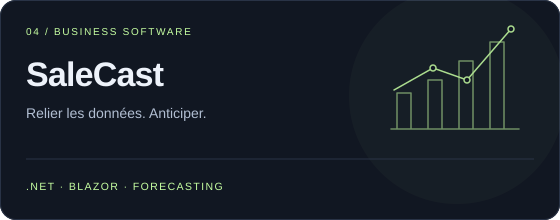
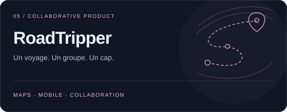
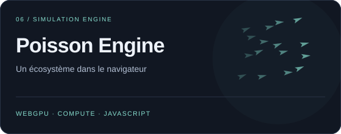

<picture>
  <source media="(prefers-color-scheme: light)" srcset="assets/cover-light.svg">
  
</picture>

  <strong>Développeur senior C#/.NET · Architecte logiciel · Créateur de produits</strong> 
  France · Du logiciel métier aux systèmes temps réel, de l’IA aux mondes simulés.

  <a href="https://floriansola.fr"><strong>Portfolio</strong></a> &nbsp;·&nbsp;
  <a href="https://floriansola.fr/cv">Parcours & CV</a> &nbsp;·&nbsp;
  <a href="README.en.md">English version ↗</a>

---

### Construire ce qui relie les choses.

Un produit devient intéressant quand plusieurs difficultés se rencontrent : des données qui doivent rester cohérentes, des utilisateurs qui collaborent, une IA qui doit comprendre son contexte, un monde qui continue de vivre quand on le quitte.

C’est là que j’aime travailler. **Je relie la profondeur des systèmes à la clarté du produit** : concevoir le moteur, comprendre les règles métier, soigner l’interface et préparer l’exploitation. Mon terrain va de **C#/.NET et du temps réel** à **Rust, l’outillage pour agents et la simulation**.

Depuis mes premiers projets multijoueurs en 2016, j’ai traversé le logiciel métier, les configurateurs, le mobile télécom et le firmware IoT. Aujourd’hui, je développe des SaaS, des outils de développement et des projets de recherche, avec la même attention portée à l’architecture et à l’expérience utilisateur. [Mon parcours →](https://floriansola.fr/cv)

### Une sélection de mon atelier

<table>
  <tr>
    <td width="50%" valign="top">
      
      
Donner aux agents une compréhension persistante du code : graphes de dépendances, contexte pertinent et liens entre changements, tâches et preuves. Un travail sur <strong>ce que l’agent doit savoir pour agir</strong>.

      <a href="https://aindex.floriansola.fr">Découvrir AINDEX ↗</a>
    </td>
    <td width="50%" valign="top">
      
      
Explorer un langage et un compilateur pour les humains et les agents, avec des noyaux natifs et WebAssembly. <strong>Continuum</strong> prolonge cette recherche vers l’apprentissage et la navigation.

      Recherche en cours · HECTOR & Continuum
    </td>
  </tr>
  <tr>
    <td width="50%" valign="top">
      
      
Penser le roleplay comme une plateforme : backend .NET, <strong>Fusion RPC</strong>, isolation des instances, modules FiveM et interfaces React. Le métier, l’autorité serveur et le temps réel dans une même architecture.

      <a href="https://floriansola.fr/projects/onerp-framework">Lire le projet ↗</a>
    </td>
    <td width="50%" valign="top">
      
      
Rapprocher commerce multicanal, synchronisation et prévisions dans un SaaS .NET/Blazor. Autre terrain métier : <strong>StaffingOS</strong>, consacré aux opérations RH, aux validations et aux parcours comptables.

      <a href="https://floriansola.fr/projects/salecast">Lire le projet ↗</a>
    </td>
  </tr>
  <tr>
    <td width="50%" valign="top">
      
      
Transformer un voyage à plusieurs en un programme partagé : étapes, carte, collaboration et expérience mobile. Du premier <strong>MyRoadTrip</strong> aux nouvelles itérations de RoadTripper, le terrain relie géographie et produit.

      <a href="https://floriansola.fr/projects/myroadtrip">Lire le projet ↗</a>
    </td>
    <td width="50%" valign="top">
      
      
Faire émerger un écosystème à partir d’agents et de règles : simulation, indexation spatiale et calcul <strong>WebGPU</strong>. Une rencontre entre performance, comportement collectif et rendu navigateur.

      <a href="https://poisson.floriansola.fr/demo/">Explorer la démo ↗</a> · <a href="https://floriansola.fr/projects/poisson-engine">Architecture ↗</a>
    </td>
  </tr>
</table>

Cette sélection rassemble des produits, des missions et de la R&D à des stades différents. Une grande partie du code est privée ; les liens ouvrent les présentations publiques ou les démos disponibles.

### Le reste du terrain

**IA dans le produit** — [PromptVault](https://floriansola.fr/projects/promptvault) pour transformer des prompts en outils d’équipe ; [Matchr](https://floriansola.fr/projects/matchr) pour les candidatures et l’analyse ATS ; [GeopolAI / ModelRisk](https://floriansola.fr/projects/geopolai) pour explorer et comparer les décisions de modèles.

**Jeux et mondes persistants** — FantasyOnline et son socle partagé Unity/Roblox, SurvivalKingdom sous Unreal, les cartes de REWORLD, la stratégie de MANDATE EARTH, l’écologie de Symbiont et les systèmes roleplay s&box. Des projets en développement où je travaille les règles, les états persistants et les interactions.

**L’infrastructure derrière** — Linux, Docker, Caddy, PostgreSQL, Forgejo et GitHub Actions sur VPS. Je m’intéresse aussi à ce qui fait vivre le logiciel après le commit : déploiements reproductibles, observabilité, sauvegardes et procédures de reprise.

### Ce que j’apporte à un projet

| Terrain | Ma manière d’aborder le problème |
| :--- | :--- |
| **Architecture & métier** | Définir les responsabilités, les contrats et les règles qui doivent rester vraies. |
| **Temps réel & données** | Travailler l’autorité serveur, l’invalidation, la synchronisation et les transactions. |
| **IA & outils** | Relier contexte, comportement, évaluation et supervision humaine. |
| **Produit & livraison** | Relier l’interface au métier, puis les tests et le déploiement au comportement attendu. |

  <code>C# / .NET</code> <code>Rust</code> <code>TypeScript</code> <code>C / C++</code> 
  <code>ActualLab Fusion</code> <code>Blazor</code> <code>React</code> <code>Vue</code> <code>PostgreSQL</code> 
  <code>Unity</code> <code>Unreal Engine</code> <code>WebGPU</code> <code>LLVM / WASM</code> <code>Linux / Docker</code>

---

  <strong>Un produit à créer, un système à repenser, une idée difficile à concrétiser ?</strong> 
  Parlons architecture, contraintes et prochaines étapes.  
  <a href="https://floriansola.fr/#contact">Me contacter</a>

Comprendre en profondeur. Construire avec intention.

