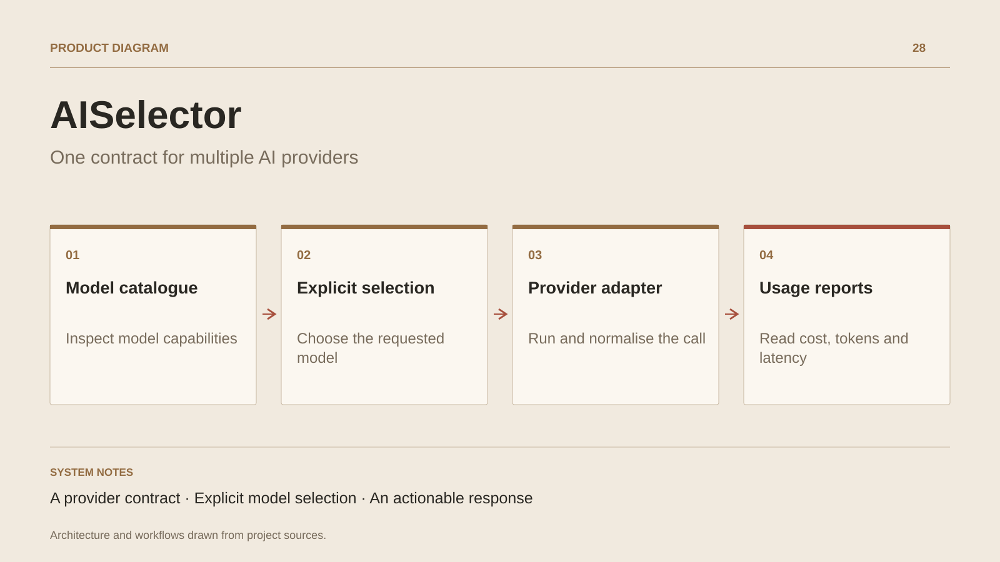

# AISelector

**One contract for multiple AI providers**

[All projects](../README.en.md#the-whole-workshop) · [Français](ai-selector.md)

AISelector provides one interface for several AI-provider APIs. The calling application browses the catalogue, selects a model and submits a prompt. The service validates the model, finds a compatible adapter and forwards parameters to the provider.

The normalized response combines text, model, provider, token usage, calculated cost and measured latency. A tracking service groups usage by tenant identifier and model to generate reports. Those records are stored in memory in this prototype.

The project demonstrates separation between application contracts and external formats. Routing follows the explicitly requested model. Usage tracking stays in memory and costs are calculated from the service configuration.

## Journey

1. Browse the model catalogue and its characteristics.
2. Send a request with an explicitly selected model.
3. The provider adapter executes the call and normalizes the response.
4. Read tokens, calculated cost and latency; inspect usage reports.

## Design decisions

### A provider contract

IAiProvider exposes model support and request execution. Adapters isolate API-specific formats.

### Explicit model selection

The service finds the requested model in its registry, then selects a compatible provider. The caller can understand the routing decision.

## Technology

C# · ASP.NET Core · AI · Dependency injection

**Status :** Backend prototype · AI contracts and adapters.

[Back to the workshop](../README.en.md#the-whole-workshop) · [Studio & services ↗](https://floriansola.fr/en)
