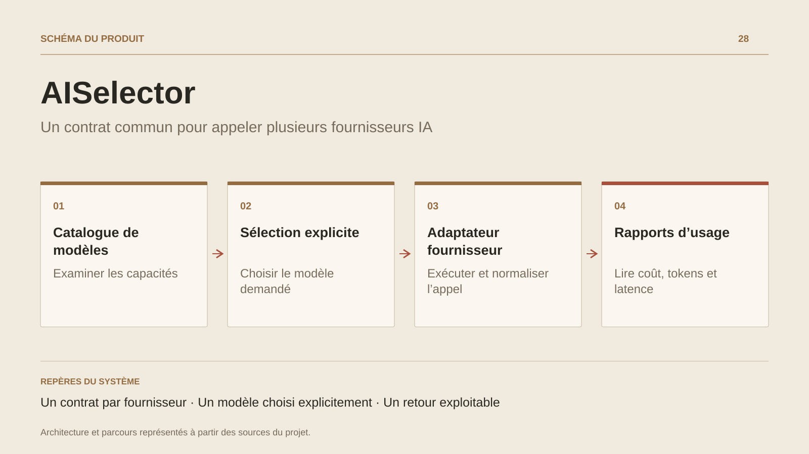

# AISelector

**Un contrat commun pour appeler plusieurs fournisseurs IA**

[Tous les projets](../README.md#tout-latelier) · [English](ai-selector.en.md)

AISelector fournit une interface commune aux APIs de plusieurs fournisseurs IA. L’application appelante consulte le catalogue, choisit un modèle et envoie son prompt. Le service valide le modèle, retrouve l’adaptateur compatible et transmet les paramètres au fournisseur.

La réponse normalisée rassemble le texte, le modèle, le fournisseur, les tokens utilisés, le coût calculé et la latence mesurée. Un service de suivi regroupe les usages par identifiant de tenant et par modèle pour produire des rapports. Ces enregistrements sont conservés en mémoire dans ce prototype.

Le projet illustre la séparation entre contrat applicatif et formats externes. Le routage suit le modèle explicitement demandé. Le suivi des usages est conservé en mémoire et les coûts sont calculés à partir de la configuration du service.

## Parcours

1. Consulter le catalogue des modèles et leurs caractéristiques.
2. Envoyer une requête en choisissant explicitement un modèle.
3. L’adaptateur du fournisseur exécute l’appel et normalise la réponse.
4. Lire les tokens, le coût calculé et la latence ; consulter le rapport d’usage.

## Décisions de conception

### Un contrat par fournisseur

IAiProvider expose la capacité à prendre en charge un modèle et l’exécution de la requête. Les adaptateurs isolent les formats propres à chaque API.

### Un modèle choisi explicitement

Le service retrouve le modèle demandé dans son registre puis sélectionne un fournisseur compatible. Ce parcours rend le choix lisible pour l’appelant.

## Technologies

C# · ASP.NET Core · IA · Dependency injection

**État :** Prototype backend · contrats et adaptateurs IA.

[Retour à l’atelier](../README.md#tout-latelier) · [Studio & services ↗](https://floriansola.fr)
