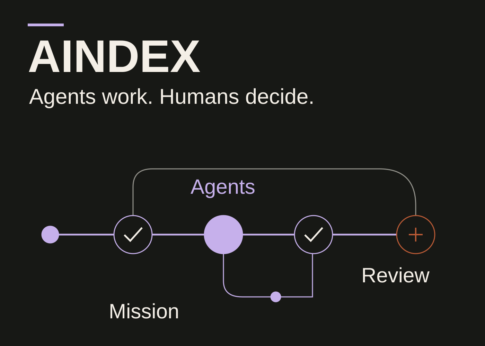
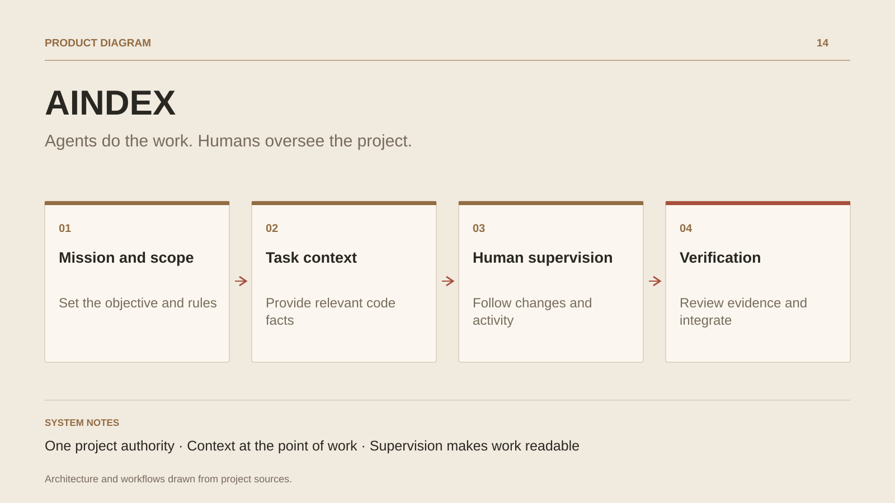

# AINDEX

**Agents do the work. Humans oversee the project.**

[All projects](../README.en.md#the-whole-workshop) · [Français](aindex.md)

AINDEX connects project objectives to agent work and human decisions. Planning, missions, context, code, verification and execution form one product: a repository becomes a workspace whose rules, dependencies and evidence remain available to inspect.

The native engine owns tasks, reservations and validation. Its current observations feed a context layer that assembles the mission contract and useful references. Changes in sessions, files or work situations can trigger a new capsule, with identity, revision and freshness checks supporting its composition.

Humans follow progress through Studio and its viewers: changes, agent activity, mission relationships, context provenance and items requiring attention. An extension brings these observations into the editor. A remote gateway controls private reads by organization; account, team and license services form a separate boundary from source code authority.

The product brings together agentic project management, repository understanding and human supervision. Integration workflows prepare an independent copy, run authorized checks and present their results for a decision.

## Journey

1. Connect an objective to a mission, its scope and the repository’s rules.
2. Give the agent useful context when work happens: contracts, dependencies, references and observed state.
3. Follow changes and agent activity through the supervision components shared by Studio and its viewers.
4. Inspect verification results, resolve contradictions and make the integration decision.

## Design decisions

### One project authority

The Rust engine owns tasks, reservations, validation and provenance. Studio, the extension and the gateway present these contracts, keeping every interface aligned with the same authority.

### Context at the point of work

A capsule combines the complete mission contract with selected current references. A host adapter can supply it on work events; aindex_context provides a reading entry point when a refresh is needed.

## Technology

Rust · TypeScript · PostgreSQL · Studio · Editor extension

**Status :** In development · native engine and human supervision.

[Back to the workshop](../README.en.md#the-whole-workshop) · [Studio & services ↗](https://floriansola.fr/en)
