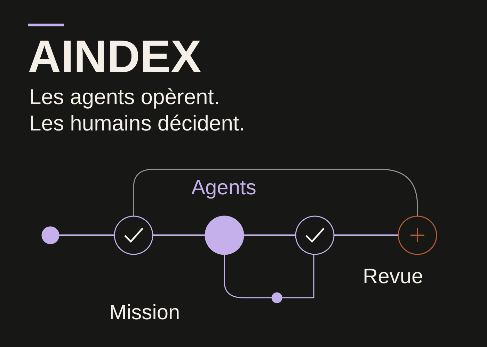
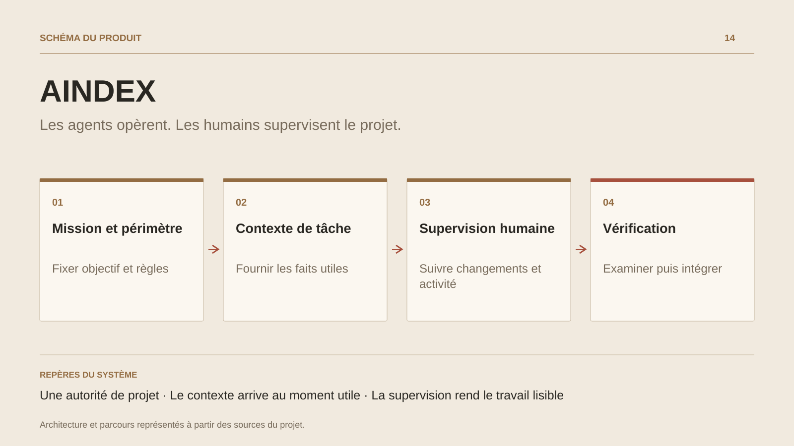

# AINDEX

**Les agents opèrent. Les humains supervisent le projet.**

[Tous les projets](../README.md#tout-latelier) · [English](aindex.en.md)

AINDEX relie l’objectif d’un projet au travail des agents et aux décisions humaines. Ses parcours de pilotage, missions, contexte, code, vérification et exécution composent un même produit : le dépôt devient un espace de travail dont les règles, les dépendances et les preuves restent consultables.

Le moteur natif conserve l’autorité sur les tâches, les réservations et les validations. Il fournit les observations courantes à une couche de contexte qui rassemble le contrat de la mission et les références utiles. Les changements de session, de fichiers ou de situation peuvent déclencher une nouvelle capsule ; les contrôles d’identité, de révision et de fraîcheur accompagnent sa composition.

L’humain suit la progression depuis le Studio et ses surfaces de consultation : changements, activité des agents, relations entre missions, provenance du contexte et éléments à examiner. L’extension rapproche ces informations de l’éditeur. La passerelle distante encadre les lectures privées par organisation ; les services de compte, d’équipe et de licence constituent une frontière séparée de l’autorité sur le code.

Le développement associe ainsi orchestration agentique, compréhension du dépôt et supervision humaine. Les parcours d’intégration préparent une copie indépendante, exécutent les vérifications autorisées et présentent leurs résultats à la décision.

## Parcours

1. Relier un objectif à une mission, à son périmètre et aux règles du dépôt.
2. Fournir à l’agent le contexte utile au moment du travail : contrats, dépendances, références et état observé.
3. Suivre les changements et l’activité dans une supervision humaine commune au Studio et à ses lecteurs.
4. Examiner les vérifications, résoudre les contradictions et prendre la décision d’intégration.

## Décisions de conception

### Une autorité de projet

Le moteur Rust possède les tâches, les réservations, les validations et leur provenance. Le Studio, l’extension et la passerelle présentent ces contrats ; les interfaces restent alignées sur la même autorité.

### Le contexte arrive au moment utile

Une capsule rassemble le contrat complet de la mission et une sélection de références courantes. Un adaptateur d’hôte peut la fournir lors des événements de travail ; la lecture aindex_context sert de point d’accès quand un rafraîchissement est nécessaire.

## Technologies

Rust · TypeScript · PostgreSQL · Studio · Extension éditeur

**État :** En développement · moteur natif et supervision humaine.

[Retour à l’atelier](../README.md#tout-latelier) · [Studio & services ↗](https://floriansola.fr)
