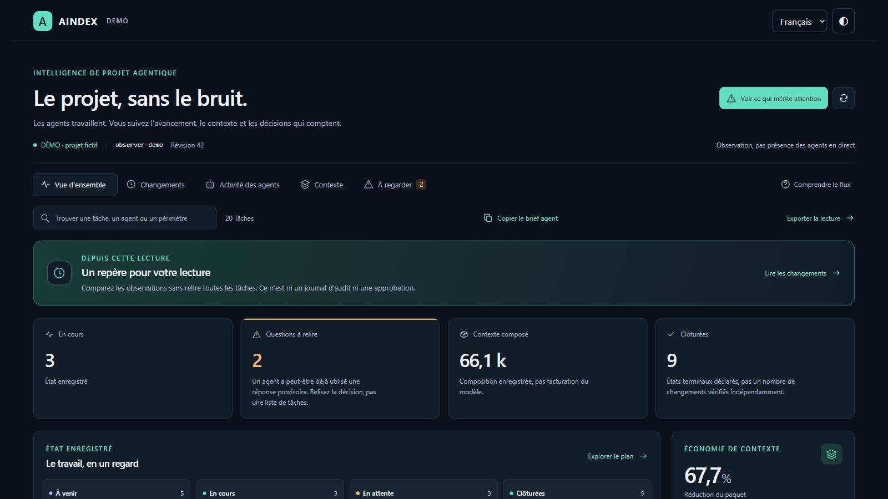

# AINDEX

**Confier le travail aux agents. Garder la maîtrise du projet.**

[Tous les projets](../README.md#tout-latelier) · [English](aindex.en.md)

AINDEX organise le développement avec des agents autour d’un même projet. Un objectif devient des missions reliées à un périmètre, aux dépendances du code et aux décisions à prendre. L’équipe peut suivre le travail, examiner les changements et intervenir là où son jugement compte.

Le moteur Rust indexe les symboles et leurs relations. Il compose un contexte ciblé à partir de la mission, de l’état du dépôt et des références utiles. La capsule accompagne le travail de l’agent ; le Studio et l’extension permettent à l’humain de comprendre sa provenance et ce qui a changé.

La supervision rassemble avancement, activité, contexte, questions et vérifications. L’atelier d’intégration prépare un espace indépendant pour examiner un changement. Le compte commercial, les licences et les accès d’équipe complètent le produit avec une frontière distincte de l’autorité sur le code.

## Parcours

1. Relier un objectif à une mission, à son périmètre et aux règles du dépôt.
2. Fournir à l’agent le contexte utile au moment du travail : contrats, dépendances, références et état observé.
3. Suivre les changements et l’activité dans une supervision humaine commune au Studio et à ses lecteurs.
4. Examiner les vérifications, résoudre les contradictions et prendre la décision d’intégration.

## Décisions de conception

### Une mission reliée au code

Objectif, périmètre et dépendances partagent le même contexte. L’index relie symboles, appels et références utiles au travail demandé.

### Le bon contexte au bon moment

Une capsule rassemble les obligations et les sources pertinentes. Sa provenance et sa fraîcheur restent consultables pendant la mission.

### La supervision au service de la décision

Le Studio montre ce qui avance, ce qui change et ce qui mérite attention. L’équipe retrouve questions, résultats et éléments de revue dans le même parcours.

**État :** En développement · moteur natif et supervision humaine.

[Studio & services ↗](https://floriansola.fr/projects/aindex)
