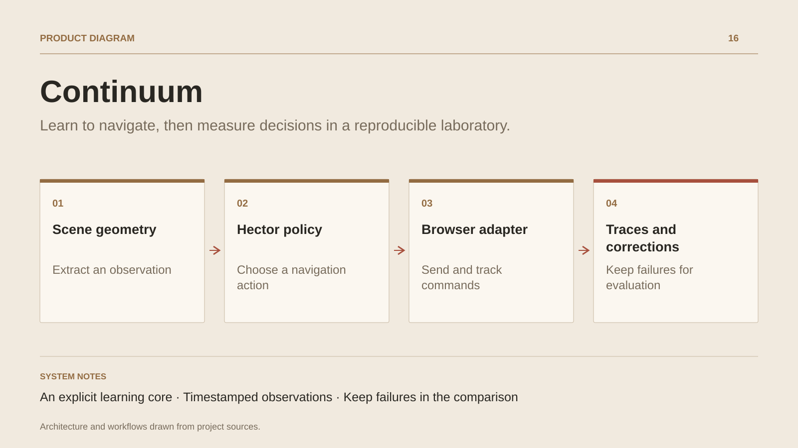

# Continuum

**Learn to navigate, then measure decisions in a reproducible laboratory.**

[All projects](../README.en.md#the-whole-workshop) · [Français](continuum.md)

Continuum connects a scene observation to a decision and then a command executed in a controlled environment. Its current slice learns a navigation policy in Hector: shape perception provides useful geometry, the network selects a direction and a browser adapter sends the keys.

Campaigns compare imitation and corrective collection, retain failures and separate training from evaluation. The project also investigates stale observations, asynchronous races and command refusals.

Other laboratory tasks retain classical controllers; learned navigation is the documented experimental slice.

## Journey

1. **Define an experiment.** Choose a controlled environment, a navigation model and campaign seeds.
2. **Observe and act.** Extract scene geometry, calculate a direction and track the command sent by the adapter.
3. **Collect corrections.** Retain failure situations and teacher interventions to enrich learning.
4. **Evaluate again.** Compare policies on evaluation-only environments, then inspect traces and reproducibility.

## Design decisions

### An explicit learning core

Network, training and simulator are written in Hector. Node.js handles campaigns and host adaptation.

### Timestamped observations

Observation age is part of the policy input. Asynchronous commands and refusals distinguish intended actions from confirmed effects.

## Technology

HECTOR · Node.js · Chromium · Machine learning

**Status :** Applied research · learning and navigation.

[Back to the workshop](../README.en.md#the-whole-workshop) · [Studio & services ↗](https://floriansola.fr/en)
