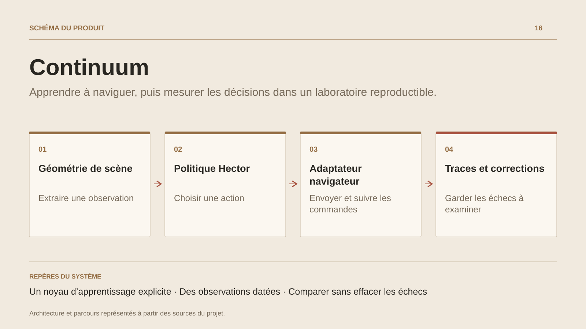

# Continuum

**Apprendre à naviguer, puis mesurer les décisions dans un laboratoire reproductible.**

[Tous les projets](../README.md#tout-latelier) · [English](continuum.en.md)

Continuum relie une observation de scène à une décision puis à une commande exécutée dans un environnement contrôlé. La tranche actuelle apprend une politique de navigation en Hector : une perception de formes fournit la géométrie utile, le réseau choisit une direction et l’adaptateur navigateur transmet les touches.

Des campagnes comparent imitation et collecte corrective, conservent les échecs et séparent entraînement et évaluation. Le projet étudie aussi les observations vieillies, les courses asynchrones et les refus de commande.

Les autres tâches du laboratoire gardent leurs contrôleurs classiques ; la navigation apprise constitue la tranche expérimentale documentée.

## Parcours

1. **Définir une expérience.** Choisir un environnement contrôlé, un modèle de navigation et les graines de la campagne.
2. **Observer et agir.** Extraire la géométrie de la scène, calculer une direction et suivre la commande envoyée par l’adaptateur.
3. **Collecter les corrections.** Conserver les situations d’échec et les interventions de l’enseignant pour enrichir l’apprentissage.
4. **Évaluer à nouveau.** Comparer les politiques sur des environnements réservés à l’évaluation, puis examiner traces et reproductibilité.

## Décisions de conception

### Un noyau d’apprentissage explicite

Réseau, entraînement et simulateur sont écrits en Hector. Node.js assure les campagnes et les adaptations d’hôte.

### Des observations datées

L’âge des observations fait partie de l’entrée de politique. Les commandes asynchrones et leurs refus sont suivis pour distinguer une intention d’un effet confirmé.

## Technologies

HECTOR · Node.js · Chromium · Apprentissage machine

**État :** Recherche appliquée · apprentissage et navigation.

[Retour à l’atelier](../README.md#tout-latelier) · [Studio & services ↗](https://floriansola.fr)
