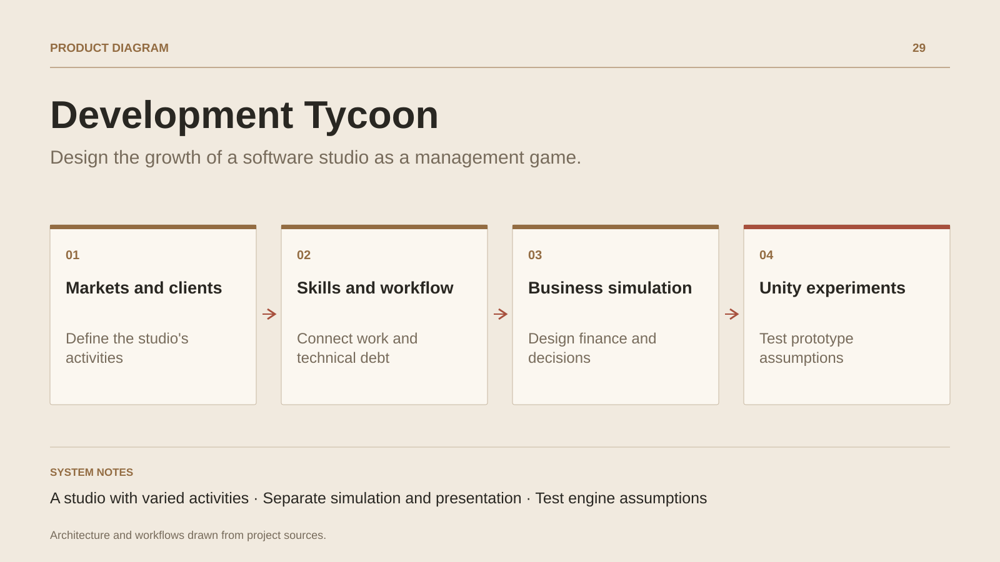

# Development Tycoon

**Design the growth of a software studio as a management game.**

[All projects](../README.en.md#the-whole-workshop) · [Français](development-tycoon.md)

Development Tycoon explores running a software development studio. The player starts by doing the work, then organises a team, manages a portfolio and develops several activities. Planned markets range from web and SaaS to embedded software, games and AI.

Current work focuses on design: business models, clients, reputation, projects, quality, technical debt, skills, employee needs and finance. The documents connect these systems to edge cases, acceptance criteria and a simulation architecture.

The collaboration has produced a GDD foundation and proposed decisions, with targeted Unity technical checks. The project is at the Systems Design stage; gameplay sources and a playable loop remain to be built.

## Journey

1. Define the studio’s markets, clients and business models.
2. Connect skills, workflow, technical debt and finance.
3. Formalise the simulation, architecture decisions and future prototype criteria.

## Design decisions

### A studio with varied activities

Planned verticals cover web, applications, SaaS, games, tools, embedded software and AI. Each carries its own economic constraints and skills.

### Separate simulation and presentation

The proposed architecture exposes snapshots to rendering and accepts serialisable commands. Time types, monetary arithmetic and random streams have documented decisions.

## Technology

Unity · C# · Game design

**Status :** Collaborative project · Unity management game.

[Back to the workshop](../README.en.md#the-whole-workshop) · [Studio & services ↗](https://floriansola.fr/en)
