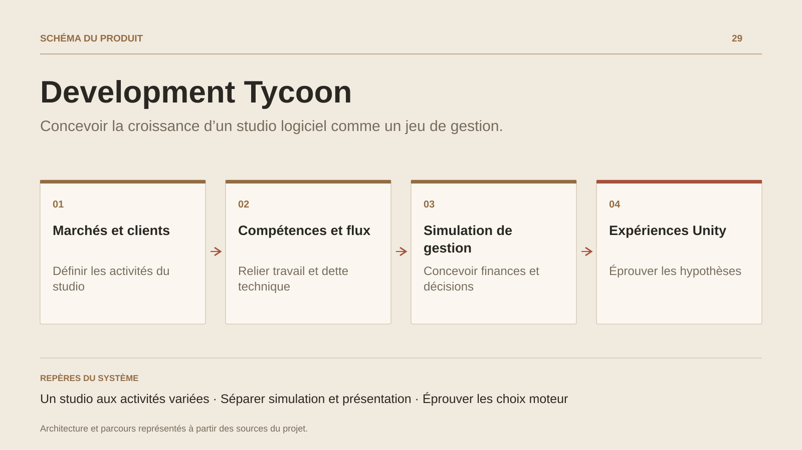

# Development Tycoon

**Concevoir la croissance d’un studio logiciel comme un jeu de gestion.**

[Tous les projets](../README.md#tout-latelier) · [English](development-tycoon.en.md)

Development Tycoon explore la gestion d’un studio de développement logiciel. Le joueur commence à produire lui-même, puis organise une équipe, arbitre un portefeuille et développe plusieurs activités. Les marchés prévus vont du web au SaaS, de l’embarqué aux jeux et à l’IA.

Le travail actuel porte sur la conception : modèles économiques, clients, réputation, projets, qualité, dette technique, compétences, besoins des employés et finances. Les documents relient ces systèmes à leurs cas limites, à leurs critères d’acceptation et à une architecture de simulation.

La collaboration a produit un socle de GDD et de décisions proposées, accompagné de vérifications techniques Unity ciblées. Le chantier est à l’étape Systems Design ; les sources de gameplay et une boucle jouable restent à construire.

## Parcours

1. Définir les marchés, les clients et les modèles économiques du studio.
2. Relier compétences, flux de travail, dette technique et finances.
3. Formaliser la simulation, les décisions d’architecture et les critères du futur prototype.

## Décisions de conception

### Un studio aux activités variées

Les verticales envisagées couvrent le web, les applications, le SaaS, les jeux, les outils, l’embarqué et l’IA. Elles ont leurs propres contraintes économiques et compétences.

### Séparer simulation et présentation

L’architecture proposée expose des instantanés au rendu et reçoit des commandes sérialisables. Les types de temps, l’arithmétique monétaire et les flux aléatoires ont des décisions documentées.

## Technologies

Unity · C# · Game design

**État :** Projet collaboratif · jeu de gestion sous Unity.

[Retour à l’atelier](../README.md#tout-latelier) · [Studio & services ↗](https://floriansola.fr)
