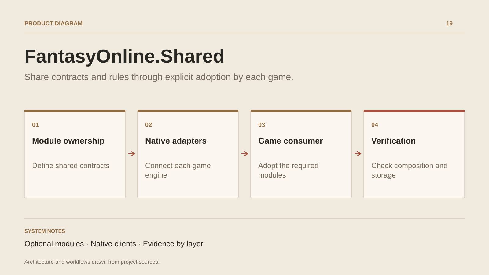

# FantasyOnline.Shared

**Share contracts and rules through explicit adoption by each game.**

[All projects](../README.en.md#the-whole-workshop) · [Français](fantasy-online-shared.md)

FantasyOnline.Shared organises reuse around genuinely shared responsibilities: gameplay rules, contracts, application services, persistence, web components and tooling. Modules are optional; each game keeps its content, identity and composition.

The C# backend holds reusable rules and services. Persistence adapters are explicitly adopted by consumers, which retain responsibility for their migrations. The contract compiler produces bounded C#/Luau profiles, while Unity and Roblox keep native clients.

Documentation separates evidence: canonical source ownership, consumer composition, deterministic checks, contracts and isolated PostgreSQL scenarios. Targeted adoptions are documented in FantasyOnline and Nexus; ecosystem-wide and native user-flow validation remain separate work.

## Journey

1. Define the module, its contracts and ownership.
2. Integrate it into an identified consumer.
3. Check composition, contracts and the relevant persistence paths.

## Design decisions

### Optional modules

Each game adopts the modules it needs. Content, identity and deployment remain owned by the consuming game.

### Native clients

Unity retains C# and Roblox retains Luau. Generation produces contracts and integration glue, using engine-specific adapters.

## Technology

C# · .NET · Luau · PostgreSQL · Code generation

**Status :** In development · shared contracts and services.

[Back to the workshop](../README.en.md#the-whole-workshop) · [Studio & services ↗](https://floriansola.fr/en)
