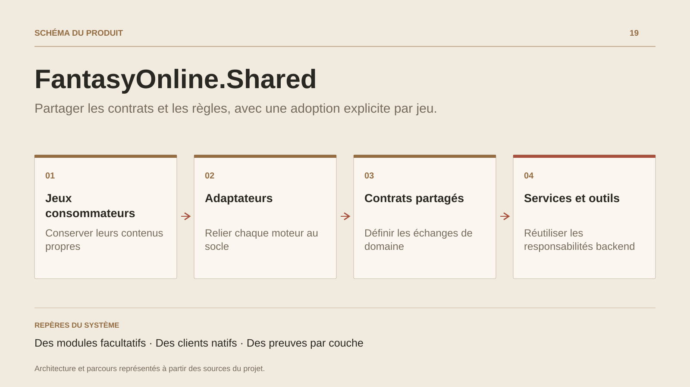

# FantasyOnline.Shared

**Partager les contrats et les règles, avec une adoption explicite par jeu.**

[Tous les projets](../README.md#tout-latelier) · [English](fantasy-online-shared.en.md)

FantasyOnline.Shared organise la mutualisation au niveau des responsabilités réellement communes : règles de gameplay, contrats, services applicatifs, persistance, composants web et outillage. Les modules sont facultatifs ; chaque jeu conserve son contenu, son identité et sa composition.

Le backend C# accueille les règles et les services réutilisables. Les adaptateurs de persistance sont adoptés explicitement par les consommateurs, qui gardent la responsabilité de leurs migrations. Le compilateur de contrats produit des profils C#/Luau bornés, tandis que Unity et Roblox conservent leurs clients natifs.

Les documents séparent les preuves : propriété canonique du code, composition du consommateur, tests déterministes, contrats et scénarios PostgreSQL isolés. Des adoptions ciblées sont documentées dans FantasyOnline et Nexus ; la validation de tout l’écosystème et des parcours natifs reste un chantier distinct.

## Parcours

1. Définir le module, ses contrats et son propriétaire.
2. Intégrer le module dans un consommateur identifié.
3. Vérifier la composition, les contrats et les chemins de persistance concernés.

## Décisions de conception

### Des modules facultatifs

Chaque jeu adopte les modules utiles à son besoin. Contenu, identité et déploiement restent portés par le jeu consommateur.

### Des clients natifs

Unity conserve son C# et Roblox son Luau. La génération produit des contrats et leur glue d’intégration, avec des adaptateurs propres au moteur.

## Technologies

C# · .NET · Luau · PostgreSQL · Code generation

**État :** En développement · contrats et services communs.

[Retour à l’atelier](../README.md#tout-latelier) · [Studio & services ↗](https://floriansola.fr)
