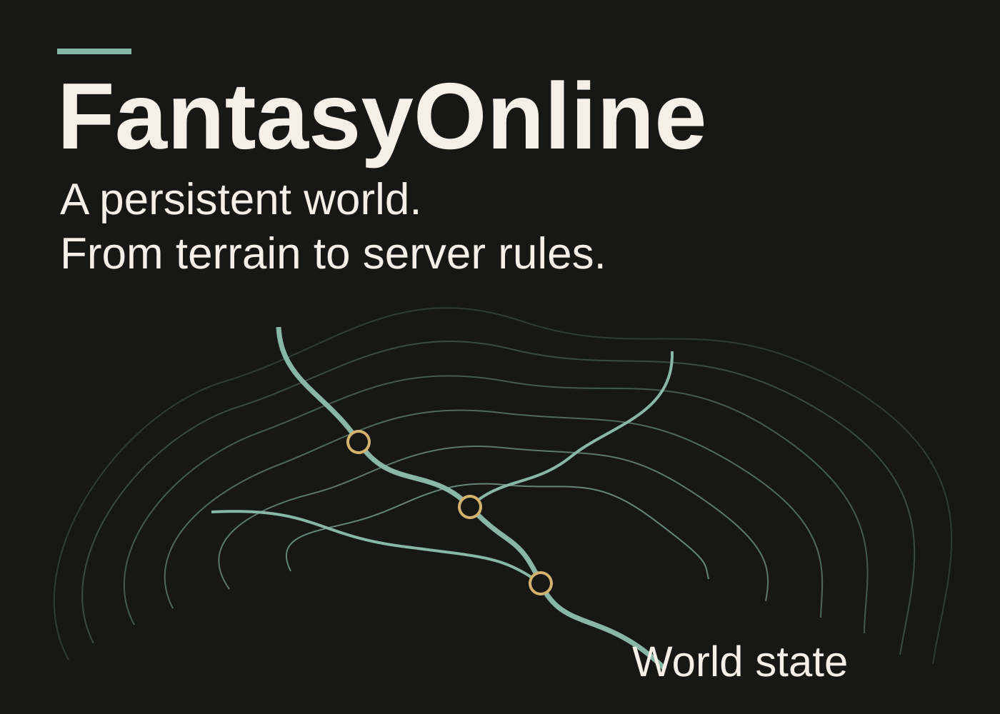
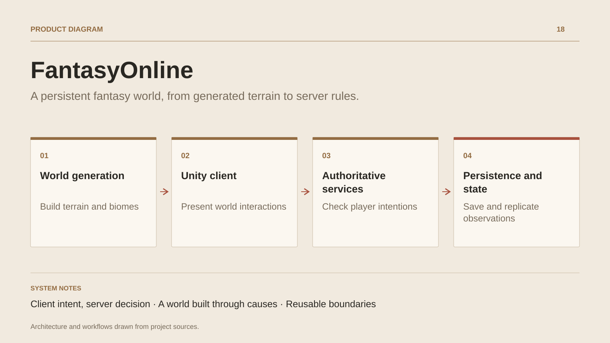

# FantasyOnline

**A persistent fantasy world, from generated terrain to server rules.**

[All projects](../README.en.md#the-whole-workshop) · [Français](fantasy-online.md)

FantasyOnline builds a persistent fantasy world in which terrain, interactions and game rules work together. A Unity client presents regions, characters and interfaces; .NET services own gameplay decisions and durable state.

World generation follows a causal chain: geology, climate, soil and hydrology inform settlements, roads, landmarks and resources. Region data is assembled into a versioned snapshot used by bake tools and runtime adapters.

Service interactions combine identity, position observations, permissions, reservations and idempotent receipts. NPC simulation advances on server ticks and supports recovery through regional checkpoints. Combat, abilities, appearance, interaction, live state and operations have dedicated boundaries.

Public contracts connect hosts and clients. The Shared framework is maintained in a separate repository, with a revision pinned by the game; Unity and other consumers retain their engine adapters. Development advances through domain integration and observable gameplay workflows.

## Journey

1. Build a coherent region from its geology, climate, water and biomes.
2. Present the world, characters and interactions through the Unity client.
3. Submit player intentions to authoritative services for identity, proximity, permissions and gameplay rules.
4. Persist durable state and replicate useful observations to sessions and interfaces.

## Design decisions

### Client intent, server decision

Unity owns presentation and engine adapters. .NET services control interactions, NPC simulation and durable state; authority derives from identity and server observations.

### A world built through causes

Generation connects geology, climate, soil, hydrology, settlements, roads and resources. A region snapshot supplies the same data to bake and runtime adapters.

## Technology

Unity · C# · .NET · URP · PostgreSQL

**Status :** In development · Unity client and world services.

[Back to the workshop](../README.en.md#the-whole-workshop) · [Studio & services ↗](https://floriansola.fr/en)
