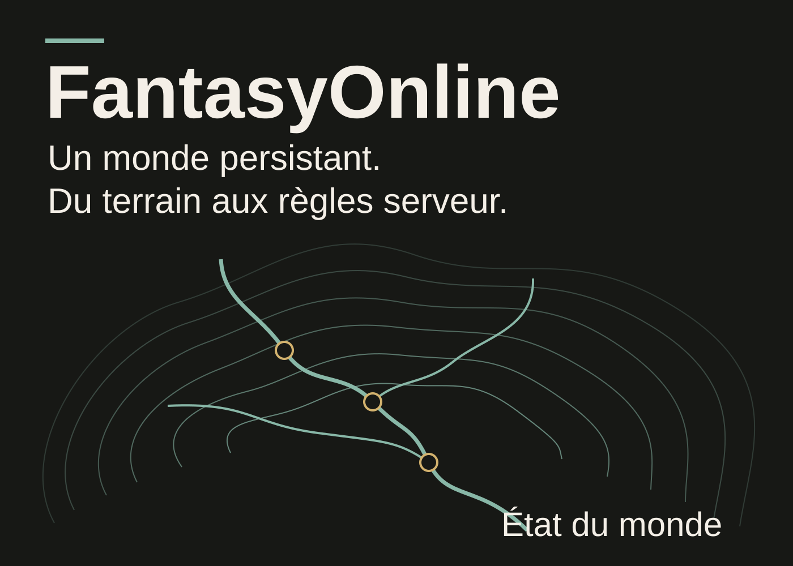
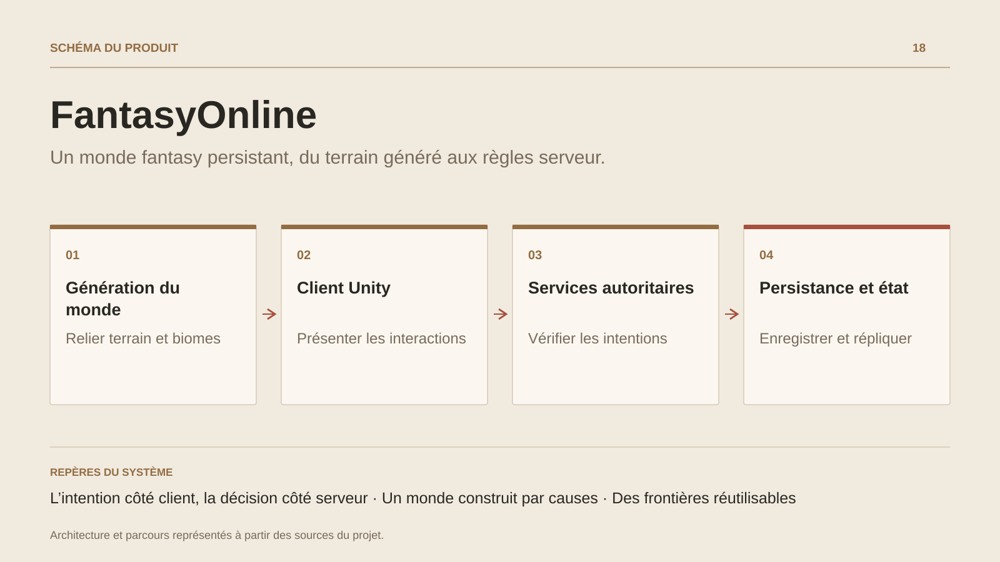

# FantasyOnline

**Un monde fantasy persistant, du terrain généré aux règles serveur.**

[Tous les projets](../README.md#tout-latelier) · [English](fantasy-online.en.md)

FantasyOnline construit un monde fantasy persistant dans lequel le terrain, les interactions et les règles de jeu se répondent. Le client Unity présente les régions, les personnages et les interfaces ; les services .NET portent les décisions de gameplay et les états durables.

La génération du monde suit une chaîne causale : géologie, climat, sols et hydrologie alimentent le placement des implantations, des routes, des repères et des ressources. Les données de région sont rassemblées dans un snapshot versionné utilisable par les outils de bake et les adaptateurs runtime.

Côté services, les interactions combinent identité, observation de position, permissions, réservations et reçus idempotents. La simulation des PNJ avance sur les ticks du serveur et possède une reprise par checkpoints régionaux. Les domaines combat, capacités, apparence, interactions, état vivant et opérations disposent de frontières propres.

Les contrats publics relient les hôtes au client. Le framework Shared est maintenu dans un dépôt séparé, avec une révision épinglée par le jeu ; Unity et les autres consommateurs conservent leurs adaptations moteur. Le développement progresse par intégrations de domaines et parcours de jeu observables.

## Parcours

1. Construire une région cohérente à partir de sa géologie, de son climat, de son eau et de ses biomes.
2. Présenter le monde, ses personnages et ses interactions dans le client Unity.
3. Soumettre les intentions du joueur aux services autoritaires : identité, proximité, permissions et règles de gameplay.
4. Conserver les états durables et répliquer les observations utiles aux sessions et aux interfaces.

## Décisions de conception

### L’intention côté client, la décision côté serveur

Unity porte présentation et adaptations moteur. Les services .NET contrôlent les interactions, la simulation des PNJ et les états durables ; l’autorité découle de l’identité et des observations serveur.

### Un monde construit par causes

La génération relie géologie, climat, sols, hydrologie, implantations, routes et ressources. Un snapshot de région fournit les mêmes données au bake et aux adaptateurs runtime.

## Technologies

Unity · C# · .NET · URP · PostgreSQL

**État :** En développement · client Unity et services de monde.

[Retour à l’atelier](../README.md#tout-latelier) · [Studio & services ↗](https://floriansola.fr)
