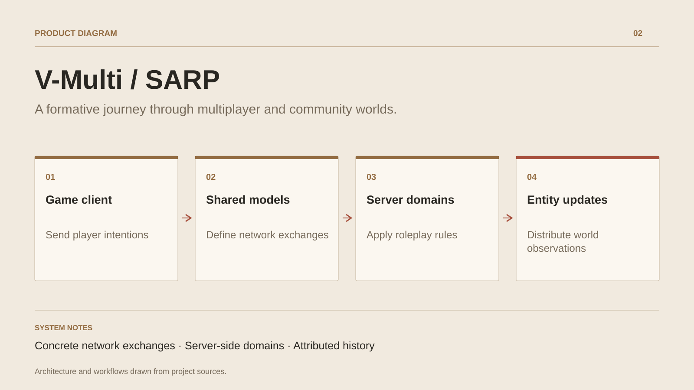

# V-Multi / SARP

**A formative journey through multiplayer and community worlds.**

[All projects](../README.en.md#the-whole-workshop) · [Français](gaming-platform.md)

V-Multi and SARP trace the early work on multiplayer worlds. The V-Multi archive groups the server, client, launcher, master server and shared models. Transport uses Lidgren; the code organises messages, connections and world entities.

SARP sources continue this work with a C# roleplay structure: shared models, services, persistent data, interactions and spatial synchronisation. The client and presentation tools connect server rules to the player experience.

These projects are a historical reference within the professional journey and its declared technical organisation responsibilities. They show continuity between networking, game systems and current architectures. Third-party dependencies and host platforms retain their attribution.

## Journey

1. Build V-Multi’s network exchanges and shared models.
2. Develop the rules and services of a roleplay world.
3. Evolve the architecture across projects and host environments.

## Design decisions

### Concrete network exchanges

The V-Multi archive contains a server, client, master server and shared models. Lidgren supplies UDP transport and Protobuf appears in the exchanges.

### Server-side domains

SARP sources group shared models, data access, events and entity synchronisation. Game systems build on this foundation.

## Technology

C# · Lidgren UDP · Protobuf · CitizenFX · Client / Server

**Status :** Multiplayer experience · C# networking and roleplay systems.

[Back to the workshop](../README.en.md#the-whole-workshop) · [Studio & services ↗](https://floriansola.fr/en)
