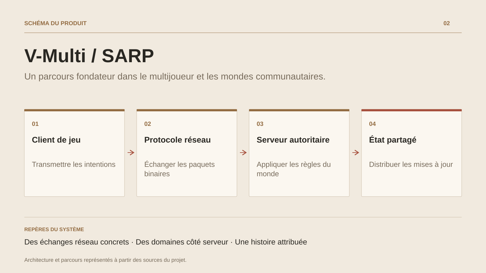

# V-Multi / SARP

**Un parcours fondateur dans le multijoueur et les mondes communautaires.**

[Tous les projets](../README.md#tout-latelier) · [English](gaming-platform.en.md)

V-Multi et SARP retracent les premières étapes du travail sur les mondes multijoueurs. L’archive V-Multi regroupe le serveur, le client, le launcher, le master server et les modèles partagés. Le transport utilise Lidgren ; le code organise les messages, les connexions et les entités du monde.

Les sources SARP poursuivent ce terrain avec une structure C# dédiée au roleplay : modèles partagés, services, données persistantes, interactions et synchronisation spatiale. Le client et les outils de présentation relient les règles serveur à l’expérience du joueur.

Ces travaux constituent une référence historique du parcours et des responsabilités déclarées d’organisation technique. Ils éclairent la continuité entre réseau, systèmes de jeu et architectures actuelles. Les dépendances tierces et les plateformes hôtes conservent leur attribution.

## Parcours

1. Construire les échanges réseau et les modèles partagés de V-Multi.
2. Développer les règles et les services d’un monde roleplay.
3. Faire évoluer l’architecture à travers les projets et environnements du parcours.

## Décisions de conception

### Des échanges réseau concrets

L’archive V-Multi contient un serveur, un client, un master server et des modèles communs. Lidgren fournit le transport UDP et Protobuf apparaît dans les échanges.

### Des domaines côté serveur

Les sources SARP regroupent les modèles partagés, l’accès aux données, les événements et la synchronisation des entités. Les systèmes de jeu s’appuient sur ce socle.

## Technologies

C# · Lidgren UDP · Protobuf · CitizenFX · Client / Server

**État :** Parcours multijoueur · réseau C# et systèmes roleplay.

[Retour à l’atelier](../README.md#tout-latelier) · [Studio & services ↗](https://floriansola.fr)
