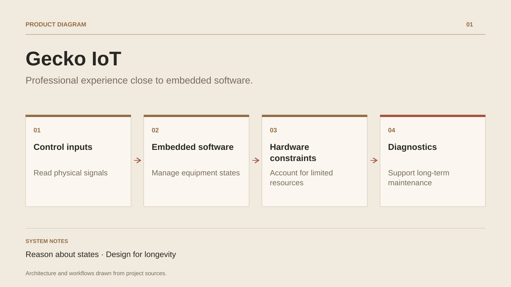

# Gecko IoT

**Professional experience close to embedded software.**

[All projects](../README.en.md#the-whole-workshop) · [Français](gecko-iot.md)

The experience at Gecko Alliance is part of the professional journey. Presentation material describes work on embedded software and control system connectivity. It places software behaviour in direct contact with hardware and its usage conditions.

This environment builds a discipline useful beyond IoT: make states explicit, plan for interruptions, enable diagnostics and consider maintenance of equipment already delivered. These concerns later inform service and application architecture.

The reference describes an employed role and the responsibilities declared in the professional journey. Proprietary code and internal employer results remain within their professional context.

## Journey

1. Work within an embedded control system context.
2. Connect software behaviour to hardware constraints.
3. Treat reliability and diagnostics as design concerns.

## Design decisions

### Reason about states

Equipment needs understandable behaviour as network, power and inputs change.

### Design for longevity

Maintaining embedded software requires updates, diagnostics and usage conditions to be considered from the design stage.

## Technology

Embedded software · Connectivity · Control systems

**Status :** Professional experience · embedded software and connectivity.

[Back to the workshop](../README.en.md#the-whole-workshop) · [Studio & services ↗](https://floriansola.fr/en)
