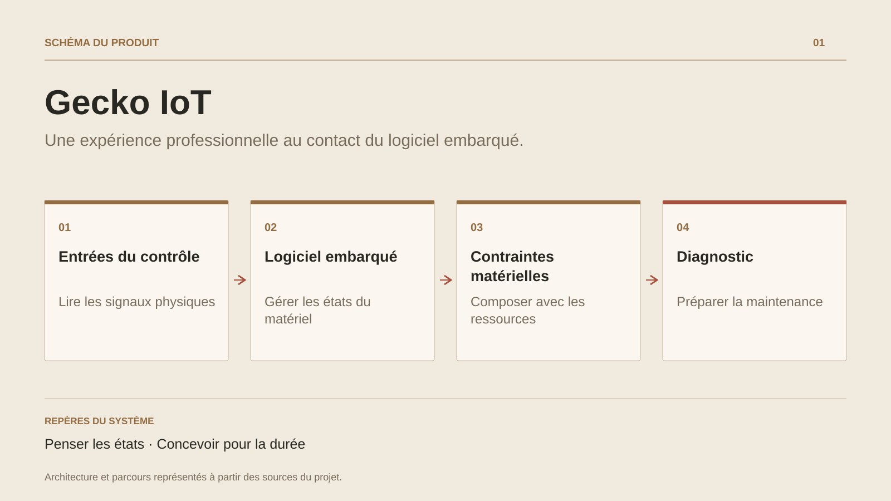

# Gecko IoT

**Une expérience professionnelle au contact du logiciel embarqué.**

[Tous les projets](../README.md#tout-latelier) · [English](gecko-iot.en.md)

Le passage chez Gecko Alliance appartient au parcours professionnel. Le travail décrit dans les éléments de présentation porte sur le logiciel embarqué et la connectivité de systèmes de contrôle. Il place le comportement logiciel au contact direct du matériel et de ses conditions d’usage.

Ce terrain forme une discipline utile au-delà de l’IoT : expliciter les états, prévoir les interruptions, rendre le diagnostic possible et penser la maintenance d’équipements déjà livrés. Ces préoccupations nourrissent ensuite la conception des services et des architectures applicatives.

La référence décrit une expérience salariée et les responsabilités déclarées du parcours. Le code propriétaire et les résultats internes de l’employeur restent dans leur contexte professionnel.

## Parcours

1. Travailler dans le contexte d’un système de contrôle embarqué.
2. Relier comportement logiciel et contraintes du matériel.
3. Faire de la fiabilité et du diagnostic des sujets de conception.

## Décisions de conception

### Penser les états

Un équipement doit garder un comportement compréhensible lorsque le réseau, l’alimentation ou ses entrées évoluent.

### Concevoir pour la durée

La maintenance d’un logiciel embarqué demande de considérer les mises à jour, le diagnostic et les conditions d’usage dès la conception.

## Technologies

Logiciel embarqué · Connectivité · Systèmes de contrôle

**État :** Parcours professionnel · logiciel embarqué et connectivité.

[Retour à l’atelier](../README.md#tout-latelier) · [Studio & services ↗](https://floriansola.fr)
