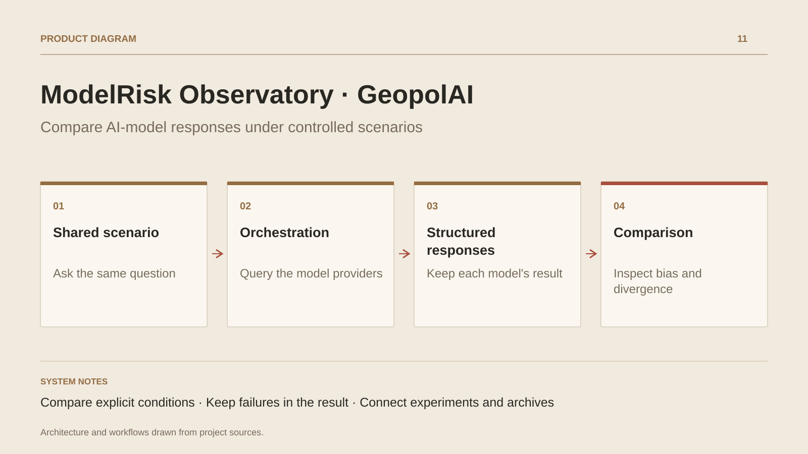

# ModelRisk Observatory · GeopolAI

**Compare AI-model responses under controlled scenarios**

[All projects](../README.en.md#the-whole-workshop) · [Français](geopolai.md)

ModelRisk Observatory is the evolution of GeopolAI. It turns a fictional scenario into a comparative experiment: several profiles receive a request, and their responses appear side by side. Users inspect proposed positions, missing information, explanations and refusal behavior.

The flow supports adding an event, asking a profile a follow-up question and revisiting a previous audit. The Guardrail Audit Lab provides neutralized cases involving contradictory instructions, role changes, expected formats and ambiguous requests. Results are classified and retained for examination.

The application distinguishes simulated mock responses from configured provider calls. Its indicators come from the response contract and result aggregations; they describe that experiment and require human interpretation. Displayed consumption figures are estimates. The project makes context, differences and response limitations visible in one tool.

## Journey

1. Choose a fictional scenario and configure model profiles.
2. Launch the comparison and follow each profile’s response.
3. Read positions, missing information, refusals and reported indicators side by side.
4. Add an event or ask a follow-up question to inspect how responses evolve.
5. Find the audit, results and consumption estimates in the history.

## Design decisions

### Compare explicit conditions

The scenario and configuration enter a shared orchestrator. Persona, contrarian and partial-information modes explore how request conditions affect responses; those conditions must remain visible when interpreting results.

### Keep failures in the result

Calls run in parallel, and provider or format errors receive dedicated states. The comparison retains evidence when a profile does not respond correctly.

## Technology

.NET · ActualLab Fusion · EF Core · PostgreSQL · React · TypeScript · Zustand · Recharts · D3

**Status :** AI laboratory · response comparison and audits.

[Back to the workshop](../README.en.md#the-whole-workshop) · [Studio & services ↗](https://floriansola.fr/en)
