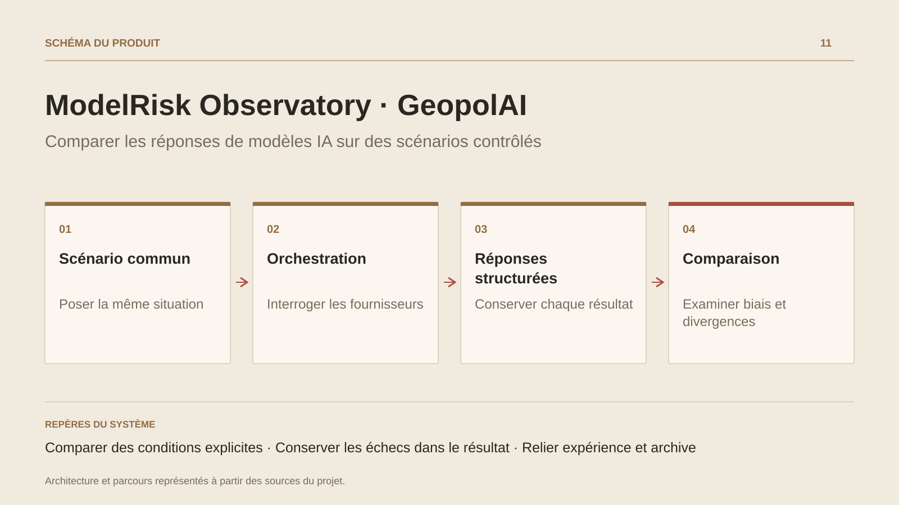

# ModelRisk Observatory · GeopolAI

**Comparer les réponses de modèles IA sur des scénarios contrôlés**

[Tous les projets](../README.md#tout-latelier) · [English](geopolai.en.md)

ModelRisk Observatory est l’évolution du projet GeopolAI. Il organise un scénario fictif en expérience comparative : plusieurs profils reçoivent une demande, puis leurs réponses apparaissent côte à côte. L’utilisateur examine les positions proposées, les informations manquantes, les justifications et les comportements de refus.

Le parcours permet d’ajouter un événement, de poser une question à un profil et de consulter les résultats d’un audit précédent. Le Guardrail Audit Lab propose des cas neutralisés autour des instructions contradictoires, du changement de rôle, du format attendu et des demandes ambiguës. Les résultats sont classés et conservés pour l’examen.

L’application distingue les réponses simulées du mode mock et les appels aux fournisseurs configurés. Ses indicateurs proviennent du contrat de réponse et d’agrégations du résultat ; ils décrivent cette expérience et demandent une interprétation humaine. Les consommations affichées sont des estimations. L’intérêt du projet est de rendre le contexte, les écarts et les limites des réponses visibles dans un même outil.

## Parcours

1. Choisir un scénario fictif et configurer les profils de modèles.
2. Lancer la comparaison et suivre les réponses de chaque profil.
3. Lire côte à côte les positions, informations manquantes, refus et indicateurs déclarés.
4. Ajouter un événement ou poser une question pour examiner l’évolution des réponses.
5. Retrouver l’audit, ses résultats et ses estimations de consommation dans l’historique.

## Décisions de conception

### Comparer des conditions explicites

Le scénario et la configuration entrent dans un orchestrateur commun. Les modes persona, contradiction et information partielle permettent d’examiner l’effet des conditions de la demande ; ils doivent rester visibles dans la lecture des résultats.

### Conserver les échecs dans le résultat

Les appels sont lancés en parallèle et les erreurs de fournisseur ou de format ont un état dédié. La comparaison conserve ainsi la trace d’un profil qui ne répond pas correctement.

## Technologies

.NET · ActualLab Fusion · EF Core · PostgreSQL · React · TypeScript · Zustand · Recharts · D3

**État :** Laboratoire IA · comparaison de réponses et audits.

[Retour à l’atelier](../README.md#tout-latelier) · [Studio & services ↗](https://floriansola.fr)
