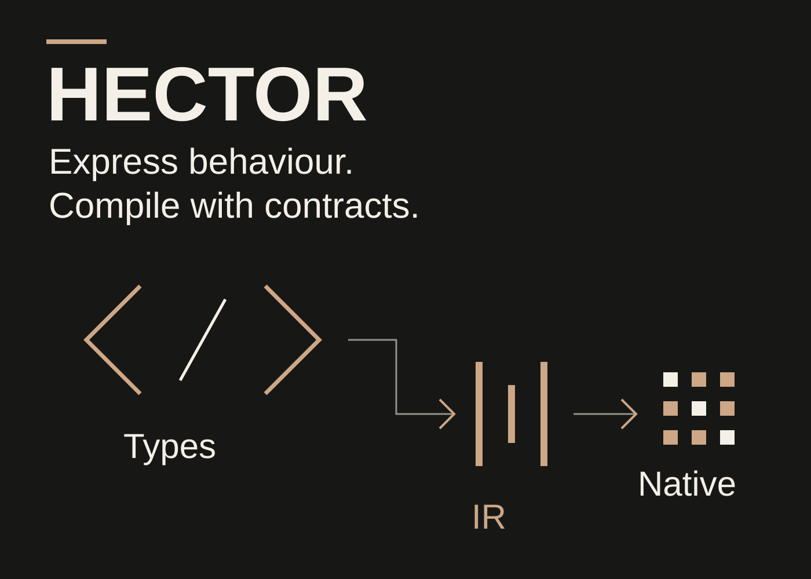
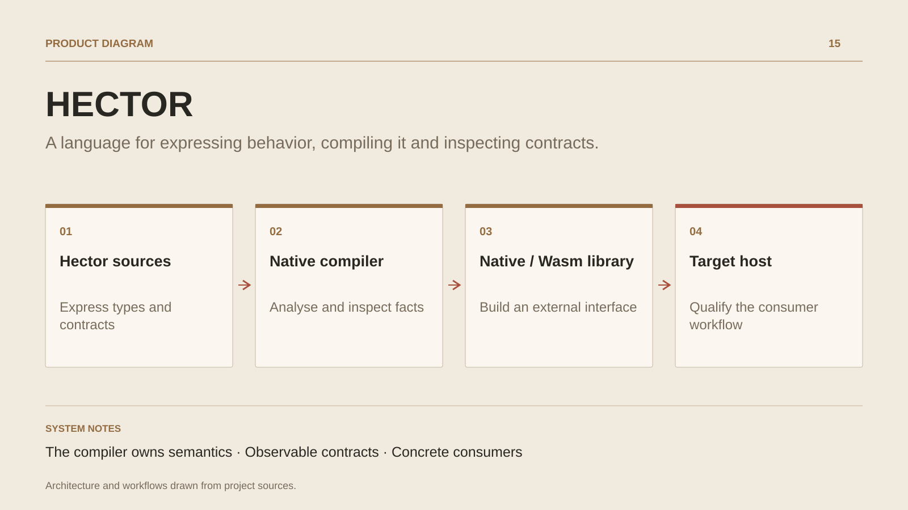

# HECTOR

**A language for expressing behavior, compiling it and inspecting contracts.**

[All projects](../README.en.md#the-whole-workshop) · [Français](hector.md)

HECTOR explores a development chain in which authors express behavior and its obligations, then inspect the resulting mechanics. The work connects language design, native compilation, execution contracts and integration into consuming software.

The compiler consists of units written in Hector. Bootstrap assembles seeds and rebuilds generations; typed components lead to LLVM and platform boundaries. Python provides build tooling, references and independent oracles. Node transports protocols and hosts WebAssembly libraries.

The foundation includes preconditions, postconditions, explicit effects, checked computations, collections and data profiles. Ledger kernels provide a concrete setting for preparation, publication and interoperability. Native analysis derives publication facts, while a separate gate compares signatures, types, effects and clauses against a verified reference.

Research advances through bounded workflows: language, library, consumer and qualification. The next boundary concerns the behavioral relationship between implementations, beyond interface compatibility.

## Journey

1. Express behavior in Hector with its types, effects and contract clauses.
2. Analyze sources with the native compiler and inspect facts produced by the checker.
3. Build a native or WebAssembly library for an external consumer.
4. Compare interfaces and publication properties, then qualify the workflow on its target host.

## Design decisions

### The compiler owns semantics

The json, syntax, foundation, core and driver units are written in Hector. Bootstrap rebuilds the chain from its seeds; LLVM handles native emission. Launchers direct work to the same authority.

### Observable contracts

Preconditions, postconditions, effects and source identities accompany analysis and execution. Checker facts feed selection and compatibility checks against a reference.

## Technology

HECTOR · LLVM · WebAssembly · C/C++ · Python

**Status :** Applied research · native compiler and WebAssembly kernels.

[Back to the workshop](../README.en.md#the-whole-workshop) · [Studio & services ↗](https://floriansola.fr/en)
