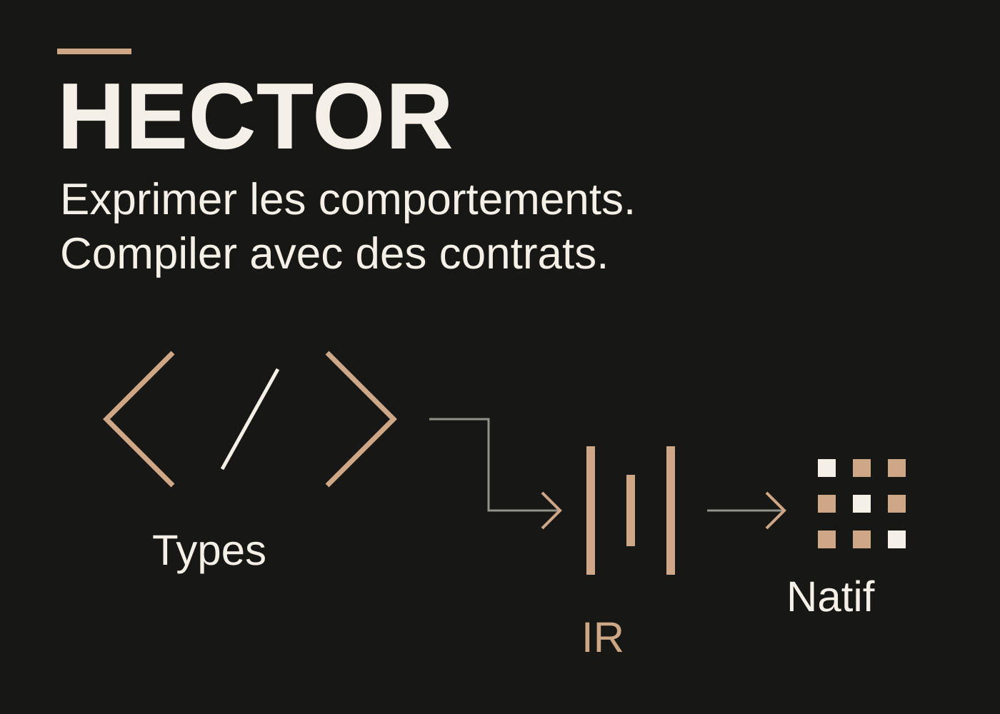
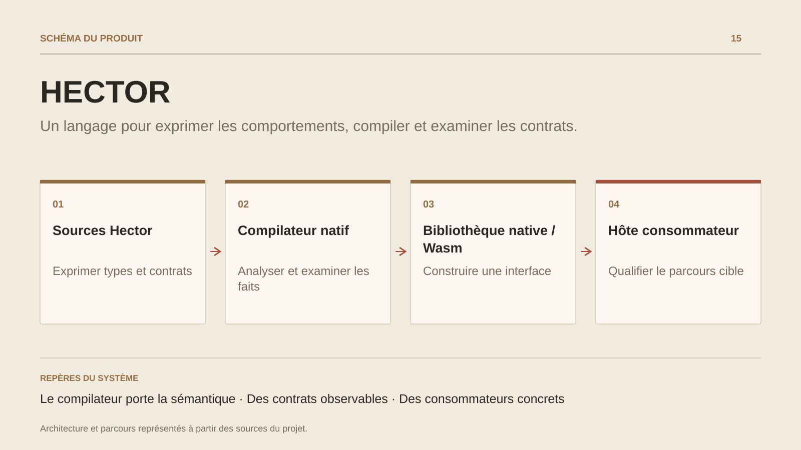

# HECTOR

**Un langage pour exprimer les comportements, compiler et examiner les contrats.**

[Tous les projets](../README.md#tout-latelier) · [English](hector.en.md)

HECTOR explore une chaîne de développement où l’auteur exprime un comportement et ses obligations, puis examine la mécanique produite. Le travail associe conception de langage, compilation native, contrats d’exécution et intégration dans des logiciels consommateurs.

Le compilateur est structuré en unités écrites en Hector. Son bootstrap assemble les seeds et reconstruit les générations ; les composants typés conduisent vers LLVM et les frontières de la plateforme. Python fournit les outils de construction, les références et les oracles indépendants ; Node transporte les protocoles et héberge les bibliothèques WebAssembly.

Le socle comprend préconditions, postconditions, effets explicites, calculs contrôlés, collections et profils de données. Les noyaux de registre offrent un terrain concret pour la préparation, la publication et l’interopérabilité. Une analyse native dérive les faits de publication ; une gate distincte compare signatures, types, effets et clauses avec une référence vérifiée.

La recherche progresse par parcours délimités : langage, bibliothèque, consommateur et qualification. La prochaine frontière concerne la relation comportementale entre réalisations, au-delà de la compatibilité de leurs interfaces.

## Parcours

1. Écrire un comportement en Hector avec ses types, effets et clauses de contrat.
2. Analyser les sources avec le compilateur natif et examiner les faits produits par le checker.
3. Construire une bibliothèque native ou WebAssembly pour un consommateur externe.
4. Comparer les interfaces et les propriétés de publication, puis qualifier le parcours sur son hôte cible.

## Décisions de conception

### Le compilateur porte la sémantique

Les unités json, syntax, foundation, core et driver sont écrites en Hector. Le bootstrap reconstruit la chaîne depuis ses seeds ; LLVM assure l’émission native. Les lanceurs dirigent vers cette même autorité.

### Des contrats observables

Préconditions, postconditions, effets et identités de source accompagnent l’analyse et l’exécution. Les faits du checker alimentent les contrôles de sélection et de compatibilité avec une référence.

## Technologies

HECTOR · LLVM · WebAssembly · C/C++ · Python

**État :** Recherche appliquée · compilateur natif et noyaux WebAssembly.

[Retour à l’atelier](../README.md#tout-latelier) · [Studio & services ↗](https://floriansola.fr)
