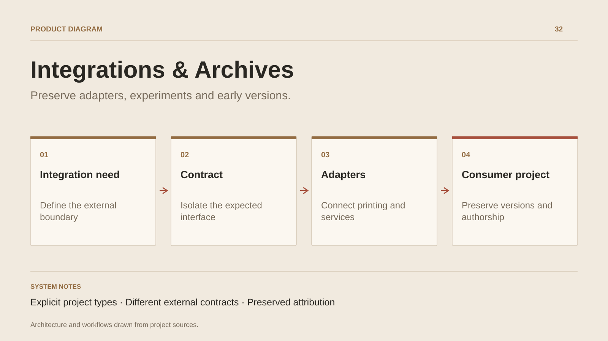

# Integrations & Archives

**Preserve adapters, experiments and early versions.**

[All projects](../README.en.md#the-whole-workshop) · [Français](integrations-archives.md)

This case study preserves work that supports the products and professional journey: SaleCast.Printer, preparation of a PrestaShop connector, MobileGame, UnrealCSharp, an expense management exercise and early web presentation versions. Each entry retains its type and context.

The backend exercise gives a concrete integration decision: save an expense, then adapt its model to two partner contracts. Mapping and transport have separate responsibilities; external failures are tracked after persistence. Synchronous dispatch and its latency are a documented trade-off.

Archives also retain early assumptions and useful supporting projects. Third-party libraries cloned as references or dependencies remain attributed to their authors; portfolio-specific adaptations are described at their own level.

## Journey

1. Identify the integration need or prototype hypothesis.
2. Read the contract, adapter and documented decisions.
3. Place the work within its product, exercise or period.

## Design decisions

### Explicit project types

A print adapter, backend exercise and engine prototype are presented within their own scope.

### Different external contracts

The expense exercise separates the internal model, persistence and partner mappings. Integration errors have traces and a documented retry policy.

## Technology

C# · ASP.NET Core · Unity · HTML / CSS

**Status :** Supporting work · adapters and prototypes.

[Back to the workshop](../README.en.md#the-whole-workshop) · [Studio & services ↗](https://floriansola.fr/en)
