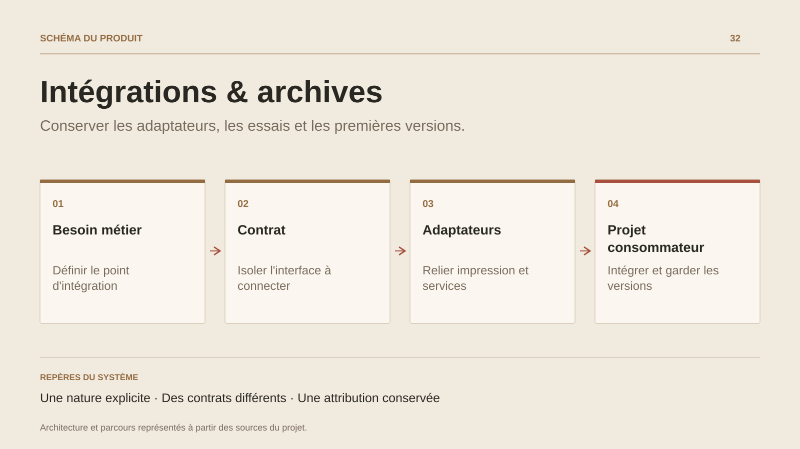

# Intégrations & archives

**Conserver les adaptateurs, les essais et les premières versions.**

[Tous les projets](../README.md#tout-latelier) · [English](integrations-archives.en.md)

Cette fiche conserve les travaux qui accompagnent les produits et le parcours : SaleCast.Printer, la préparation d’un connecteur PrestaShop, MobileGame, UnrealCSharp, un exercice de gestion de dépenses et les premières versions de la présentation web. Chaque entrée conserve sa nature et son contexte.

L’exercice backend offre un exemple concret de décision d’intégration : enregistrer une dépense, puis adapter son modèle à deux contrats partenaires. Les mappings et le transport ont des responsabilités distinctes ; les erreurs externes sont suivies après la persistance. Le dispatch synchrone et sa latence sont un arbitrage documenté.

Les archives permettent aussi de retrouver les premières hypothèses et les sous-projets utiles. Les bibliothèques tierces clonées comme références ou dépendances restent attribuées à leurs auteurs ; les adaptations propres au portfolio se lisent à leur niveau.

## Parcours

1. Identifier le besoin d’intégration ou l’hypothèse du prototype.
2. Lire le contrat, l’adaptateur et les choix documentés.
3. Replacer le travail dans son produit, son exercice ou sa période.

## Décisions de conception

### Une nature explicite

Un adaptateur d’impression, un exercice backend et un prototype moteur sont présentés avec leur périmètre propre.

### Des contrats différents

L’exercice de dépenses sépare le modèle interne, la persistance et les mappings de partenaires. Les erreurs d’intégration ont des traces et une politique de reprise documentées.

## Technologies

C# · ASP.NET Core · Unity · HTML / CSS

**État :** Travaux complémentaires · adaptateurs et prototypes.

[Retour à l’atelier](../README.md#tout-latelier) · [Studio & services ↗](https://floriansola.fr)
