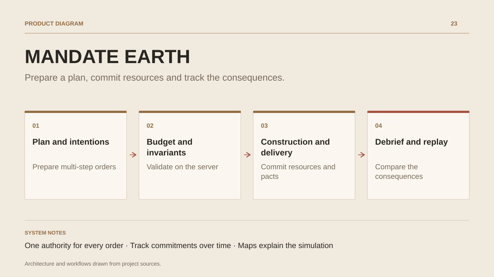

# MANDATE EARTH

**Prepare a plan, commit resources and track the consequences.**

[All projects](../README.en.md#the-whole-workshop) · [Français](mandate-earth.md)

MANDATE EARTH puts players in charge of a consortium within a scenario built around cities and corridors. They buy resources, start construction, arrange shipments and negotiate contracts or pacts. Plans can chain several steps and wait for actual delivery before proceeding. The Rhône scenario adds seasons, reserves and water shortages; its water economy is fictional. Solo games, mirrored challenges, duels and cooperation provide different ways to compare decisions. A local heuristic strategist works without external keys; optional AI providers and an MCP interface let agents act on authorised observations.

## Journey

1. **Understand the scenario.** Choose a faction and inspect cities, corridors, available resources and objectives.
2. **Prepare the steps.** Combine purchases, construction and aid or delivery. Plans wait for required results and explain blocked steps.
3. **Commit the season.** Submit orders within the faction’s budget. Shortages, deposits, access rights and delays take effect in the simulation.
4. **Compare decisions.** Inspect the debrief and replay, export a save or propose a mirrored challenge using the same scenario.

## Design decisions

### One authority for every order

Human actions, heuristics and agents use the canonical submission path. The server applies rules, checks invariants and controls each faction’s observations.

### Track commitments over time

Submission, delivery and final outcomes are separate states. A lost response remains an unknown outcome to recover from its original journal.

## Technology

TypeScript · Node.js · HECTOR · WebAssembly · SQLite

**Status :** In development · strategy, economy and logistics.

[Back to the workshop](../README.en.md#the-whole-workshop) · [Studio & services ↗](https://floriansola.fr/en)
