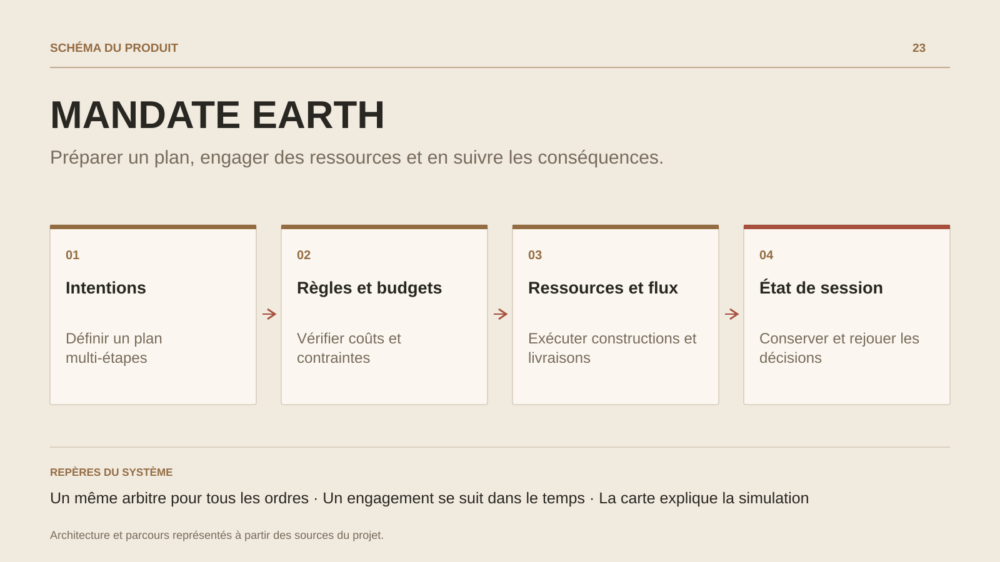

# MANDATE EARTH

**Préparer un plan, engager des ressources et en suivre les conséquences.**

[Tous les projets](../README.md#tout-latelier) · [English](mandate-earth.en.md)

MANDATE EARTH place le joueur à la tête d’un consortium dans un scénario organisé autour de villes et de corridors. Il achète des ressources, lance une construction, organise une livraison et négocie des contrats ou des pactes. Un plan peut enchaîner plusieurs étapes et attendre la livraison effective avant d’agir.

Le scénario Rhône ajoute saisons, réserves et pénuries d’eau ; son économie hydrique est fictive. Solo, défis miroirs, duels et coopération proposent plusieurs façons de confronter les décisions.

Un stratège heuristique fonctionne localement ; des fournisseurs IA et une interface MCP permettent aussi de faire intervenir des agents sur des observations autorisées.

## Parcours

1. **Prendre la mesure du scénario.** Choisir un camp et consulter villes, corridors, ressources disponibles et objectifs.
2. **Préparer les étapes.** Combiner achats, constructions et aide ou livraison. Le plan attend les résultats nécessaires et expose ses blocages.
3. **Engager la saison.** Soumettre les ordres avec le budget du camp. Les pénuries, cautions, droits de passage et délais produisent leurs effets dans la simulation.
4. **Comparer les décisions.** Lire le débrief et le replay, exporter une sauvegarde ou proposer un défi miroir sur le même scénario.

## Décisions de conception

### Un même arbitre pour tous les ordres

Actions humaines, heuristiques et agents passent par la soumission canonique. Le serveur applique les règles, vérifie les invariants et contrôle les observations de chaque camp.

### Un engagement se suit dans le temps

La soumission, la livraison et le résultat final sont des états distincts. Une réponse perdue reste un résultat inconnu à retrouver dans le journal de son origine.

## Technologies

TypeScript · Node.js · HECTOR · WebAssembly · SQLite

**État :** En développement · stratégie, économie et logistique.

[Retour à l’atelier](../README.md#tout-latelier) · [Studio & services ↗](https://floriansola.fr)
