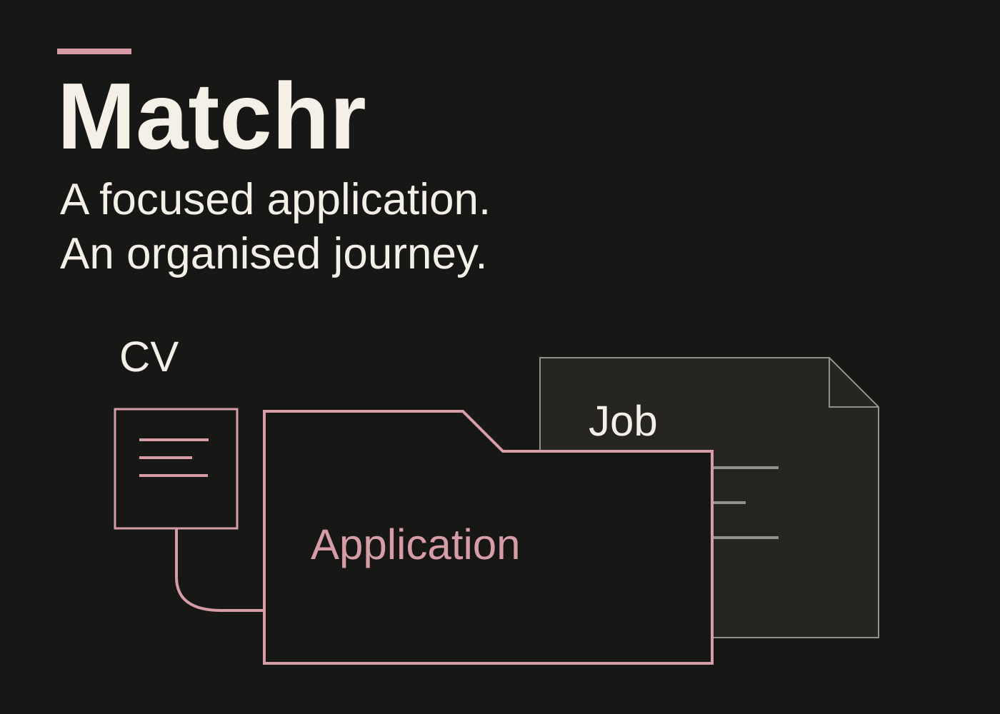
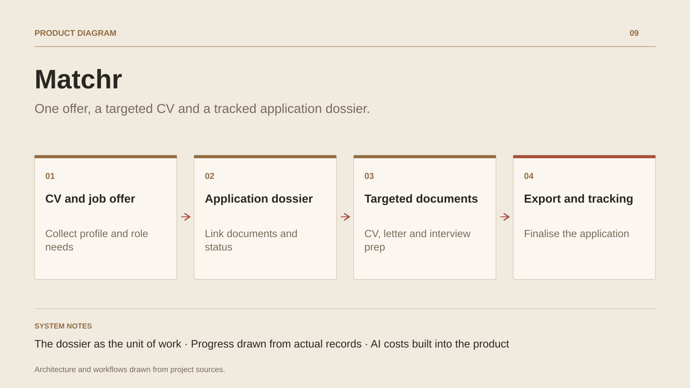

# Matchr

**One offer, a targeted CV and a tracked application dossier.**

[All projects](../README.en.md#the-whole-workshop) · [Français](matchr.md)

Matchr supports application preparation from CV and job offer through response tracking. Onboarding imports the candidate's background, extracts the offer context and creates a dossier linking them. The editor supports CV revisions and matching signals against the offer.

Cover letters and interview preparation use the dossier's linked CV. A checklist derived from present documents and application status helps candidates follow their preparation. Exports and the pipeline extend the work beyond editing; coaches can review candidates and add comments.

The SaaS includes accounts, sessions, account security, Stripe plans and AI usage quotas. Cost controls and configurable features support operation of the product, with PostgreSQL, migrations and documented backups.

## Journey

1. Import a CV and add the job offer text.
2. Create a dossier linking the offer and CV version.
3. Review matching signals and revise experience descriptions in the editor.
4. Prepare the letter and interview using the dossier's CV.
5. Export documents and track application stages and responses.

## Design decisions

### The dossier as the unit of work

Offer, CV, cover letter and interview preparation belong to one application. Tools resolve the linked CV to preserve the offer context.

### Progress drawn from actual records

The checklist is computed from linked documents, scores and application status. It guides candidates from preparation to a response.

## Technology

Node.js · Fastify · JavaScript · PostgreSQL · Stripe · AI · VPS

**Status :** Job application SaaS · files, documents and AI assistance.

[Back to the workshop](../README.en.md#the-whole-workshop) · [Studio & services ↗](https://floriansola.fr/en)
