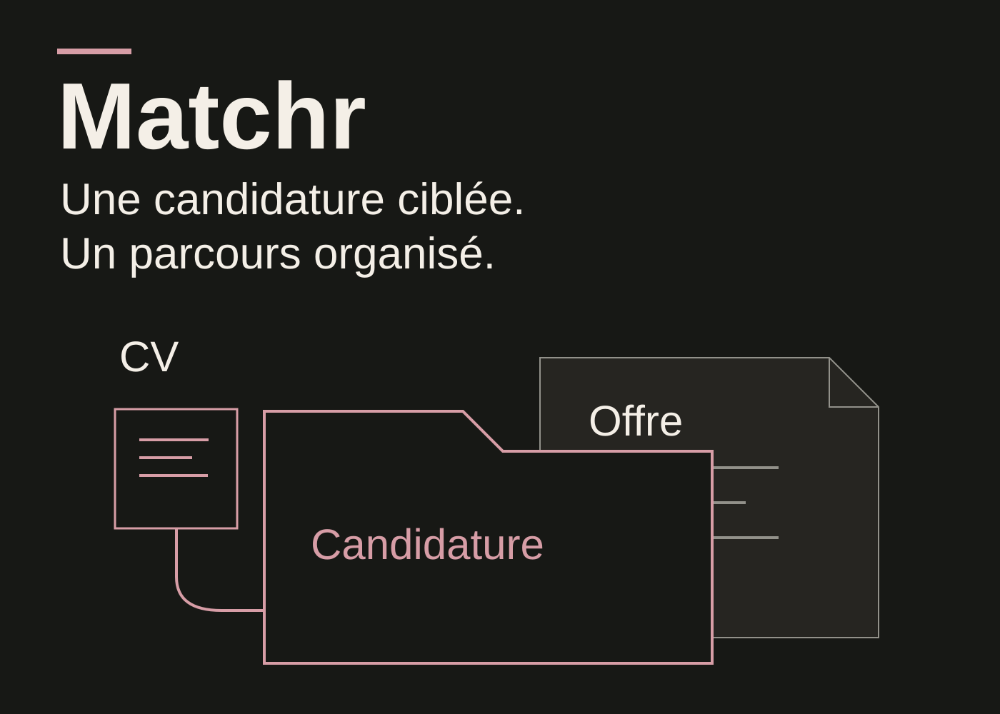
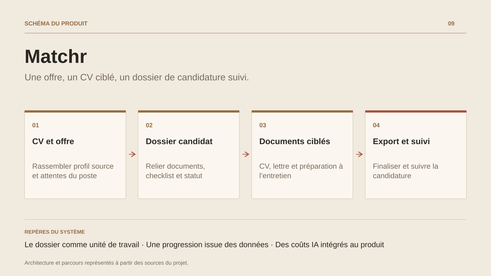

# Matchr

**Une offre, un CV ciblé, un dossier de candidature suivi.**

[Tous les projets](../README.md#tout-latelier) · [English](matchr.en.md)

Matchr accompagne la préparation d'une candidature depuis le CV et l'offre jusqu'au suivi des réponses. Le démarrage importe le parcours du candidat, extrait le contexte de l'annonce et crée un dossier qui relie les deux. L'éditeur permet ensuite de retravailler le CV et d'examiner les signaux de correspondance avec l'offre.

Lettre et préparation d'entretien utilisent le CV attaché au dossier. Une checklist calculée à partir des éléments présents et du statut aide le candidat à suivre sa préparation. Les exports et le pipeline prolongent ce travail après l'édition ; un espace coach permet l'accompagnement et les commentaires.

Le SaaS comprend comptes, sessions, sécurité du compte, plans Stripe et quotas d'usage IA. Les contrôles de coût et les fonctionnalités activables font partie de l'exploitation du produit, avec PostgreSQL, scripts de migration et sauvegardes documentées.

## Parcours

1. Importer son CV et ajouter le texte de l'offre.
2. Créer un dossier qui relie l'annonce et la version du CV.
3. Examiner les signaux de correspondance et retravailler les expériences dans l'éditeur.
4. Préparer la lettre et l'entretien à partir du CV du dossier.
5. Exporter les documents et suivre les étapes de candidature et les réponses.

## Décisions de conception

### Le dossier comme unité de travail

Annonce, CV, lettre et préparation d'entretien sont liés à une candidature. Les outils résolvent le CV attaché au dossier pour conserver le contexte de l'offre.

### Une progression issue des données

La checklist est calculée à partir des documents liés, du score et de l'état de la candidature. Elle accompagne le candidat de la préparation jusqu'à la réponse.

## Technologies

Node.js · Fastify · JavaScript · PostgreSQL · Stripe · IA · VPS

**État :** SaaS de candidature · dossiers, documents et assistance IA.

[Retour à l’atelier](../README.md#tout-latelier) · [Studio & services ↗](https://floriansola.fr)
