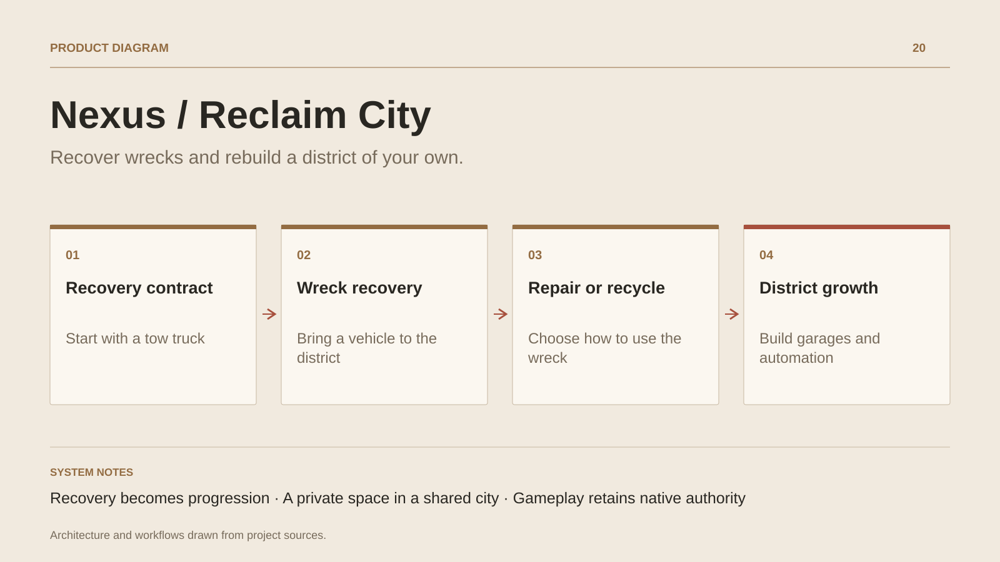

# Nexus / Reclaim City

**Recover wrecks and rebuild a district of your own.**

[All projects](../README.en.md#the-whole-workshop) · [Français](nexus.md)

Nexus / Reclaim City develops a loop around abandoned vehicles and recovered resources. Players leave their garage, complete a contract, bring back a wreck and choose its future: a repaired vehicle, raw materials, a sale or a collection item. A private district makes progress visible through a garage, workers and developing automation. A public city provides the shared setting. Gameplay and its authority stay in Roblox Luau; a .NET control plane supports telemetry, live-ops configuration, audit and support tools. This case study describes the loop and its current construction, with the complete experience still in development.

## Journey

1. **Take a contract.** The initial journey starts in a ruined garage, with a tow truck and a recovery assignment.
2. **Bring back a wreck.** Recovery produces a tangible resource to process on returning to the district.
3. **Choose its future.** Repairing, recycling, selling or keeping connects the same wreck to different forms of progression.
4. **Develop the district.** The garage, workers and automation structure a growing private space connected to a public city.

## Design decisions

### Recovery becomes progression

A wreck offers more than a cash reward. Its uses create a choice between equipment, resources, sales and collections.

### A private space in a shared city

The district records the player’s work and improvements. The public city brings another scale of play.

## Technology

Roblox · Luau · C# · ASP.NET Core

**Status :** In development · recovery, district and shared city.

[Back to the workshop](../README.en.md#the-whole-workshop) · [Studio & services ↗](https://floriansola.fr/en)
