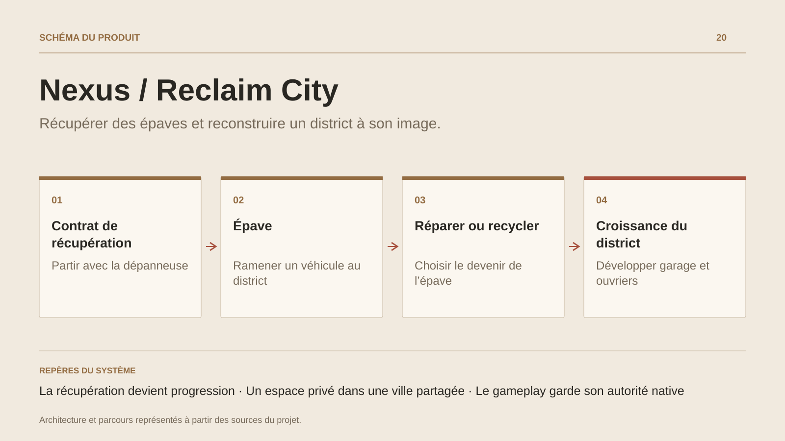

# Nexus / Reclaim City

**Récupérer des épaves et reconstruire un district à son image.**

[Tous les projets](../README.md#tout-latelier) · [English](nexus.en.md)

Nexus / Reclaim City développe une boucle autour de véhicules abandonnés et de ressources récupérées. Le joueur part de son garage, réalise un contrat, ramène une épave et choisit ce qu’elle deviendra : véhicule réparé, matières premières, vente ou collection.

Le district privé rend la progression visible, avec un garage, des ouvriers et des pistes d’automatisation. Une ville publique apporte le terrain partagé de l’expérience.

Le gameplay et son autorité restent dans Roblox en Luau ; un control-plane .NET accompagne la télémétrie, les configurations live-ops, l’audit et les outils de support. La fiche présente cette boucle et sa construction actuelle, avec une expérience complète encore en développement.

## Parcours

1. **Prendre un contrat.** Le parcours initial commence dans un garage en ruine, avec une dépanneuse et une mission de récupération.
2. **Ramener une épave.** La récupération donne une ressource concrète à traiter au retour dans le district.
3. **Choisir sa destination.** Réparer, recycler, vendre ou conserver relie la même épave à plusieurs formes de progression.
4. **Développer le district.** Garage, ouvriers et automatisation structurent la croissance de l’espace privé, en relation avec une ville publique.

## Décisions de conception

### La récupération devient progression

Une épave ne se réduit pas à une récompense monétaire. Ses usages donnent au joueur un arbitrage entre équipement, ressources, vente et collection.

### Un espace privé dans une ville partagée

Le district conserve la trace du travail et des améliorations du joueur. La ville publique apporte une autre échelle de jeu.

## Technologies

Roblox · Luau · C# · ASP.NET Core

**État :** En développement · récupération, quartier et ville partagée.

[Retour à l’atelier](../README.md#tout-latelier) · [Studio & services ↗](https://floriansola.fr)
