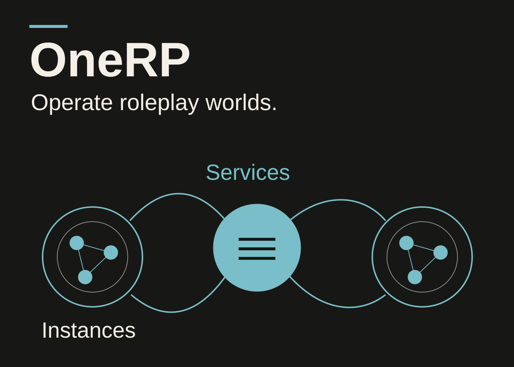
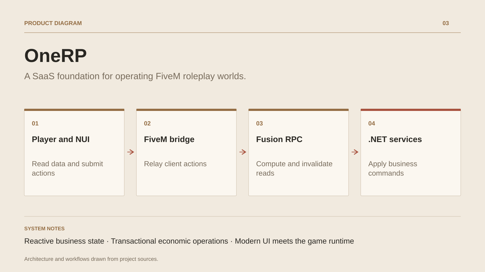

# OneRP

**A SaaS foundation for operating FiveM roleplay worlds.**

[All projects](../README.en.md#the-whole-workshop) · [Français](onerp-framework.md)

OneRP builds the operating foundation for FiveM roleplay worlds. Administration manages instances, activity and configuration. In-game journeys extend from character creation to economic systems, jobs, vehicles, housing and social interactions.

Interfaces use Fusion computed reads. Dependency tracking and invalidation connect business data to the screens that consume it. Economic services include player-scoped sentinels to target balance and transaction updates. Actions follow backend commands and business rules.

The project connects a cloud API, Blazor administration, React UI and FiveM DLLs. This composition brings serialization, identity, instance scope, transactions and Mono constraints together. The feature catalogue records module dependencies and qualification status.

## Journey

1. Create and configure a server instance in the administration panel.
2. Welcome players, select a character and guide their arrival.
3. Interact with jobs, inventory, banking, vehicles and housing.
4. Validate actions through server business services.
5. Follow state changes and manage instances through connected interfaces.

## Design decisions

### Reactive business state

Fusion tracks read dependencies. Mutations invalidate the relevant data, while player-scoped sentinels keep recomputation focused on the useful scope.

### Transactional economic operations

Mutation templates open operation contexts and provide serializable isolation for concurrent writes. Instance filters and read guards support business services.

## Technology

C# · .NET · ActualLab Fusion · EF Core · MySQL · Blazor · FiveM · React · TypeScript

**Status :** In development · roleplay SaaS platform and administration.

[Back to the workshop](../README.en.md#the-whole-workshop) · [Studio & services ↗](https://floriansola.fr/en)
