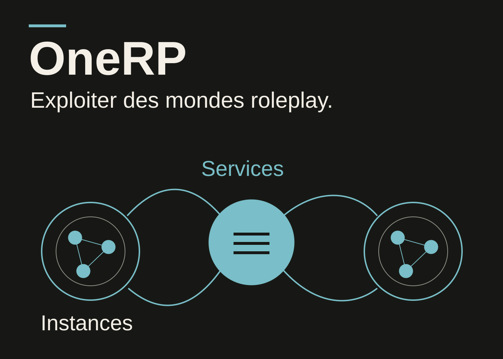
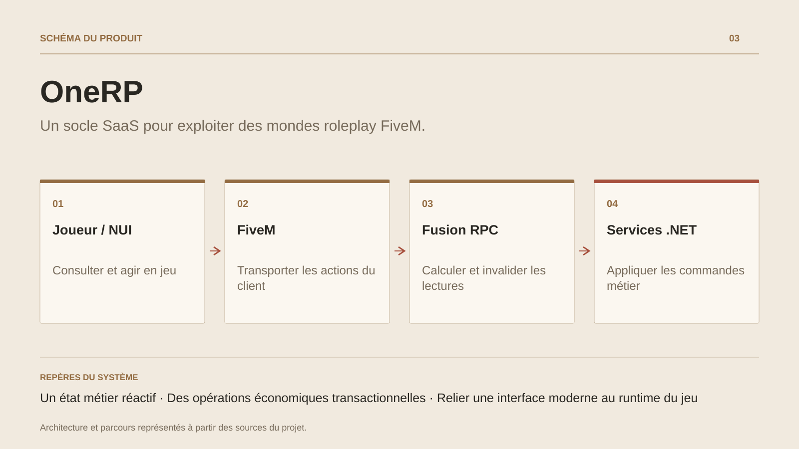

# OneRP

**Un socle SaaS pour exploiter des mondes roleplay FiveM.**

[Tous les projets](../README.md#tout-latelier) · [English](onerp-framework.en.md)

OneRP construit le socle d'exploitation de mondes roleplay FiveM. L'administration gère les instances, leur activité et leur configuration. Dans le jeu, le parcours va de la création du personnage aux systèmes économiques, métiers, véhicules, logements et interactions sociales.

Les interfaces s'appuient sur les lectures calculées de Fusion. La gestion des dépendances et de l'invalidation relie les données métier aux écrans qui les consultent. L'économie dispose notamment de sentinelles par joueur pour cibler les mises à jour des soldes et transactions. Les actions passent par les commandes et règles du backend.

Le projet relie API cloud, administration Blazor, interface React et DLL FiveM. Cette composition impose de gérer ensemble sérialisation, identité, périmètre d'instance, transactions et contraintes de Mono. Le catalogue fonctionnel documente les dépendances des modules et leur état de qualification.

## Parcours

1. Créer et configurer une instance de serveur depuis l'administration.
2. Accueillir le joueur, choisir son personnage et suivre son arrivée dans le monde.
3. Interagir avec les métiers, inventaires, banques, véhicules et logements.
4. Faire valider les actions par les services métier du serveur.
5. Suivre les états et administrer les instances depuis les interfaces connectées.

## Décisions de conception

### Un état métier réactif

Fusion relie les lectures à leurs dépendances. Les mutations invalident les données concernées ; les sentinelles propres au joueur limitent les recalculs au périmètre utile.

### Des opérations économiques transactionnelles

Les modèles de mutation ouvrent des contextes d'opération et prévoient une isolation sérialisable pour les écritures concurrentes. Les filtres d'instance et contrôles de lecture accompagnent les services métier.

## Technologies

C# · .NET · ActualLab Fusion · EF Core · MySQL · Blazor · FiveM · React · TypeScript

**État :** En développement · plateforme SaaS roleplay et administration.

[Retour à l’atelier](../README.md#tout-latelier) · [Studio & services ↗](https://floriansola.fr)
