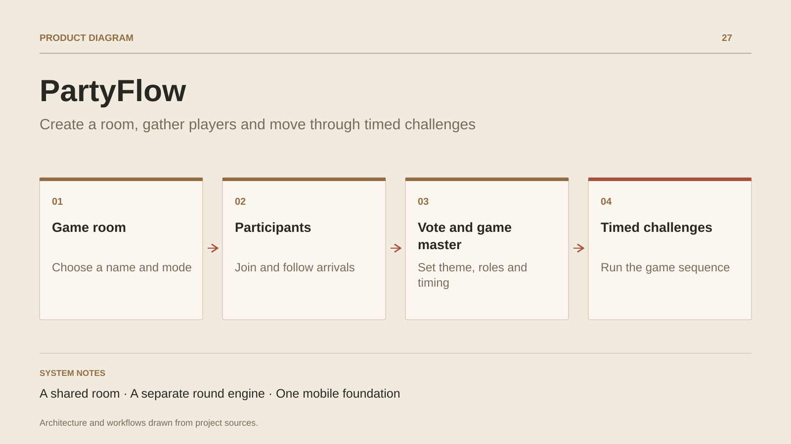

# PartyFlow

**Create a room, gather players and move through timed challenges**

[All projects](../README.en.md#the-whole-workshop) · [Français](partyflow.md)

PartyFlow uses phones to support a group game. The host creates a room, chooses a mode and sets the initial options. Participants join the same room, with players, votes and settings shared in real time.

The game master can configure round duration, theme and roles. The progression engine consumes challenges from a queue, records them in history and uses a timer to move between rounds. Callbacks connect this logic to the screens.

The repository combines Vue, Ionic, Android/iOS Capacitor projects and Firebase Realtime Database. The prototype connects room workflows and round rules to its mobile hosts.

## Journey

1. Create a game with a name, nickname and mode.
2. Join the room and watch participants arrive.
3. Vote on a mode; the game master sets duration, theme and roles.
4. Start a sequence of timed challenges.

## Design decisions

### A shared room

Firebase Realtime Database stores rooms, players, votes and settings. Views subscribe to room updates.

### A separate round engine

The engine consumes a challenge queue, keeps history, starts the timer and advances through callbacks.

## Technology

Vue · Ionic · Capacitor · TypeScript · Firebase

**Status :** Mobile game prototype · rooms, votes and challenges.

[Back to the workshop](../README.en.md#the-whole-workshop) · [Studio & services ↗](https://floriansola.fr/en)
