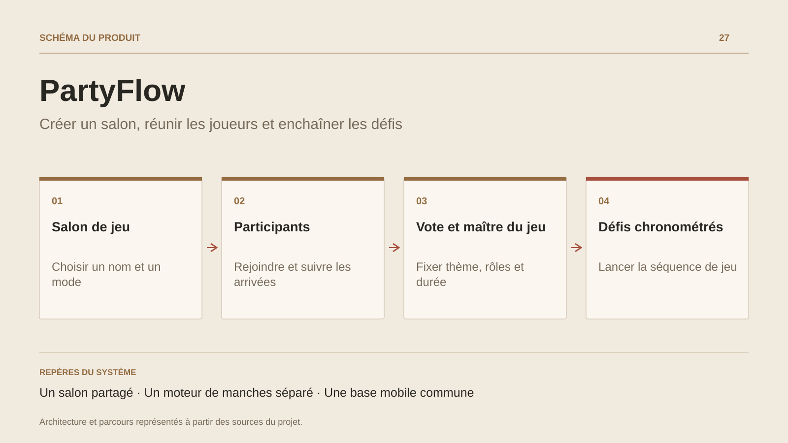

# PartyFlow

**Créer un salon, réunir les joueurs et enchaîner les défis**

[Tous les projets](../README.md#tout-latelier) · [English](partyflow.en.md)

PartyFlow met le téléphone au service d’une partie collective. L’organisateur crée un salon, choisit un mode et renseigne les options de départ. Les participants rejoignent la même salle ; la liste des joueurs, les votes et la configuration sont partagés en temps réel.

Dans le salon, le maître de jeu peut régler la durée des manches, le thème et les rôles. Le moteur de progression prend ensuite les défis dans une file, enregistre leur passage dans l’historique et utilise un minuteur pour enchaîner les manches. Des callbacks relient cette logique aux écrans.

Le dépôt réunit Vue, Ionic, des projets Capacitor Android/iOS et Firebase Realtime Database. Le prototype relie les parcours de salon et les règles des manches aux hôtes mobiles.

## Parcours

1. Créer une partie avec un nom, un pseudo et un mode.
2. Rejoindre le salon et voir les participants arriver.
3. Voter pour un mode ; le maître de jeu règle durée, thème et rôles.
4. Lancer une succession de défis chronométrés.

## Décisions de conception

### Un salon partagé

Firebase Realtime Database porte les salons, joueurs, votes et options. Les vues s’abonnent aux changements du salon.

### Un moteur de manches séparé

Le moteur consomme la file de défis, conserve l’historique, déclenche le minuteur et passe à la manche suivante via des callbacks.

## Technologies

Vue · Ionic · Capacitor · TypeScript · Firebase

**État :** Prototype de jeu mobile · salons, votes et défis.

[Retour à l’atelier](../README.md#tout-latelier) · [Studio & services ↗](https://floriansola.fr)
