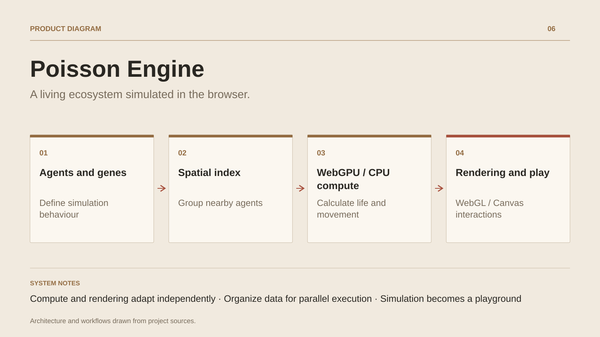

# Poisson Engine

**A living ecosystem simulated in the browser.**

[All projects](../README.en.md#the-whole-workshop) · [Français](poisson-engine.md)

Poisson Engine runs an interactive aquatic ecosystem in the browser. Collective movement combines with energy, predation, reproduction and mutations. Parametric morphology translates genomes into fish shapes and patterns.

The engine organizes agents into typed arrays and uses a spatial grid to focus searches on relevant neighbors. The WebGPU path combines biology, grid clearing and binning, prefix sums, reordering, schooling forces and physics integration. Hunting interactions are part of the flocking forces. Parallel scans can require multiple passes depending on grid size.

Compute and rendering are independent choices: simulation uses WebGPU or the CPU, while rendering uses WebGL or Canvas2D. Render layers, culling and levels of detail adapt presentation. Game modes add abilities, progression, missions, saves and an economy; multiplayer code provides rooms, area of interest filtering and interpolation.

The project offers a public demonstration and a technical workshop around shaders, data and behavior. Performance depends on hardware, agent count and the active mode.

## Journey

1. Choose a mode and observe schools, predators and ecosystem resources.
2. Adjust parameters and follow their effects on movement, energy and reproduction.
3. Explore genetics, mutations and relationships between species.
4. Play with progression, abilities, missions and the economy, or inspect the simulation.

## Design decisions

### Compute and rendering adapt independently

WebGPU accelerates simulation compute, with a CPU path when unavailable. Rendering chooses WebGL or Canvas2D. This separation adapts both workload and presentation to browser capabilities.

### Organize data for parallel execution

Typed arrays, SoA data, spatial grids, prefix sums and reordering bring neighboring agents closer in memory. The GPU pipeline handles schooling and hunting forces before physics integration.

## Technology

TypeScript / JavaScript ESM · GPU compute · WebGL · Canvas2D · Vite 7 · Vitest · Playwright · ESLint (architecture boundaries) · Fastify 5 · WebSocket

**Status :** Browser demonstrator · simulation engine and tools.

[Back to the workshop](../README.en.md#the-whole-workshop) · [Studio & services ↗](https://floriansola.fr/en)
