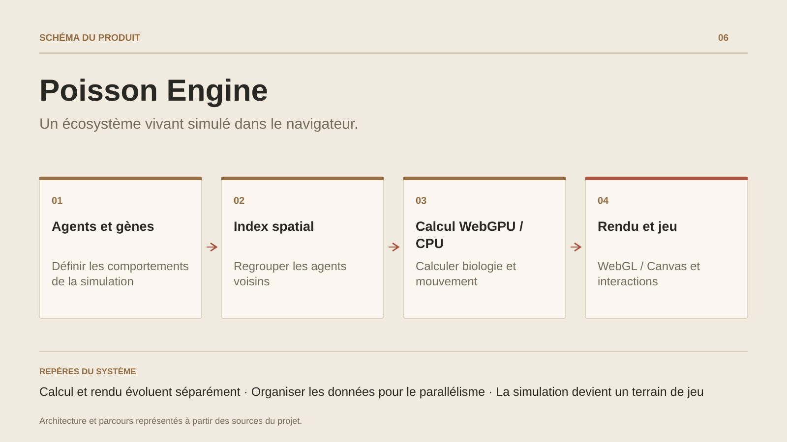

# Poisson Engine

**Un écosystème vivant simulé dans le navigateur.**

[Tous les projets](../README.md#tout-latelier) · [English](poisson-engine.en.md)

Poisson Engine fait vivre un écosystème aquatique interactif dans un navigateur. Les déplacements collectifs se combinent à l’énergie, à la prédation, à la reproduction et aux mutations. Une morphologie paramétrique traduit les génomes en formes et motifs de poissons.

Le moteur organise les agents en tableaux typés et utilise une grille spatiale pour concentrer les recherches sur les voisins utiles. Le chemin WebGPU assemble biologie, nettoyage et remplissage de grille, prefix-sum, réordonnancement, forces de banc et intégration physique. Les interactions de chasse sont intégrées aux forces de flocking. Le scan parallèle peut nécessiter plusieurs passes selon la taille de la grille.

Calcul et rendu sont deux choix indépendants : la simulation peut utiliser WebGPU ou le CPU, tandis que le rendu utilise WebGL ou Canvas2D. Les couches de rendu, le culling et les niveaux de détail ajustent la présentation. Les modes de jeu ajoutent capacités, progression, missions, sauvegardes et économie ; le code multijoueur prévoit rooms, filtrage par zone d’intérêt et interpolation.

Le projet fournit une démonstration publique et un atelier technique autour des shaders, des données et des comportements. Les performances dépendent du matériel, du nombre d’agents et du mode actif.

## Parcours

1. Choisir un mode et observer les bancs, prédateurs et ressources de l’écosystème.
2. Modifier les paramètres et suivre les effets sur les déplacements, l’énergie et la reproduction.
3. Explorer génétique, mutations et rapports entre espèces.
4. Jouer avec progression, capacités, missions et économie, ou inspecter la simulation.

## Décisions de conception

### Calcul et rendu évoluent séparément

WebGPU accélère le calcul de simulation, avec un chemin CPU quand il est indisponible. Le rendu choisit WebGL ou Canvas2D. Cette séparation permet d’adapter le travail et la présentation aux capacités du navigateur.

### Organiser les données pour le parallélisme

Tableaux typés, structures SoA, grille spatiale, prefix-sum et réordonnancement rapprochent les agents voisins en mémoire. Le pipeline GPU traite les forces de banc et de chasse avant l’intégration physique.

## Technologies

TypeScript / JavaScript ESM · GPU compute · WebGL · Canvas2D · Vite 7 · Vitest · Playwright · ESLint (frontières d'archi) · Fastify 5 · WebSocket

**État :** Démonstrateur navigateur · moteur de simulation et outils.

[Retour à l’atelier](../README.md#tout-latelier) · [Studio & services ↗](https://floriansola.fr)
