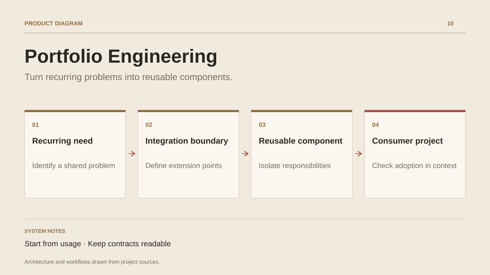

# Portfolio Engineering

**Turn recurring problems into reusable components.**

[All projects](../README.en.md#the-whole-workshop) · [Français](portfolio-engineering.md)

Portfolio Engineering collects the cross-product work behind the applications: recognise a familiar problem, isolate its behaviour and make the next integration easier to understand. The workshop describes synchronisation, offline persistence, mapping and presentation components.

Its central question concerns boundaries. Which rules belong to a component? Which decisions stay with the product? Which contract lets a consumer adapt its behaviour? This approach organises reuse around actual usage and explicit dependencies.

The workshop documents an engineering practice and opportunities for shared components. Individual libraries, versions and consumer evidence provide the next milestones for presenting each extraction separately.

## Journey

1. Identify recurring needs across products.
2. Define a useful boundary and integration points.
3. Document the component and verify its adoption in another context.

## Design decisions

### Start from usage

Synchronisation, local persistence and mapping provide concrete problems from which to define component responsibilities.

### Keep contracts readable

A reusable component exposes expected behaviour and the adaptation points needed by its consuming product.

## Technology

TypeScript · Synchronization · Local persistence · Mapping

**Status :** Cross-product tooling · synchronisation and local persistence.

[Back to the workshop](../README.en.md#the-whole-workshop) · [Studio & services ↗](https://floriansola.fr/en)
