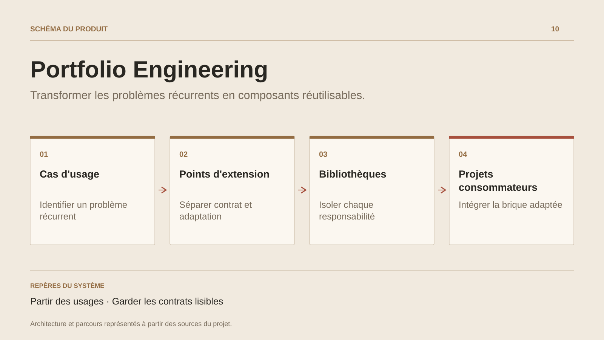

# Portfolio Engineering

**Transformer les problèmes récurrents en composants réutilisables.**

[Tous les projets](../README.md#tout-latelier) · [English](portfolio-engineering.en.md)

Portfolio Engineering rassemble le travail transverse qui accompagne les produits : reconnaître un problème déjà rencontré, isoler son comportement et rendre l’intégration suivante plus lisible. Les thèmes décrits dans cet atelier portent notamment sur la synchronisation, la persistance hors ligne, la cartographie et les composants de présentation.

La question centrale est celle de la frontière. Quelles règles appartiennent au composant ? Quels choix restent au produit ? Quel contrat permet au consommateur d’adapter le comportement ? Cette démarche organise la réutilisation autour des usages et des dépendances explicites.

L’atelier documente une pratique d’ingénierie et des pistes de mutualisation. Les bibliothèques, leurs versions et leurs preuves de consommation constituent les prochains repères pour présenter chaque extraction individuellement.

## Parcours

1. Repérer les besoins récurrents dans les produits.
2. Définir une frontière utile et les points d’intégration.
3. Documenter le composant et vérifier son adoption dans un autre contexte.

## Décisions de conception

### Partir des usages

La synchronisation, la persistance locale et la cartographie offrent des problèmes concrets pour définir les responsabilités d’un composant.

### Garder les contrats lisibles

Une brique réutilisable expose les comportements attendus et les points d’adaptation nécessaires au produit qui la consomme.

## Technologies

TypeScript · Synchronisation · Persistance locale · Cartographie

**État :** Outillage transverse · synchronisation et persistance locale.

[Retour à l’atelier](../README.md#tout-latelier) · [Studio & services ↗](https://floriansola.fr)
