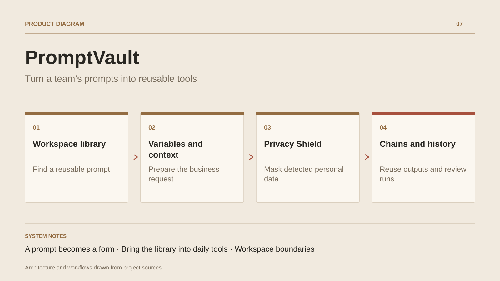

# PromptVault

**Turn a team’s prompts into reusable tools**

[All projects](../README.en.md#the-whole-workshop) · [Français](promptvault.md)

PromptVault brings together prompts that would otherwise remain in personal notes. Users find a template, fill its fields and add useful context such as writing style, instructions or business information. ContextPacks and versions preserve a shared method while allowing each request to be adapted.

The project also addresses workflow continuity: chains pass outputs between steps, extensions bring the library into Chrome and VS Code, and workspaces group members, prompts and settings. Feedback, approval and audit screens support reviewing how the tools are used.

The extension Shield detects selected entities, replaces them with placeholders and can restore values in the displayed response. Masking rules and settings control the text prepared by the team.

## Journey

1. Find a prompt in the workspace library.
2. Fill its variables and add relevant business context.
3. Prepare the text in the app, Chrome or VS Code; mask detected data according to Shield settings.
4. Reuse the output in a prompt chain and inspect the execution history.

## Design decisions

### A prompt becomes a form

Variables are separated from the text and ContextPacks provide shared instructions. The same template can serve different people and situations.

### Bring the library into daily tools

Chrome and VS Code extensions make prompts available where people already work. The extension Shield replaces detected entities with placeholders and keeps a mapping for restoration.

## Technology

.NET · Blazor Web App · EF Core · PostgreSQL · ActualLab Fusion · Chrome Manifest V3 · VS Code

**Status :** In development · shared library and extensions.

[Back to the workshop](../README.en.md#the-whole-workshop) · [Studio & services ↗](https://floriansola.fr/en)
