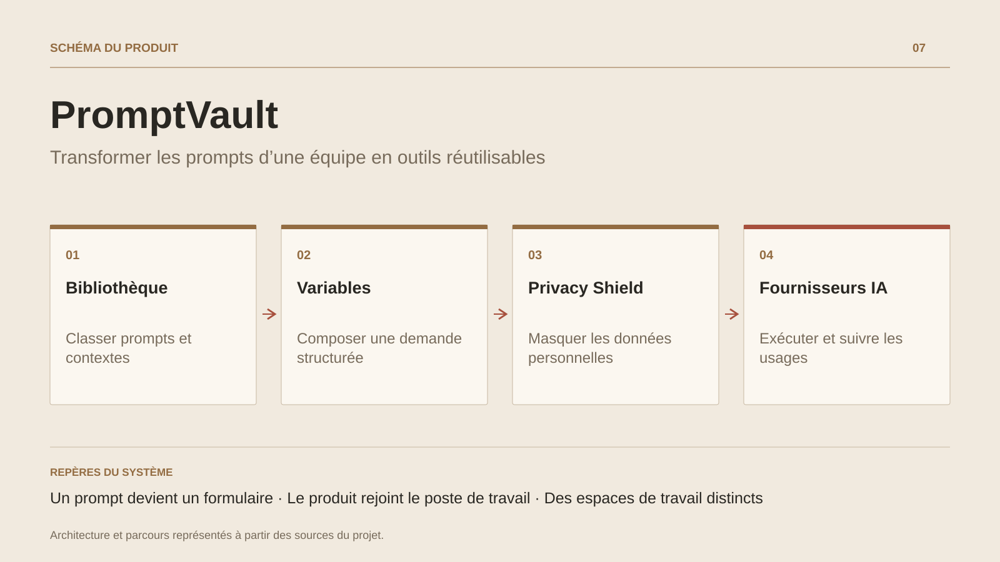

# PromptVault

**Transformer les prompts d’une équipe en outils réutilisables**

[Tous les projets](../README.md#tout-latelier) · [English](promptvault.en.md)

PromptVault organise les prompts qui circulent dans les notes personnelles d’une équipe. Un utilisateur retrouve un modèle, renseigne ses champs et ajoute le contexte utile : ton de rédaction, consignes ou informations métier. Les ContextPacks et les versions permettent de conserver une méthode commune tout en l’adaptant à chaque demande.

Le projet couvre aussi la continuité du travail : une chaîne passe la sortie d’une étape à la suivante, les extensions rapprochent la bibliothèque de Chrome et de VS Code, et les workspaces regroupent membres, prompts et configuration. Les écrans de feedback, d’approbation et d’audit donnent une place à la révision des usages.

Le Shield de l’extension détecte certaines entités, les remplace par des marqueurs et peut restituer les valeurs dans la réponse affichée. Les règles de masquage et leur configuration font partie du contrôle des textes préparés par l’équipe.

## Parcours

1. Retrouver un prompt dans la bibliothèque du workspace.
2. Renseigner ses variables et lui associer un contexte métier.
3. Préparer le texte dans l’application, Chrome ou VS Code ; masquer les données détectées selon la configuration du Shield.
4. Réutiliser le résultat dans une chaîne de prompts et consulter l’historique d’exécution.

## Décisions de conception

### Un prompt devient un formulaire

Les variables sont séparées du texte et les ContextPacks apportent des instructions communes. Le même modèle peut servir à plusieurs personnes et situations.

### Le produit rejoint le poste de travail

Les extensions Chrome et VS Code rendent la bibliothèque accessible dans les outils déjà utilisés. Le Shield de l’extension remplace les entités détectées par des marqueurs et conserve une correspondance pour les restituer.

## Technologies

.NET · Blazor Web App · EF Core · PostgreSQL · ActualLab Fusion · Chrome Manifest V3 · VS Code

**État :** En développement · bibliothèque partagée et extensions.

[Retour à l’atelier](../README.md#tout-latelier) · [Studio & services ↗](https://floriansola.fr)
