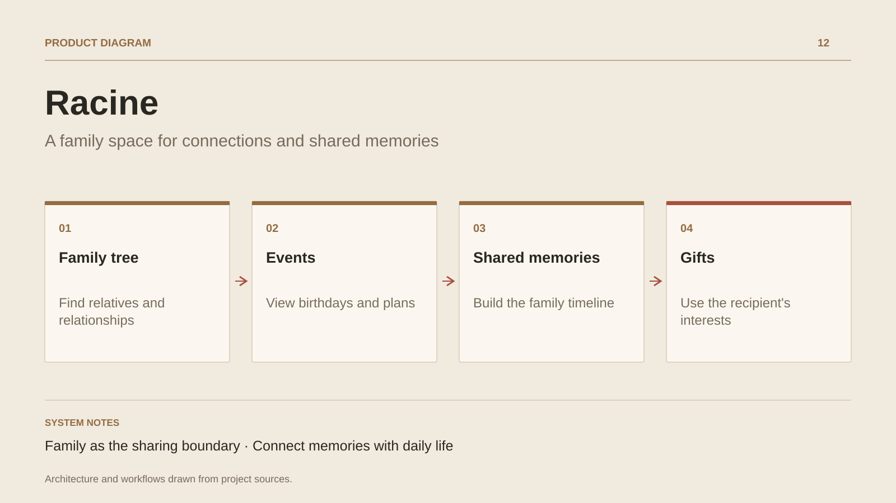

# Racine

**A family space for connections and shared memories**

[All projects](../README.en.md#the-whole-workshop) · [Français](racine.md)

Racine starts from a family need: maintaining connections between relatives who live apart. The documented scope brings together a family tree, an event timeline and shared memories. The tree shows relationships; the timeline preserves the moments that connect people over time. Birthdays and gift ideas support everyday uses.

Sharing is organized around family identity. The documentation describes a .NET/Blazor application, Fusion services, EF Core and gift suggestions. The design study connects family relationships, a private space and useful information for preparing a thoughtful gift.

## Journey

1. Find relatives and relationships in the family tree.
2. View upcoming events and birthdays.
3. Add a memory to the shared timeline.
4. Prepare a gift using the recipient’s interests.

## Design decisions

### Family as the sharing boundary

The documented scope organizes data around the family and describes filtering tied to family identity.

### Connect memories with daily life

The family tree, events and memories form one space, supporting recurring uses beyond a photo album.

## Technology

.NET · Blazor · ActualLab Fusion · EF Core

**Status :** Family project · genealogy, events and memories.

[Back to the workshop](../README.en.md#the-whole-workshop) · [Studio & services ↗](https://floriansola.fr/en)
