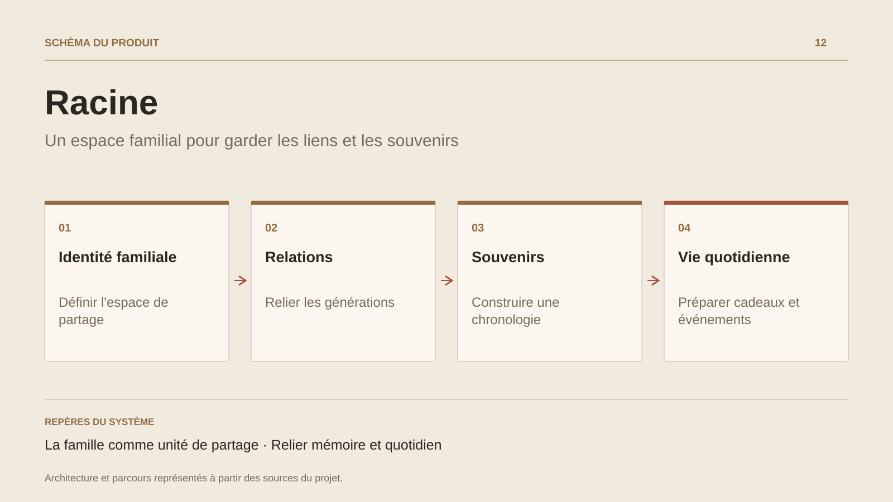

# Racine

**Un espace familial pour garder les liens et les souvenirs**

[Tous les projets](../README.md#tout-latelier) · [English](racine.en.md)

Racine part d’un besoin familial : conserver un lien entre des proches qui vivent à distance. Le périmètre documenté réunit un arbre généalogique, une chronologie d’événements et un espace de souvenirs. L’arbre donne les relations entre les personnes ; la chronologie conserve ce qui les relie au fil du temps. Les anniversaires et les idées cadeaux donnent une place aux usages du quotidien.

Le partage est organisé autour d’une identité familiale. La documentation décrit une application .NET/Blazor, des services Fusion, EF Core et une couche de suggestions cadeaux. L’étude de conception porte sur la cohérence entre relations familiales, espace privé et informations utiles pour préparer une attention à un proche.

## Parcours

1. Retrouver les membres et les relations dans l’arbre familial.
2. Consulter les prochains événements et anniversaires.
3. Ajouter un souvenir à la chronologie partagée.
4. Préparer une attention ou un cadeau à partir des intérêts du destinataire.

## Décisions de conception

### La famille comme unité de partage

Le périmètre documenté organise les données autour de la famille et prévoit un filtrage lié à son identité.

### Relier mémoire et quotidien

Arbre familial, événements et souvenirs sont présentés comme les entrées d’un même espace, avec des usages récurrents au-delà de l’album photo.

## Technologies

.NET · Blazor · ActualLab Fusion · EF Core

**État :** Projet familial · généalogie, événements et souvenirs.

[Retour à l’atelier](../README.md#tout-latelier) · [Studio & services ↗](https://floriansola.fr)
