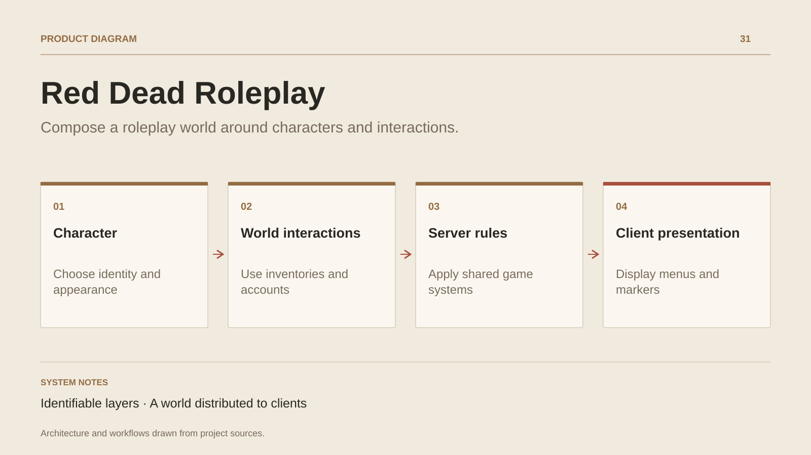

# Red Dead Roleplay

**Compose a roleplay world around characters and interactions.**

[All projects](../README.en.md#the-whole-workshop) · [Français](red-dead-roleplay.md)

Red Dead Roleplay extends work on community worlds into the RedM environment. Its sources bring together character creation, appearances, inventories, bank accounts, doors and interaction areas.

The server organises persistent models, domain services and entity distribution. The client handles native menus, player input, markers, animations and world behaviours including fishing and trains. Shared elements connect commands and events on both sides.

This case study presents a historical collaborative project through its preserved sources. Its engineering interest lies in system composition and engine adaptation; the state of a current public server still requires verification.

## Journey

1. Create or retrieve a character and appearance.
2. Use inventories, accounts and world interactions.
3. Connect server rules to menus, markers and in-game events.

## Design decisions

### Identifiable layers

Sources group the client, server services and shared contracts. Presentation code and persistent models have their own locations.

### A world distributed to clients

Streamers and spatial partitions organise entities, markers and interactions communicated to players.

## Technology

C# · RedM · Client / Server

**Status :** Collaborative project · client, server and contracts.

[Back to the workshop](../README.en.md#the-whole-workshop) · [Studio & services ↗](https://floriansola.fr/en)
